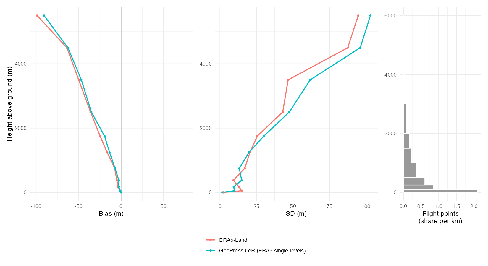

# How accurate is altitude from pressure geolocators?

A global validation of the altitude that [GeoPressureR](https://github.com/GeoPressure/GeoPressureR)
and [GeoPressureAPI](https://github.com/GeoPressure/GeoPressureAPI) retrieve from a pressure
measurement using ERA5 reanalysis, against:

- **Tier A – surface barometers (ground level):** HadISD station-level pressure, 969 stations
  worldwide, 2022–2024 (plus 1990, 2005, 2015 for a subset).
- **Tier B – radiosondes (0–6 km above ground):** IGRA2, 326 stations, 2023–2024.

The full methods and results are in the **[report](report/index.md)** (source
`report/index.qmd`; a self-contained HTML version is rendered locally to `report/index.html`). This
page summarises what users need.

## Results in one table

ERA5 single-levels (the GeoPressureR / GeoPressureAPI default), assuming a perfect pressure reading.

| Situation | Typical error |
|---|---|
| **Ground, absolute altitude** (905 reference stations, 2022–2024) | median bias **3.2 m** (90% of sites < 15 m); MAE **7.3 m**; 95% of errors < 25 m |
| Ground, flat terrain → mountains | MAE 4.9 m → 15.7 m; median bias 2.2 m → 7.1 m |
| **Ground, altitude changes at one site** (precision) | SD **4.1 m** (3.2 m flat → 9.3 m mountains); almost no diurnal/seasonal cycle |
| **In flight** (326 radiosonde stations, 2023–2024) | underestimated by ~1–1.5% of height above ground: −14 m at 1–1.5 km, −35 m at 2–3 km, −91 m at 5–6 km |
| In flight, averaged over the heights birds fly | adds bias −10.7 m, MAE **15.6 m**, RMSE 30.6 m |
| ERA5-Land instead | ground MAE 29.0 m, median bias ~4× larger: do not use for altitude |
| GeoPressureAPI vs GeoPressureR ARCO | identical to < 0.09 m |

**Reference screen.** 64 of 969 surface stations (7%) are excluded from the reference set: 50
with a constant offset larger than ERA5 can produce (a wrong elevation, pressure datum or barometer,
as documented by ECMWF for SYNOP stations), and 14 with a clear step change during 2022–2024.
Neighbouring stations, SRTM/ASTER DEMs and the radiosondes confirm that these are station errors,
not ERA5 errors; the report's appendix shows the results are robust to the screen.

**Main drivers.** On the ground: terrain the 0.25° ERA5 grid cannot resolve (gap between true
elevation and ERA5 orography, sub-grid roughness). The error there is a fixed offset per place, not
noise. In flight: the formula's standard temperature profile (−6.5 K/km from the 2 m temperature,
dry air). The real atmosphere is usually warmer, so birds come out too low. This explains 93% of
the variance of the in-flight error, and it is worst in continental and polar winters (surface
inversions). ERA5 has also improved over time: the median ground-level bias was ~6 m in 1990.

**The formula can be improved.** Using the 2 m virtual temperature (humidity) and a lapse rate of
−5.0 K/km fitted to the radiosondes, instead of dry air and −6.5 K/km, reduces the in-flight bias
averaged over bird flight heights from −10.7 m to −1.8 m (MAE 15.5 → 13.1 m) on held-out stations,
without changing ground-level altitude. The scatter in flight stays. See the report for details; this
is not (yet) implemented in GeoPressureR.




## What is validated

Exactly GeoPressureR's code path: grid snapping, nearest ERA5 hour, ERA5 orography and
`pressure_to_altitude()` are taken from GeoPressureR itself (ERA5 read from the ECMWF ARCO archive,
i.e. `pressurepath_create(source = "arco")`). A cross-check confirms GeoPressureAPI (Earth Engine)
returns the same altitudes.

## Reproducing

Requirements: R ≥ 4.3 with `data.table`, `arrow`, `ncdf4`, `terra`, `mgcv`, `ggplot2`, `patchwork`,
`sf`, `rnaturalearth`, `kgc`, `zoo`, `R.utils`, `httr2`, `ecmwfr`, `Rarr`; a local clone of
GeoPressureR (set `GEOPRESSURER_PATH`, default `~/Documents/GitHub/GeoPressureR`); a CDS API key
registered with `ecmwfr` (used for ARCO access); `curl`, `funzip` and `awk`; Quarto for the report.

```bash
make            # everything: downloads, ERA5 extraction, errors, analysis, report
N_CORES=4 make  # fewer parallel workers
```

| Step | Script | What it does |
|---|---|---|
| 00 | `00_bird_heights.R` | Flight-height distribution of tracked birds (optional; output committed) |
| 01 | `01_select_hadisd.R` | Spatially balanced HadISD candidates |
| 02 | `02_download_hadisd.R` | Download HadISD, extract station-level pressure, coverage filter |
| 02b | `02b_thin_hadisd.R` | Thin to one station per 5° cell (+ one per 2.5° cell above 1000 m) |
| 03 | `03_igra.R` | Select and stream IGRA2 radiosonde soundings |
| 04 | `04_static.R` | ERA5 orography, sub-grid roughness, land-sea mask, DEM check, Köppen |
| 05 | `05_era5_extract.R` | Hourly ERA5 at every station from ARCO |
| 06 | `06_errors.R` | Altitude errors (Tier A, Tier B, formula variants) |
| 08 | `08_api_crosscheck.R` | GeoPressureAPI vs ARCO |
| 09 | `09_reference_checks.R` | Step changes, SRTM/ASTER DEM and neighbour checks of the surface stations |
| 07 | `07_analysis.R` | Summaries, driver models, figures → `output/` |
| 07b | `07b_formula.R` | Formula variants: virtual temperature and a lapse rate fitted to the radiosondes (cross-validated) |

Every step skips work already on disk, so the pipeline can be interrupted and resumed.
Raw and intermediate data (`data/`, ~2 GB) are not committed; `output/` holds the derived tables and
figures.

## Data sources and licences

- **ERA5 / ERA5-Land**: Copernicus Climate Change Service (C3S), doi:10.24381/cds.adbb2d47 and
  doi:10.24381/cds.e2161bac, via the ECMWF ARCO archive.
- **HadISD v3.4.3.2025f**: Met Office Hadley Centre, Dunn et al. (2012, 2016). Non-Commercial
  Government Licence. *This product may contain data which are governed by WMO Policy following WMO
  Resolution 40 Annex 1 alongside additional data that may have restrictions placed on their
  commercial use by the data owners.* Only derived error statistics are published here.
- **IGRA v2.2**: NOAA NCEI, Durre et al. (2006, 2018), doi:10.7289/V5X63K0Q.
- **Bird heights**: GeoLocator master data package, doi:10.5281/zenodo.18187092 (binned counts only).
- **DEM checks**: Mapzen terrain tiles, SRTM GL1 (doi:10.5067/MEaSUREs/SRTM/SRTMGL1.003) and ASTER
  GDEM v3 (doi:10.5067/ASTER/ASTGTM.003) via the OpenTopoData public API.

Code: MIT. Derived tables and figures in `output/`: CC BY 4.0 (subject to the HadISD attribution
above).

## Citation

See `CITATION.cff`. A Zenodo DOI will be minted at the first tagged release.
