# How accurate is altitude from pressure geolocators?
Raphaël Nussbaumer, Mathieu Gravey
2026-10-01

# Abstract

Pressure geolocators reveal the altitude of a bird by converting the pressure it records into height with the ERA5 reanalysis, as done by GeoPressureR and GeoPressureAPI. We validate this conversion, assuming a perfect pressure reading, against four references of known height: 2,502 HadISD weather stations worldwide, 47 GNSS and 138 MeteoSwiss stations with documented barometer heights, and 648 IGRA2 radiosonde stations up to 6 km above the ground. On the ground, the median station has a constant bias of 2.5 m and a scatter (SD) of 3.6 m around it, but the bias exceeds 11.4 m at 10% of the stations. Both grow with the gap between the station and ERA5’s smoothed terrain, while season, time of day and climate matter little. Stations whose pressure ERA5 never assimilated give the same figures, and much of the remaining spread comes from wrong station elevations rather than from ERA5. In flight, altitude is underestimated by 1–1.5% of the height above the ground, because the formula assumes a column that is too cold; over the heights birds fly, the mean absolute error is 16.4 m. ERA5-Land is about four times less accurate on the ground and should not be used for altitude. Using the virtual temperature and a lapse rate that varies with season and latitude removes most of the in-flight bias (mean absolute error 13.0 m on held-out stations) without changing the altitude on the ground. The in-flight scatter remains: it follows the day-to-day temperature profile, which no simple formula can capture.

# Introduction

Knowing the altitude of a bird matters both on the ground and in flight. On the ground, altitude constrains where the bird is: comparing it with the terrain refines the position beyond what pressure alone resolves, and it characterises the habitat used, as done to follow the local movements of an Alpine-breeding migrant (Rime et al. 2023). In flight, altitude is the key variable to understand how birds use winds and temperatures aloft, to reveal strategies such as how small migrants cross ecological barriers (Dufour et al. 2026), and to assess their exposure to hazards such as offshore wind farms (Doniol-Valcroze et al. 2026).

Multi-sensor geolocators, however, do not measure altitude. They record atmospheric pressure (Bäckman et al. 2017; Liechti et al. 2018; Sjöberg et al. 2018), from which altitude must be derived. The sensors themselves are precise, but the conversion is not straightforward: it needs a reference pressure and assumptions about the atmosphere between that reference and the bird, both of which vary in space and time. How well these assumptions hold sets the accuracy of the altitude, and it needs to be assessed and, where possible, calibrated.

Pressure decreases with height because each layer of air carries the weight of the air above it. Combining this hydrostatic balance with the ideal gas law gives the exact relationship between pressure and height, a differential equation (Wallace & Hobbs 2006, ch. 3):

$$
\frac{dp}{dz} = -\frac{g\,M\,p}{R\,T_v(z)},
$$

where:

- $p$ is the pressure (Pa) at height $z$ (m);
- $g$ = 9.807 m s⁻² is the gravitational acceleration;
- $R$ = 8.314 J mol⁻¹ K⁻¹ is the universal gas constant and $M$ = 0.02896 kg mol⁻¹ the molar mass of dry air;
- $T_v(z)$ is the virtual temperature (K) of the air at height $z$, i.e. its temperature corrected for humidity (see below).

The equation says that pressure drops faster through cold, dense air than through warm, light air. To turn a recorded pressure into an altitude, it must be integrated from a reference level, where both pressure and altitude are known, up to the bird. This requires the reference level and the temperature profile $T_v(z)$ in between, which is never known exactly. Every conversion is therefore an approximation of this equation. We introduce three of them, each more realistic than the previous one.

**The standard atmosphere.** Altimeters take a fixed reference, sea level, and a temperature that decreases linearly with height, $T(z) = T_0 + L\,(z - z_0)$, in dry air ($T_v = T$), with the values of the standard atmosphere (ICAO 1993; ISO 1975). Integrating the equation above then gives the barometric equation:

$$
z = z_0 + \frac{T_0}{L}\left[\left(\frac{p}{p_0}\right)^{-R L / (g M)} - 1\right],
$$

where:

- $z_0$, $p_0$ and $T_0$ are the altitude, pressure and temperature of the reference level (in the standard atmosphere: sea level, 1013.25 hPa and 15 °C);
- $L$ is the lapse rate, the rate at which temperature changes with height (−6.5 K/km in the standard atmosphere, i.e. 6.5 °C cooler per km).

**A reference that follows the weather.** The standard atmosphere is a global, annual mean. At any place and time, weather systems change the surface pressure by tens of hPa, and 10 hPa alone shifts the apparent altitude by about 80 m, so a fixed reference cannot serve a bird tracked for months over thousands of kilometres. [GeoPressureR](https://geopressure.org/GeoPressureR/) (Nussbaumer et al. 2023a, 2023b) and [GeoPressureAPI](https://github.com/GeoPressure/GeoPressureAPI), which serves it, therefore take the reference level from the ERA5 reanalysis: for a pressure recorded at a given place and hour, $p_0$, $T_0$ and $z_0$ are the surface pressure, 2 m temperature and orography of the nearest ERA5 grid cell (0.25°) and hour. The barometric equation is then applied with the constant lapse rate $L = -6.5$ K/km ([`pressure_to_altitude()`](https://github.com/GeoPressure/GeoPressureR/blob/main/R/pressure_to_altitude.R)), for instance along the reconstructed trajectory by [`pressurepath_create()`](https://geopressure.org/GeoPressureR/reference/pressurepath_create.html).

**The real temperature of the air column.** Even with a reference that follows the weather, the barometric equation keeps two simplifications of the standard atmosphere, dry air and a constant lapse rate, which together fix the temperature assumed for the air column between the ground and the bird. Integrating the differential equation without assuming any temperature profile shows how much this matters, through the hypsometric equation:

$$
z = z_0 + \frac{R\,\bar T_v}{g\,M}\,\ln\frac{p_0}{p},
$$

where $\bar T_v$ is the mean virtual temperature of the air column between the reference level and the bird. The altitude depends on the temperature of the column only through this average, which is formally taken over $\ln p$ but in practice is close to the temperature at mid-height (approximately $T_0 + L\,(z - z_0)/2$ for a linear profile). The virtual temperature accounts for humidity: water vapour is lighter than dry air, so moist air is less dense than dry air at the same temperature, and $T_v = T\,(1 + 0.608\,q)$, with $q$ the specific humidity (kg of water vapour per kg of air), is the temperature that dry air would need to have the same density. It is warmer than $T$ by a few tenths of a kelvin in cold, dry air and up to ~3 K in humid tropical air.

Because the height above the reference level is proportional to $\bar T_v$, an error in the assumed mean temperature becomes the same *relative* error in height:

$$
\frac{\delta (z - z_0)}{z - z_0} = \frac{\bar T_\text{assumed} - \bar T_{v,\text{true}}}{\bar T_{v,\text{true}}}.
$$

An assumed column 3 K (≈1%) too cold thus places a bird flying 2 km above the ground about 20 m too low. Each simplification gets the column wrong in its own way:

- **Humidity.** Assuming dry air ($T_v = T$) always makes the column too cold. It is a simplification of the physics, not a modelling choice, and it can be corrected without any free parameter.
- **Lapse rate.** −6.5 K/km is a mean over the whole troposphere (0–11 km). Near the surface, lapse rates vary with latitude and season (Stone & Carlson 1979; Rolland 2003) and are often shallower, e.g. 3.9–5.2 K/km annual means in the Cascade Mountains (Minder et al. 2010), and surface inversions make them shallower still, or reverse them.

Both errors grow with the height above the ground, so they mostly matter in flight. On top of these, a geolocator’s own offset, drift and resolution (1 hPa ≈ 8 m near the ground) add to the error; they are not evaluated here.

Since GeoPressureR takes its reference level from ERA5, the accuracy of the altitude rests first on ERA5’s surface pressure. Validations against weather stations report errors of about 1 hPa, i.e. 8 m: over China, ERA5 surface pressure has a bias of −0.07 hPa and an RMSE of 0.95 hPa, rising to 1.5 hPa on the Tibetan Plateau, where station and model orography differ most (Huang et al. 2023). Two caveats limit what such validations say about altitude. First, ERA5 assimilates the surface pressure of these very stations, so they are not independent of it (Hersbach et al. 2020). Second, the reference itself is imperfect: station pressure is biased at several hundred stations, mostly because the height assigned to the barometer is wrong (Vasiljevic et al. 2006; Haiden et al. 2018). Moreover, altitude also depends on the 2 m temperature and on the assumed temperature profile, which pressure validations do not test.

In this study, we evaluate the altitude computed by GeoPressureR against references of known height: surface weather stations, GNSS stations whose barometers have geodetic heights and are not assimilated by ERA5, Swiss stations with published barometer heights, and radiosondes, which measure pressure and height together up to 6 km above the ground. We address three questions: (1) how accurate and precise is the altitude, on the ground across the globe and in flight at the heights birds fly, what drives its error, and how far can these estimates be trusted, given errors in the reference heights and ERA5’s assimilation of the references? (2) does ERA5-Land, with its finer 0.1° grid, give a better altitude than ERA5 single-levels (0.25°)? (3) can the formula be improved, by using the virtual temperature and a lapse rate fitted to the radiosondes?

# Methods

We give GeoPressureR atmospheric pressures measured by barometers at a known height, as if a geolocator had recorded them, and compare the altitudes it returns with those heights. The computation evaluated is exactly that of [GeoPressureR](https://geopressure.org/GeoPressureR/) 3.6.3.9000 (): ERA5 is read from the ECMWF ARCO archive with [`pressurepath_create(source = "arco")`](https://geopressure.org/GeoPressureR/reference/pressurepath_create.html), including its grid snapping and nearest-hour matching, and altitude is computed with [`pressure_to_altitude()`](https://github.com/GeoPressure/GeoPressureR/blob/main/R/pressure_to_altitude.R). Every evaluation is run with both ERA5 single-levels (0.25°; Hersbach et al. 2020), the GeoPressureR default, and ERA5-Land (0.1°; Muñoz-Sabater et al. 2021). GeoPressureR takes the reference level of the barometric equation from ERA5 at the location and hour of each pressure: the ERA5 orography as $z_0$, the surface pressure as $p_0$ and the 2 m temperature as $T_0$, with the standard lapse rate $L$ = −6.5 K/km in dry air (Introduction). GeoPressureR can also compute the altitude on Google Earth Engine through [GeoPressureAPI](https://github.com/GeoPressure/GeoPressureAPI) (`source = "api"`); we checked on a sample of stations that both give the same altitude.

## Data

### Four imperfect references

An ideal reference would record pressure continuously at a height known to within a metre, span the terrain and climates birds experience, and be unknown to ERA5, so that ERA5 cannot have been adjusted to it. No dataset meets all four criteria, so we use four that fail on different ones (<a href="#tbl-data" class="quarto-xref">Table 1</a>, <a href="#fig-stations" class="quarto-xref">Figure 1</a>):

- **HadISD.** The pressure measured at the barometer of synoptic weather stations worldwide, with the elevation listed for each station, from HadISD v3.4.3.2025f (Dunn et al. 2012, 2016), a quality-controlled subset of NOAA’s Integrated Surface Database (Smith et al. 2011), for 2022–2024. It is the only reference that covers the whole globe, but ERA5 assimilates these pressures, and the listed elevation is not always the height of the barometer.
- **GNSS stations.** Permanent GNSS stations, run for geodesy, are often equipped with a barometer to correct the satellite signals for the atmosphere. Their pressure is not sent to weather services and is therefore not assimilated by ERA5 (Hersbach et al. 2020), and the height of the barometer is measured relative to the antenna, whose position is known to the millimetre. We use the stations of the international (IGS) and European (EUREF) networks, 2022–2024. They are few, and about half are in Germany. Some carry precise barometers (±0.1–0.2 hPa, i.e. 1–2 m), others all-in-one weather sensors (Vaisala WXT, ±0.5–1 hPa, i.e. 4–8 m), which we report separately.
- **MeteoSwiss.** The Swiss national weather service publishes the height of the barometer of each of its automatic stations, separately from the station elevation, together with the pressure at that height every 10 min, which we take at the full hour for 2022–2024. Most of these stations are assimilated by ERA5, but a few are not, and all are in the steep Alpine terrain where errors are largest.
- **IGRA2.** Radiosondes, weather balloons launched once or twice a day, report the pressure and height of each level as they rise (IGRA v2.2; Durre et al. 2006, 2018; 2023–2024). The pressure of each level is given to GeoPressureR at the launch site and the hour of that level, up to 6 km above the ground, the upper end of bird flight (<a href="#fig-height" class="quarto-xref">Figure 8</a> c). They are the only reference in flight, and are assimilated by ERA5.

Table 1: Reference data. Stations: used / raw (see <a href="#tbl-steps" class="quarto-xref">Table 2</a>).

|  | HadISD | GNSS | MeteoSwiss | IGRA2 |
|:---|:---|:---|:---|:---|
| Type | synoptic weather stations | geodetic GNSS stations with a barometer | Swiss automatic weather stations | radiosondes (weather balloons) |
| Source | HadISD v3.4.3.2025f | IGS and EUREF (BKG archive) | MeteoSwiss SwissMetNet | IGRA v2.2 |
| Years | 2022–2024 (+ 1990, 2005, 2015 for 100 stations) | 2022–2024 | 2022–2024 | 2023–2024 |
| Stations | 2,502 / 8,381 | 47 / 79 | 138 / 158 | 648 / 772 |
| Barometer height | listed station elevation | surveyed relative to the antenna | published | not needed (error relative to the surface level) |
| Assimilated by ERA5 | yes | no | mostly (9 probably not) | yes |

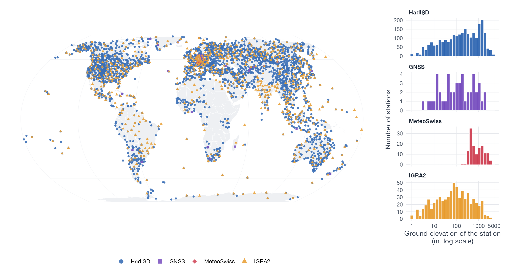

Figure 1: Reference stations used: HadISD, GNSS, MeteoSwiss and IGRA2 radiosondes.

### From raw data to reference stations

Each dataset goes through four steps (<a href="#tbl-steps" class="quarto-xref">Table 2</a>): keeping stations with enough data, thinning dense networks, removing gross errors, and checking that the height of each barometer can be trusted. The principles are the same for all datasets; only their implementation differs.

Table 2: Selection and quality control of the references: criterion and stations kept / stations before the step (share removed). Step 3 removes observations, not stations.

| step | HadISD | GNSS | MeteoSwiss | IGRA2 |
|:---|:---|:---|:---|:---|
| 1\. Enough data | pressure on ≥ 50% of days each year, ≥ 6-hourly | ≥ 180 days of data | barometer height published | ≥ 100 soundings |
|  | 6,204 / 8,381 (\<U+2212\>26%) | 66 / 79 (\<U+2212\>16%) | 138 / 158 (\<U+2212\>13%) | 736 / 772 (\<U+2212\>5%) |
| 2\. Spatial thinning | one station per 2° cell + all above 1000 m | none (small network) | none (small network) | as HadISD |
|  | 2,646 / 6,204 (\<U+2212\>57%) |  |  | 702 / 736 (\<U+2212\>5%) |
| 3\. Gross errors | \> 100 m and 10 robust SD from the station’s median | as HadISD | as HadISD | \> 150 m and 10 robust SD from the median of the height bin |
|  | 0.03% of observations | 0.01% of observations | 0.00% of observations | 0.04% of levels |
| 4\. Barometer height | screen: step change, gross-error rate, implausible offset | two height records agree within 1 m | published height used as given | not needed; ≥ 100 soundings with usable levels |
|  | 2,502 / 2,646 (\<U+2212\>5%) | 47 / 66 (\<U+2212\>29%) |  | 648 / 702 (\<U+2212\>8%) |

**1. Enough data.** A station’s systematic error (bias) and its scatter can only be estimated reliably from a long and regular record that samples the daily and annual cycles. Stations reporting rarely or for a few weeks would add noise to every summary, so each dataset keeps only stations with a record spanning most of the study period.

**2. Spatial thinning.** HadISD and IGRA2 are dense in Europe, North America and East Asia and sparse elsewhere. Kept as they are, a few countries would dominate the global statistics, and neighbouring stations, which share the same ERA5 grid cells and weather, would count as independent evidence. We therefore keep one random station per 2°×2° cell (about 200 km), plus every station above 1000 m, because mountain stations are scarce and are where errors are expected to be largest; the cell weights described below then stop these extra mountain stations from tilting global summaries. The GNSS and MeteoSwiss networks are small and are used in full. A random 100 of the HadISD stations that also reported in 1990, 2005 and 2015 are used to test change over time.

**3. Gross errors.** Isolated values far from the rest of a station’s record, such as typing, encoding or unit errors, say nothing about ERA5 but would inflate the error statistics. They are removed with a robust rule that only catches values no atmospheric process can produce: more than 100 m and 10 robust SD from the station’s median error (for radiosondes, more than 150 m from the median of the height bin, as the error grows with height). Such values are rare (<a href="#tbl-steps" class="quarto-xref">Table 2</a>).

**4. Barometer height.** The height of the reference must be right to within a few metres. A wrong height shifts every altitude at that station by a constant, which looks exactly like a local ERA5 error, and ERA5 cannot be used to tell them apart: it gives each assimilated station a slowly varying bias correction that absorbs any persistent offset, whatever its cause (Hersbach et al. 2020). We therefore rely on documentation where it exists, and on the signatures of station errors where it does not:

- *IGRA2:* not needed. The error at each level is taken relative to the error at the surface level of the same sounding, which cancels any error in the station elevation and isolates how the error grows with height.
- *MeteoSwiss:* the published barometer height is used as given.
- *GNSS:* each station documents its barometer height twice, in its log file (antenna position plus the height of the barometer relative to it) and in each daily data file, and is kept when both agree within 1 m. GNSS heights refer to a mathematical ellipsoid and are converted to heights above sea level with the EGM96 geoid model, as used for ERA5’s orography; the more recent EGM2008 (Pavlis et al. 2012) changes the results by at most 1.8 m.
- *HadISD:* synoptic station pressure is biased at several hundred stations worldwide, often by several hPa, “mostly … \[because of\] incorrect assumptions about the station heights”, and the bias stays fairly constant in time (Vasiljevic et al. 2006; Haiden et al. 2018). Typical causes are wrong elevation metadata, GNSS elevations without geoid correction, pressure reported at a barometer height different from the listed elevation (WMO 2023) and barometer moves (ECMWF 2025), none of which HadISD’s quality control tests for (Dunn et al. 2012, 2016). Three rules screen them: a **step change** in the station’s error during 2022–2024 (32 stations; one step fitted to monthly median errors with a seasonal cycle, \|step\| ≥ 10 m and \|t\| ≥ 10), since ERA5 does not jump at one site but a station does when its barometer is moved or replaced (e.g. Wu Lu Mu Qi (77 m), Mogocha (74 m), Litang (56 m)); an **unreliable barometer**, with more than 1% of gross errors (7 stations); and an **implausible offset**, a constant error larger than 30 m plus 10% of the elevation gap between the station and ERA5’s orography (106 stations). This bound is set from references that do not depend on HadISD’s elevations. Radiosondes measure ERA5’s extrapolation error over an elevation gap at -0.7 to -1.2% of the gap (within 9% at 99% of stations), and among the 185 GNSS and MeteoSwiss stations with documented heights, only 1 exceeds the bound: Zürich/Fluntern (-50.3 m), whose pressure matches the elevation listed by HadISD (558 m) rather than the published barometer height (605 m). The stations kept form the HadISD **reference set**. Neighbouring stations, DEMs and the time series of the excluded stations support that the excluded ones are station errors, and the screen affects only the tail: the median offset and the precision hardly change without it, whereas MAE and RMSE depend on a few stations with offsets of hundreds of metres ([Appendix A.4](#sec-a-screen)). Errors of a few metres that no screen can catch remain, so the error measured on the reference set is an upper bound on ERA5’s.

### Bird flight heights

To know which heights matter, we use a rough distribution of bird flight heights: the flight segments (points between stationary periods) of 274 tagged birds in the GeoLocator master data package (<https://doi.org/10.5281/zenodo.18187092>). These heights were computed with the same pressure-to-altitude conversion assessed here, but its errors of 1–2% of height do not matter for this purpose. Tags record pressure every 5 to 60 min, so each point is weighted by the time until the next one, capped at 60 min (<a href="#fig-height" class="quarto-xref">Figure 8</a> c). Raw, 12% of the flight time comes out below the ERA5 surface. Part of it is because tags at rest read a few hPa more than ERA5’s surface pressure (tag calibration, and resting sites lower than the ERA5 grid cell), so each flight is referenced to the bird’s own ground, as in GeoPressureR: the tag minus ERA5 pressure difference at departure and arrival, interpolated over the flight. The remaining 9% is near-ground flight or, mostly over mountains, flight along valleys below ERA5’s smoothed terrain, and is counted as flying at ground level. Half of the flight time is spent below 560 m above the ground and 90% below 2320 m.

## Analysis

### Error metrics

We compare the altitude retrieved by GeoPressureR with the reference height. At each station, the error is split into (1) its mean, the **bias**, which is constant in time and sets the **accuracy** of absolute altitude, and (2) the SD around that mean, which sets the **precision** of altitude changes. Across stations, accuracy is summarised by the median and 90th percentile of \|bias\|, and precision by the median and 90th percentile of the SD. For radiosondes, the bias and SD are computed per height bin above the ground (0–0.1, 0.1–0.25, 0.25–0.5, 0.5–1, 1–1.5, 1.5–2 km, then 1 km bins up to 6 km). Averaged over these bins, weighted by the share of bird flight time in each (<a href="#fig-height" class="quarto-xref">Figure 8</a> c), they give a **bird-weighted** in-flight bias, and a bird-weighted mean absolute error (MAE), which combines accuracy and precision.

Stations are unevenly spread, so every HadISD and radiosonde statistic gives each 2°×2° cell the same weight: a station counts one over the number of stations in its cell, shared among its observations. The extra stations kept above 1000 m therefore sharpen the results for mountains without tilting the global summaries towards them: they are 24% of the HadISD stations but carry 14% of the weight. The GNSS and MeteoSwiss networks are small and are summarised without weights.

### How the error varies

How accuracy and precision vary is studied with HadISD alone, the only reference that covers the globe. Each dimension is looked at separately, with accuracy and precision side by side:

- **Elevation gap.** The gap between the station and the ERA5 orography is the height over which GeoPressureR extrapolates ERA5’s surface pressure with its assumed temperature profile. It explains more of the differences between stations than station elevation or terrain roughness, with which it is strongly correlated, so it is the only terrain variable used. Its effect on \|bias\| and SD is fitted with a GAM (mgcv, on the log scale).
- **Geography.** What the gap leaves unexplained is mapped as the median, over 5°×5° cells, of the station bias and of the station SD divided by the SD expected from its gap.
- **Climate zone**, the main Köppen-Geiger zone.
- **Season and time of day.** The bias and SD are computed at each station for each month and each 3 h bin of local solar hour (southern hemisphere shifted by six months).
- **Change over time.** The 100 HadISD stations sampled among those that also reported in 1990, 2005 and 2015 (step 2) are evaluated in each of these years; 97 have enough data in all of them.

For each class, we show the distribution of the station bias and SD by its median and its 25–75% and 10–90% ranges. A joint GAM of all these variables, and of weather variables at the hourly level, gives the same picture ([Appendix A.1](#sec-a-offset)).

In flight, the bias is compared between climate zones and between summer and winter half-years. It is also compared with the error expected from the temperature assumption alone, $\Delta z \cdot (\bar T_\text{assumed} - \bar T_\text{obs}) / \bar T_\text{obs}$, with $\bar T_\text{obs}$ the sonde’s mean temperature of the column below the level, for levels more than 200 m above the ground.

### ERA5-Land vs ERA5 single-levels

Every evaluation is repeated with ERA5-Land, with the same metrics. On the ground, the two products are compared at the three ground references. In flight, the error is taken relative to the surface level of the same sounding, so a constant offset of the reference level cancels: comparing the two products in flight separates an error of the reference level (the orography and surface pressure of each product) from an error of the temperature profile above it.

### Formula changes

Three changes to the GeoPressureR formula, which assumes dry air and a lapse rate of −6.5 K/km from the 2 m temperature, are tested on the radiosondes:

1.  **Virtual temperature.** The 2 m temperature is replaced by the 2 m virtual temperature, which accounts for the lower density of moist air. It uses the specific humidity computed from the ERA5 2 m dewpoint and surface pressure (vapour pressure from Bolton 1980), assuming that surface humidity holds through the column, as in pressure reduction to sea level (WMO 1968).
2.  **Constant fitted lapse rate.** The lapse rate $L$ is fitted by minimising the bird-weighted squared error, with the 2 m temperature and with the 2 m virtual temperature.
3.  **Lapse rate varying with season and latitude.** With the virtual temperature, $L = b_1 + b_2 a + (b_3 + b_4 a)\cos(2\pi(d - 15)/365.25)$, with $a$ the absolute latitude divided by 90° and $d$ the day of year (southern hemisphere shifted by six months): a mean lapse rate and a seasonal cycle peaking in mid-winter, both changing linearly with latitude. Its four parameters are fitted on the same objective, and $L$ is kept between −9.5 and −2 K/km.

The fitted lapse rates are tested with 20 random 50/50 station splits (fitting on one half, evaluating on the other). The constant lapse rate is also fitted separately per climate zone and half-year, and with an alternative objective that weights all height bins equally. The effect of the changes on the ground is evaluated on the HadISD reference set. All other results use the GeoPressureR formula.

### Reliability of the references

The stations with documented barometer heights are used for three checks of the HadISD results:

- *Accuracy and precision.* The GNSS and MeteoSwiss stations are summarised like the HadISD reference set and compared with it.
- *HadISD elevations.* At the Swiss stations present in both HadISD and MeteoSwiss, the HadISD bias is compared with the difference between the elevation listed by HadISD and the published barometer height.
- *Assimilation.* If ERA5 were drawn towards the stations it assimilates, it would fit them better than other places. We compare stations never assimilated (GNSS, and MeteoSwiss stations absent from ISD, which receives most of its data through the same exchange as ERA5) with assimilated ones (HadISD, and the other MeteoSwiss stations) within the same terrain-roughness class. We also compare the precision of HadISD stations in flat terrain by the number of other HadISD stations within 300 km, since an isolated observation weighs most in the analysis.

The effect of the barometer-height screen (step 4) is assessed by comparing the reference set with all stations, and with looser and stricter bounds ([Appendix A.4](#sec-a-screen)).

# Results

## Accuracy and precision on the ground

Table 3: Altitude error at ground level at the reference stations, 2022–2024 (m).

| reference | ERA5 | stations | Accuracy: median \|bias\| | Accuracy: p90 \|bias\| | Precision: median SD | Precision: p90 SD |
|:---|:---|---:|:---|:---|:---|:---|
| HadISD | ERA5 single-levels | 2502 | 2.5 | 11.4 | 3.6 | 7.0 |
| GNSS | ERA5 single-levels | 47 | 2.3 | 8.7 | 3.0 | 7.0 |
| MeteoSwiss | ERA5 single-levels | 138 | 2.9 | 9.7 | 5.4 | 13.5 |
| HadISD | ERA5-Land | 2160 | 9.5 | 58.3 | 5.0 | 9.6 |
| GNSS | ERA5-Land | 40 | 10.7 | 63.7 | 4.3 | 11.3 |
| MeteoSwiss | ERA5-Land | 138 | 35.2 | 121.7 | 9.0 | 17.4 |

- **On the ground, GeoPressureR’s altitude is typically within a few metres** (<a href="#tbl-main" class="quarto-xref">Table 3</a>): the median station has a constant bias of 2.5 m and a scatter (SD) of 3.6 m around it.
- **But the bias is skewed.** At 10% of the stations it exceeds 11.4 m, 4× the median, while the SD only doubles (7.0 m). A user should expect a small offset at most sites, and an offset of tens of metres at a few, mostly where ERA5’s smoothed terrain departs from the real one (next section).
- **The three references agree**, so these figures do not depend on HadISD’s metadata (see also Reliability of the references).

## How the error varies

### Elevation gap

The elevation gap is how far the station lies above or below ERA5’s smoothed terrain (the ERA5 orography of its 0.25° cell), and thus the height over which GeoPressureR has to extrapolate ERA5’s surface pressure.

- **The bias spreads with the gap, but stays centred on zero** (<a href="#fig-gap" class="quarto-xref">Figure 2</a> a). The expected \|bias\| grows from 2.3 m where ERA5’s terrain matches the station to 6.6 m for a 1000 m gap, but the gap explains only 6% of the differences in log \|bias\|: large biases occur at every gap.
- **Precision degrades steeply above a gap of ~100 m** (<a href="#fig-gap" class="quarto-xref">Figure 2</a> b). The expected SD is 3.3 m without a gap, 4.0 m for a 100 m gap and 12.1 m for a 1000 m gap. The gap explains 39% of the differences in log SD between stations.

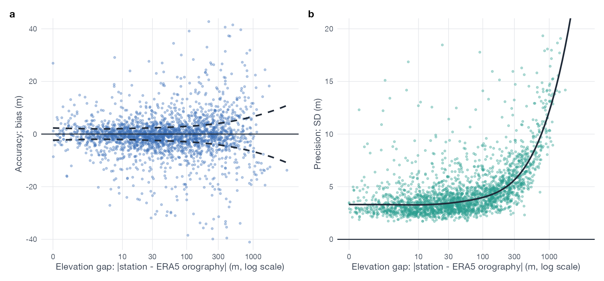

Figure 2: Bias (a) and SD (b) per station against the elevation gap, the absolute difference between station elevation and ERA5 orography (HadISD reference set). Dashed: ± the expected \|bias\|; solid: the expected SD (GAM fits).

### Geography

- **Accuracy: biases form regional patches of a few metres** (<a href="#fig-map-residual" class="quarto-xref">Figure 3</a> a), for example negative in southern Africa and along the Andes and positive in Southeast Asia, without a global pattern.
- **Precision: a clear regional pattern remains once the elevation gap is accounted for** (<a href="#fig-map-residual" class="quarto-xref">Figure 3</a> b). The SD is lower than expected from the elevation gap in Europe, Australia and on oceanic islands, and higher in Central and South Asia, the Sahel, southern South America and the polar regions.

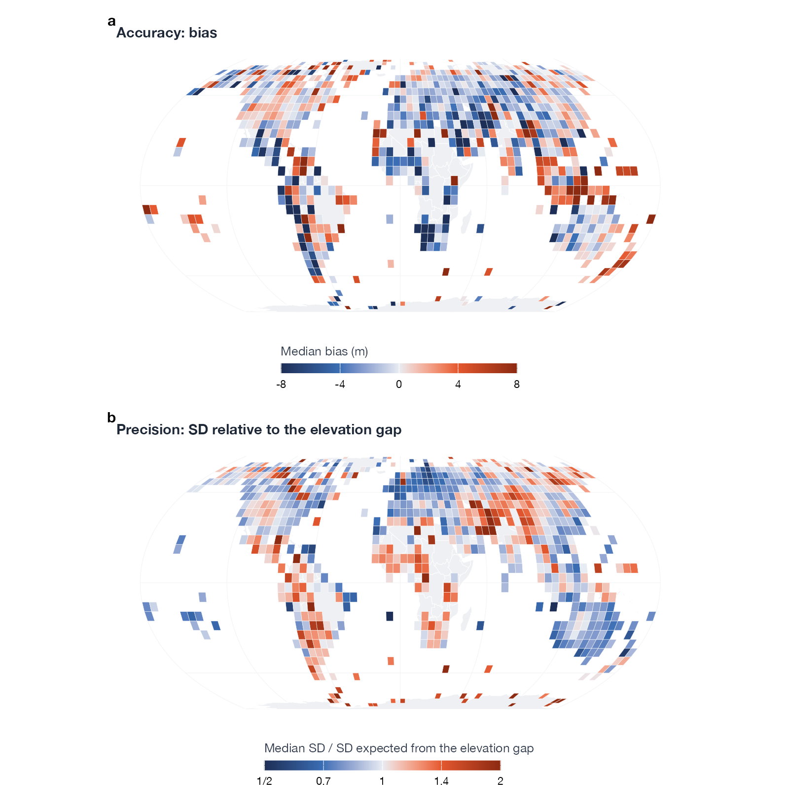

Figure 3: Median over 5°×5° cells of (a) the station bias and (b) the station SD divided by the SD expected from its elevation gap, HadISD reference set. Colours clipped at ±8 m and ×2.

### Climate zone

- **Polar stations have the lowest precision** (<a href="#fig-climate-ground" class="quarto-xref">Figure 4</a> c): median SD 5.0 m, against 3.4 to 4.0 m elsewhere.
- **Accuracy hardly differs between climate zones** (<a href="#fig-climate-ground" class="quarto-xref">Figure 4</a> b). Arid stations are slightly too low (median bias -1.6 m).

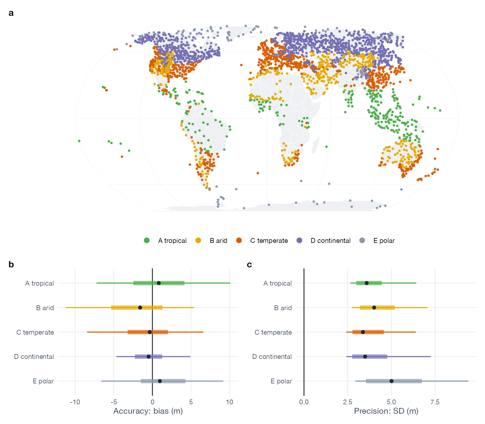

Figure 4: (a) Main Köppen-Geiger climate zone of the HadISD reference stations, and distribution of their bias (b) and SD (c) in each zone, from the lowest (top) to the highest median latitude. Point: median; thick: 25–75%; thin: 10–90% of stations.

### Over the year and the day

- **The error changes little over the year** (<a href="#fig-season-hour" class="quarto-xref">Figure 5</a> a, c). The median bias shifts from 0.3 m in winter to -1.1 m in summer, and the median SD from 3.2 to 3.7 m, small against the differences between stations.
- **Nor over the day** (<a href="#fig-season-hour" class="quarto-xref">Figure 5</a> b, d). In the afternoon, the median bias is -0.9 m and the median SD 3.8 m, against 0.1 m and 3.4 m at night.

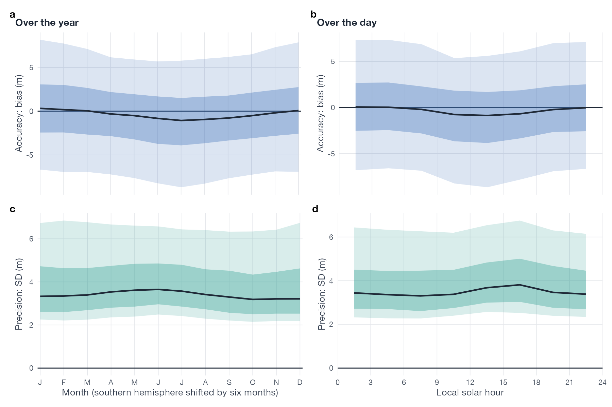

Figure 5: Distribution of the station bias (a, b) and SD (c, d) computed per month (a, c; southern hemisphere shifted by six months) and per 3 h bin of local solar hour (b, d), HadISD reference set. Line: median; bands: 25–75% and 10–90% of stations.

### Over the decades

- **ERA5 has improved, in both accuracy and precision** (<a href="#fig-era" class="quarto-xref">Figure 6</a>). For the same 97 stations, the median SD fell from 6.3 m in 1990 to 4.1 m in 2024, and the median \|bias\| from 5.9 to 4.1 m.

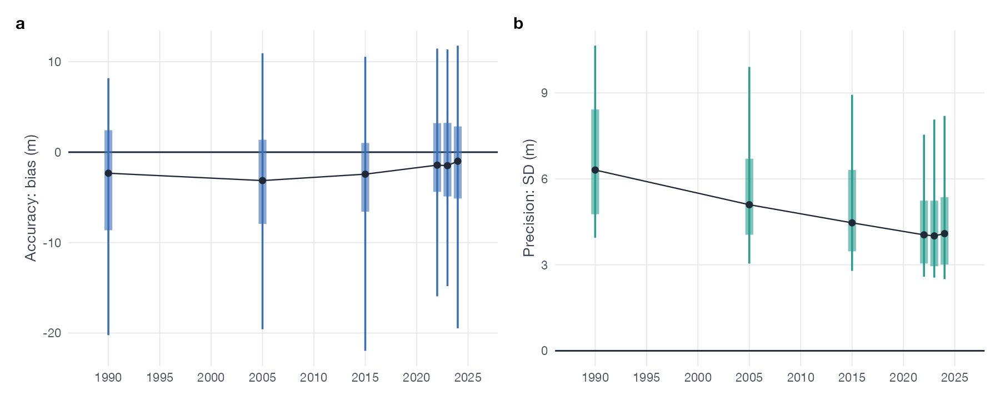

Figure 6: Distribution of the station bias (a) and SD (b) per year, for the HadISD stations reporting in every year (unweighted). Point: median; thick: 25–75%; thin: 10–90% of stations.

## ERA5-Land vs ERA5 single-levels

- **On the ground, ERA5-Land is ~4× less accurate** (<a href="#fig-land" class="quarto-xref">Figure 7</a>, <a href="#tbl-main" class="quarto-xref">Table 3</a>): median \|bias\| 9.5 m against 2.5 m at the HadISD stations, and the same holds at the GNSS and MeteoSwiss stations, so it is not an artefact of HadISD’s elevations.
- **Its precision is also lower**: median SD 5.0 m against 3.6 m.
- **In flight, the two products behave alike**: bird-weighted MAE 17.3 m with ERA5-Land against 16.4 m. Relative to the surface, the offset of the reference level cancels, so ERA5-Land’s problem is its reference level, not its temperature.

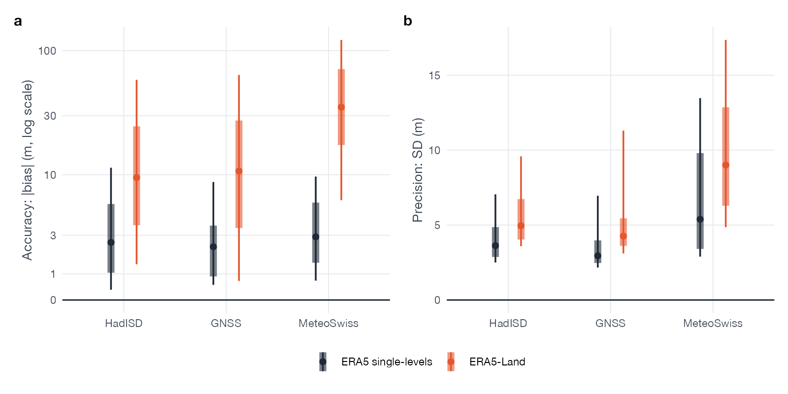

Figure 7: Station \|bias\| (a, log scale) and SD (b) with ERA5 single-levels and ERA5-Land at the three ground references. Point: median; thick: 25–75%; thin: 10–90% of stations.

## Error in flight

- **Accuracy: altitude is too low, by ~1–1.5% of the height above the ground** (<a href="#fig-height" class="quarto-xref">Figure 8</a> a): -15 m at 1–1.5 km, -35 m at 2–3 km and -91 m at 5–6 km. Most stations are biased low above 1 km.
- **Precision degrades with height as fast as accuracy** (<a href="#fig-height" class="quarto-xref">Figure 8</a> b): the median station SD reaches 14 m at 1–1.5 km and 34 m at 2–3 km, about the size of the bias.
- **Over the heights birds fly**, half of the flight time below 560 m (<a href="#fig-height" class="quarto-xref">Figure 8</a> c), the bird-weighted bias is -11.8 m and the MAE 16.4 m.
- **The temperature assumption explains it.** The error expected from the sonde’s own temperature profile explains 94% of the variance of the in-flight error (r = 0.97). The assumed layer is usually too cold (shallower real lapse rates, inversions, humidity), so the bird is placed too low.
- **Worst in continental and polar winters** (<a href="#fig-climate" class="quarto-xref">Figure 9</a>), where strong surface inversions sit under much warmer air.

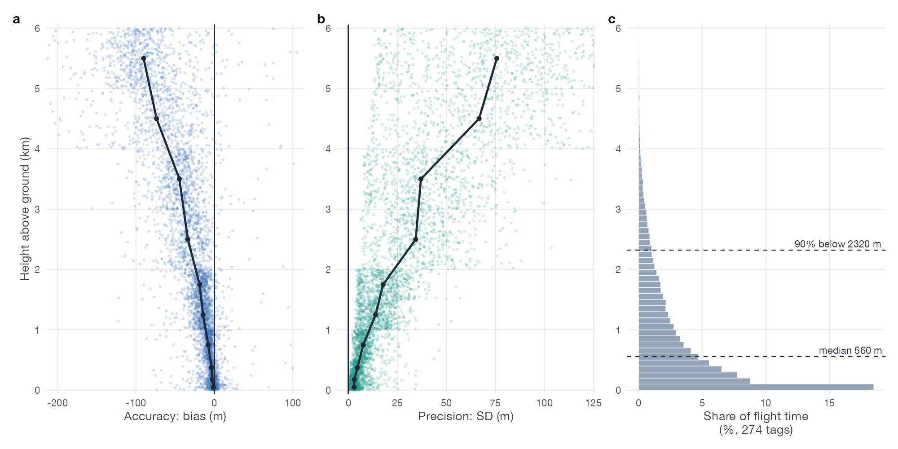

Figure 8: In-flight error against height above the ground (IGRA2, ERA5 single-levels, relative to the surface level of the same sounding). (a) Bias and (b) SD per station and height bin (points), with the cell-weighted mean bias and median SD (line). (c) Share of flight time of tracked birds by height above the ground (100 m bins; the lowest bar includes the points below the ERA5 surface); dashed: median and 90th percentile.

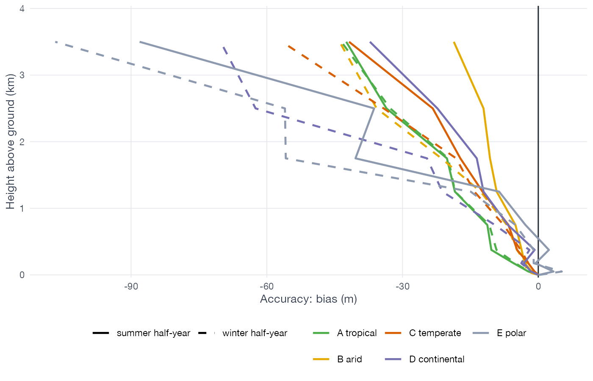

Figure 9: In-flight bias by climate zone and half-year, up to 4 km (solid: summer; dashed: winter; southern hemisphere shifted by six months).

## Formula changes

- **Constant fitted lapse rate: -4.2 K/km with the 2 m temperature, -5.1 K/km with the virtual temperature.** It is well determined: ±0.1 K/km across splits, and -5.4 K/km when all height bins weigh equally. About a third of the gap to −6.5 K/km is humidity.
- **Virtual temperature alone** reduces the held-out bias from -11.9 m to -6.8 m. The correction ranges from 0.3 K (polar winter) to 3.4 K (tropics).
- **Virtual temperature with the constant fitted lapse rate**: bias -2.3 m, MAE 16.4 → 13.5 m, better in all 20 splits. With the global value, regional and seasonal biases remain (<a href="#fig-formula-climate" class="quarto-xref">Figure 11</a>, middle): fitted per climate zone and half-year, the lapse rate ranges from -6.9 K/km (arid summer) to -2.7 K/km (polar winter).
- **A lapse rate varying with season and latitude follows these differences** (<a href="#fig-lapse-var" class="quarto-xref">Figure 10</a>). It stays near -6.6 K/km all year at the equator, while at 60° it goes from -6.2 K/km in summer to -2.1 K/km in winter, when surface inversions are frequent. On held-out stations, the bias is the same (-2.3 m), but the MAE drops to 13.0 m and the RMSE to 24.6 m, better than the constant lapse rate in every split. The remaining bias in continental and polar winters is roughly halved (<a href="#fig-formula-climate" class="quarto-xref">Figure 11</a>, right). The four parameters vary little between splits (SD below 0.4 K/km).
- **No change on the ground.** On the HadISD reference set, the pooled MAE goes from 6.07 m to 6.08 m with the constant lapse rate and 6.09 m with the varying one.
- **Precision does not change** (<a href="#fig-formula" class="quarto-xref">Figure 12</a> b). The corrections remove the bias up to ~3 km, but the SD stays the same: no lapse rate set from the date and place can follow the day-to-day temperature profile.

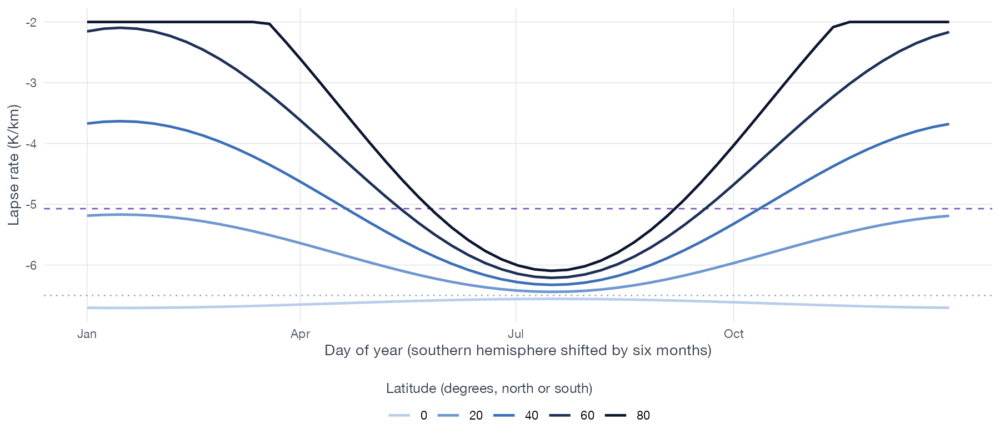

Figure 10: Lapse rate varying with season and latitude, fitted on all radiosonde stations (with the virtual temperature; capped at −2 K/km). Dashed: constant fitted lapse rate; dotted: −6.5 K/km.

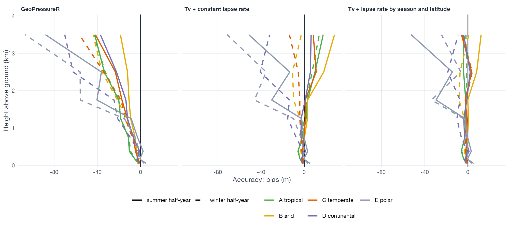

Figure 11: In-flight bias by climate zone and half-year: GeoPressureR formula (left), virtual temperature with the constant fitted lapse rate (middle) and with the lapse rate varying with season and latitude (right), up to 4 km. Solid: summer; dashed: winter.

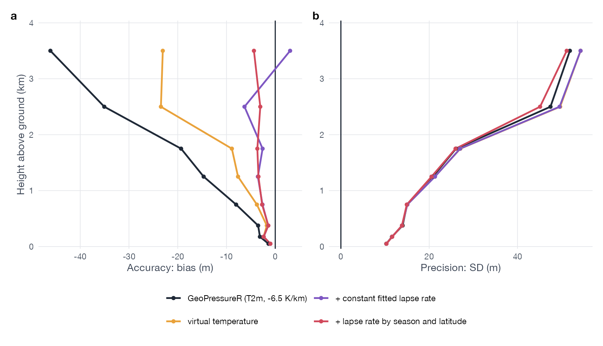

Figure 12: Bias (a) and SD (b) against height, up to 4 km, for the GeoPressureR formula and the formula changes (lapse rates fitted on all stations).

## Reliability of the references

Table 4: Ground-level error with different references and selections, ERA5 single-levels (m). HadISD: before (all stations) and after the barometer-height screen. GNSS height-checked: the two height records of the station agree within 1 m. MeteoSwiss not in ISD: probably not assimilated by ERA5.

|  | stations | Accuracy: median \|bias\| | Accuracy: p90 \|bias\| | Precision: median SD | Precision: p90 SD |
|:---|---:|:---|:---|:---|:---|
| HadISD, all stations | 2646 | 2.8 | 15.9 | 3.7 | 7.4 |
| HadISD, reference set | 2502 | 2.5 | 11.4 | 3.6 | 7.0 |
| GNSS, all | 66 | 2.8 | 14.5 | 3.2 | 6.3 |
| GNSS, height-checked | 47 | 2.3 | 8.7 | 3.0 | 7.0 |
| GNSS, height-checked, barometer | 30 | 1.9 | 4.6 | 2.6 | 4.8 |
| GNSS, height-checked, weather transmitter | 14 | 1.7 | 9.4 | 3.7 | 7.0 |
| MeteoSwiss, all | 138 | 2.9 | 9.7 | 5.4 | 13.5 |
| MeteoSwiss, not in ISD | 9 | 4.4 | 14.5 | 7.2 | 14.6 |

- **Checking the barometer height matters for the tail, not for the typical error** (<a href="#tbl-indep" class="quarto-xref">Table 4</a>). Without the screen, HadISD’s median \|bias\| barely changes, but its 90th percentile rises from 11.4 to 15.9 m, driven by a few stations with offsets of hundreds of metres ([Appendix A.4](#sec-a-screen)). Likewise, the GNSS stations whose two height records disagree widen the 90th percentile from 8.7 to 14.5 m.
- **HadISD elevations explain much of its station-to-station spread** ([Appendix A.2](#sec-a-elevation)). At the 32 Swiss stations present in both datasets, the HadISD bias follows the difference between the elevation listed by HadISD and the published barometer height almost one for one (r = 0.93): the median \|bias\| drops from 7.2 m with HadISD’s elevations to 3.8 m with the barometer heights, and 12 of the 31 stations that pass our screen have an elevation more than 5 m off.
- **Assimilation does not flatter ERA5.** In flat terrain, the GNSS stations, never assimilated, have a median \|bias\| of 2.5 m and SD of 2.5 m, comparable to the 1.9 m and 3.1 m of HadISD, and isolated HadISD stations do not have better precision than those in dense networks ([Appendix A.5](#sec-a-assim)).

# Discussion

## How accurate is the altitude from GeoPressureR?

| Situation | Typical error | Main cause |
|----|----|----|
| Absolute altitude on the ground, flat terrain | bias 1.9 m (p90 8.3 m), MAE 4.6 m | ERA5 surface pressure at 0.25° |
| Absolute altitude on the ground, mountains | bias 5.9 m (p90 24.1 m), MAE 13.4 m | terrain the 0.25° grid can’t resolve |
| Altitude *changes* at one site | SD 3.1 m (flat) to 8.2 m (mountains) | as above; almost no diurnal or seasonal cycle |
| In flight, 1–1.5 km above ground | -15 m bias, RMSE 25 m (on top of the ground error) | assumed temperature profile |
| In flight, 2–3 km above ground | -35 m bias, RMSE 59 m | as above; ~2× in continental/polar winter |

**On the ground, the error is a fixed offset per place, not noise.** Station identity explains almost all the explainable variation of the error, and hour of day, season or weather hardly matter ([Appendix A.1](#sec-a-offset)). The offset comes from the terrain the 0.25° grid cannot resolve, so it roughly triples from flat terrain to mountains. For users, this means that altitude changes at one site are more reliable than absolute altitudes, and that comparing absolute altitudes between distant sites, or with a fine-scale DEM, should allow for tens of metres in mountains. These figures do not depend on HadISD’s metadata or on our screen: the GNSS and MeteoSwiss stations, whose barometer heights are documented, give the same accuracy and precision (<a href="#tbl-indep" class="quarto-xref">Table 4</a>), and the typical error hardly changes with the screen ([Appendix A.4](#sec-a-screen)).

**HadISD’s accuracy is, if anything, pessimistic.** In Switzerland, where barometer heights are published, about half of HadISD’s apparent error comes from listed elevations that are not the barometer height, including at stations that pass our screen ([Appendix A.2](#sec-a-elevation)). Much of the station-to-station spread in HadISD is thus an error of the reference, not of ERA5, which no screen based on the error itself can remove without also removing genuine ERA5 errors.

**In flight, the error is systematic and grows with height.** It comes almost entirely from the difference between the assumed and the real temperature profile, which explains 94% of its variance ([Appendix A.3](#sec-a-temperature)). Because the assumed layer is usually too cold, flight altitudes from GeoPressureR are conservative: a bird at 2 km above the ground is placed about 25–35 m too low, with a scatter of 30–50 m, and both roughly double in continental and polar winters, when strong surface inversions sit under much warmer air. For the same reason, the bias is two to four times larger at night than during the day ([Appendix B](#sec-b)).

**Older tracks are somewhat less accurate.** ERA5’s ground-level bias in 1990 was about 1.5 times that of 2024, likely because fewer observations constrained the reanalysis then.

**Comparison with validations of ERA5 surface pressure.** Our median \|bias\| (2.5 m ≈ 0.3 hPa) and scatter (3.6 m ≈ 0.4 hPa) are smaller than the ~1 hPa RMSE typically reported for ERA5 surface pressure (Huang et al. 2023), because the RMSE pools both, and because those validations neither screen station heights nor extrapolate ERA5 to the station with its own temperature as GeoPressureR does. Validations of reanalysis pressure against GNSS meteorological sensors found that about a quarter of IGS stations needed to be removed for offsets or noise (Wang et al. 2017), consistent with our sensor-height check and screen ([Appendix A.4](#sec-a-screen)).

## What does the error represent, and does assimilation flatter it?

**What the error is made of.** At each hour, the difference between the retrieved altitude and the height of the reference combines three things: (i) *representativeness*, mostly the extrapolation from the 0.25° ERA5 orography to the height of the reference through the assumed temperature profile, which dominates in rough terrain and in flight; (ii) the *analysis error* of ERA5’s surface pressure, of the order of 0.2–0.4 hPa (2–3 m; Soci et al. 2024); and (iii) *errors of the reference*, sensor noise and, for the tail of large constant offsets, wrong barometer heights. For a user, (i) and (ii) are the error of the retrieval; (iii) is noise in our yardstick, which the screen and the references with documented heights address ([Appendix A.2](#sec-a-elevation), [A.4](#sec-a-screen)).

**ERA5 does not copy the observations it assimilates.** Its 4D-Var analysis weighs each surface pressure observation, given an error of ~0.5 hPa (Bell et al. 2021), against a short-range forecast of similar accuracy (first-guess departures ~0.57 hPa; Hersbach et al. 2020). In dense networks, a single surface pressure observation contributes about 20% of the analysis at its own location, approaching 100% only at isolated stations (Cardinali et al. 2004), and its increment is spread smoothly over hundreds of kilometres, as increments are computed on a ~80 km grid (Bell et al. 2021). Assimilation thus corrects the large-scale pressure field around a station, but cannot create the sub-grid structure that dominates the ground error. Persistent offsets are absorbed by a bias correction specific to each station (Hersbach et al. 2020), so ERA5 is pulled neither towards a station’s constant error nor away from its own local error there. One therefore expects constant biases (accuracy) to be about the same at assimilated and independent stations, and the temporal scatter (precision) to be at most moderately optimistic at assimilated stations; linear analysis theory with the values above suggests by a factor of 1.2–1.5 at most (our estimate).

**The data agree.** Stations never assimilated (GNSS) are fitted as well as assimilated HadISD stations in the same terrain, and isolated stations, where an observation weighs most, do not fit better than stations in dense networks; if anything, they fit slightly worse, which reflects better-constrained analyses in dense networks rather than overfitting ([Appendix A.5](#sec-a-assim)). The few Swiss stations probably not assimilated are too few to tell.

Our accuracy and precision therefore describe what a user can expect away from the stations, not only at them. The caveat is regional: where stations are sparse (parts of Africa, South America, Siberia), ERA5 itself is less constrained, and the error is probably larger than our global figures, as the improvement of ERA5 since 1990 also suggests.

## ERA5 single-levels or ERA5-Land?

**Use ERA5 single-levels for altitude.** ERA5-Land’s finer grid does not help, because its orography is inconsistent with its surface pressure, which shifts every altitude by a fixed offset that depends on the place ([GeoPressureAPI#27](https://github.com/GeoPressure/GeoPressureAPI/issues/27)). The flight comparison, where this offset cancels and both products agree, confirms that the problem lies in this reference level and not in ERA5-Land’s weather.

## Can the formula be improved?

**Add the virtual temperature.** It corrects a simplification of the current formula, has no free parameter, and on its own removes about 40% of the in-flight bias. It only requires reading the ERA5 2 m dewpoint in addition to the surface pressure and 2 m temperature.

**Combine it with a lapse rate of -5.1 K/km.** The held-out in-flight bias drops from -11.9 m to -2.3 m, with no effect on the ground. The estimate is stable across station splits and objectives, and it lies within the range reported near the surface. A dry-air fit (-4.2 K/km) does about as well statistically, but it folds humidity and the temperature profile into one constant with no physical meaning, which is harder to interpret and to refine.

**Let the lapse rate vary with season and latitude.** A constant lapse rate leaves the winter tracks of mid- and high-latitude birds too low, because surface inversions make the real lapse rate much shallower then. Four parameters, a mean and a winter cycle that both grow with latitude, capture most of this: the MAE drops by another 0.5 m on held-out stations, the regional and seasonal biases roughly halve, and the parameters are stable across station splits. The form is simple and smooth, so it should transfer to places without radiosondes, and it only needs the date and position GeoPressureR already has. We therefore recommend it, with the virtual temperature, for GeoPressureR.

**Precision is the limit.** No lapse rate set from the date and place can follow the day-to-day temperature profile (inversions, deep convective boundary layers), so the in-flight scatter is unchanged by all the formula changes. Reducing it needs the ERA5 temperature profile or geopotential on pressure levels, which could remove most of the temperature-driven variance (94% of the in-flight error), but needs far more ERA5 data per point.

## GeoPressureAPI

GeoPressureR can also compute altitude through [GeoPressureAPI](https://github.com/GeoPressure/GeoPressureAPI) (`source = "api"`), which applies the same computation on Google Earth Engine. Across 2,330 station-hours at 25 stations, the two differ by at most 0.08 m, so all results apply to either.

## Limitations

- **The sensor is not included.** These are errors of the retrieval, given a perfect pressure reading; a geolocator’s own offset, drift and resolution add to them.
- **Radiosonde geometry.** The ERA5 column at the launch site is used, and balloon drift (a few km below 5 km) is ignored. Sonde heights are themselves hypsometric. The ~10 m scatter in the first 100 m partly reflects integer-metre reporting.
- **Reference heights.** HadISD elevations are not always those of the barometer, and the screen cannot catch errors of a few metres; the GNSS and MeteoSwiss stations, with documented heights, are few and unevenly spread (about half the GNSS stations are in Germany).
- **Sampling.** Thinning and cell weights even out station density only where stations exist: parts of Africa, South America and Siberia remain sparsely covered, and all references are on land.

# Data and code availability

- **Code, derived tables and figures:** <https://github.com/GeoPressure/altitude-validation> (code MIT; tables, figures and this report CC BY 4.0). Every step can be rerun with `Rscript run_all.R`. Code and the downloaded data needed to rerun it (all but HadISD) are archived on Zenodo, <https://doi.org/10.5281/zenodo.XXXXXXX>.
- **GeoPressureR** 3.6.3.9000 (): <https://github.com/GeoPressure/GeoPressureR>, documentation <https://raphaelnussbaumer.com/GeoPressureR/>. **GeoPressureAPI:** <https://github.com/GeoPressure/GeoPressureAPI>.
- **ERA5 single-levels** (<https://doi.org/10.24381/cds.adbb2d47>) **and ERA5-Land** (<https://doi.org/10.24381/cds.e2161bac>): Copernicus Climate Change Service, read from the ECMWF ARCO archive (<https://github.com/google-research/arco-era5>), as GeoPressureR does.
- **HadISD v3.4.3.2025f:** Met Office Hadley Centre, <https://www.metoffice.gov.uk/hadobs/hadisd/>, Non-Commercial Government Licence. It may contain data governed by WMO Resolution 40 Annex 1; only derived statistics are published here.
- **IGRA v2.2:** NOAA NCEI, <https://doi.org/10.7289/V5X63K0Q>.
- **GNSS meteorological data:** International GNSS Service (IGS) and EUREF Permanent GNSS Network, daily RINEX met files from the BKG GNSS Data Center (<https://igs.bkg.bund.de>); site logs from IGS (<https://files.igs.org/pub/station/log/>) and EPN (<https://epncb.oma.be/ftp/station/log/>).
- **MeteoSwiss:** SwissMetNet open data (<https://data.geo.admin.ch/ch.meteoschweiz.ogd-smn>), “Source: MeteoSwiss”. Assimilation status from the ISD station history (<https://www.ncei.noaa.gov/pub/data/noaa/isd-history.csv>).
- **Geoid models:** EGM96 and EGM2008, NGA (grids distributed with PROJ, <https://cdn.proj.org>).
- **Bird heights:** GeoLocator master data package (<https://doi.org/10.5281/zenodo.18187092>).
- **DEMs:** Mapzen terrain tiles (<https://registry.opendata.aws/terrain-tiles/>), SRTM GL1 (<https://doi.org/10.5067/MEaSUREs/SRTM/SRTMGL1.003>) and ASTER GDEM v3 (<https://doi.org/10.5067/ASTER/ASTGTM.003>), via OpenTopoData (<https://www.opentopodata.org>).
- **Climate zones:** Köppen-Geiger, 1986–2010, from the kgc R package (<https://cran.r-project.org/package=kgc>). **Basemaps:** Natural Earth (<https://www.naturalearthdata.com>).

# References

- Bäckman J, Andersson A, Alerstam T, Pedersen L, Sjöberg S, Thorup K, Tøttrup AP (2017) Activity and migratory flights of individual free-flying songbirds throughout the annual cycle: method and first case study. *Journal of Avian Biology* 48:309–319. <https://doi.org/10.1111/jav.01068>
- Bell B, Hersbach H, Simmons A, et al. (2021) The ERA5 global reanalysis: preliminary extension to 1950. *Quarterly Journal of the Royal Meteorological Society* 147:4186–4227. <https://doi.org/10.1002/qj.4174>
- Bolton D (1980) The computation of equivalent potential temperature. *Monthly Weather Review* 108:1046–1053. <https://doi.org/10.1175/1520-0493(1980)108%3C1046:TCOEPT%3E2.0.CO;2>
- Cardinali C, Pezzulli S, Andersson E (2004) Influence-matrix diagnostic of a data assimilation system. *Quarterly Journal of the Royal Meteorological Society* 130:2767–2786. <https://doi.org/10.1256/qj.03.205>
- Doniol-Valcroze P, Beggs I, Bell F, et al. (2026) Multi-sensor logger tracking reveals the threats of offshore windfarms to passerine-sized birds. *Conservation Letters* 19:e70077. <https://doi.org/10.1111/con4.70077>
- Dufour P, Nussbaumer R, Briedis M, et al. (2026) Ecological barrier crossing strategies in small migratory birds depend on wing morphology and plumage color. *iScience* 29:114466. <https://doi.org/10.1016/j.isci.2025.114466>
- Dunn RJH, Willett KM, Thorne PW, et al. (2012) HadISD: a quality-controlled global synoptic report database for selected variables at long-term stations from 1973–2011. *Climate of the Past* 8:1649–1679. <https://doi.org/10.5194/cp-8-1649-2012>
- Dunn RJH, Willett KM, Parker DE, Mitchell L (2016) Expanding HadISD: quality-controlled, sub-daily station data from 1931. *Geoscientific Instrumentation, Methods and Data Systems* 5:473–491. <https://doi.org/10.5194/gi-5-473-2016>
- Durre I, Vose RS, Wuertz DB (2006) Overview of the Integrated Global Radiosonde Archive. *Journal of Climate* 19:53–68. <https://doi.org/10.1175/JCLI3594.1>
- Durre I, Yin X, Vose RS, et al. (2018) Enhancing the data coverage in the Integrated Global Radiosonde Archive. *Journal of Atmospheric and Oceanic Technology* 35:1753–1770. <https://doi.org/10.1175/JTECH-D-17-0223.1>
- ECMWF (2025) Guidance on SYNOP surface pressure monitoring issues. ECMWF Confluence (E. Kuscu). <https://confluence.ecmwf.int/pages/viewpage.action?pageId=298952900>
- Haiden T, Dahoui M, Ingleby B, et al. (2018) Use of in situ surface observations at ECMWF. ECMWF Technical Memorandum 834. <https://www.ecmwf.int/sites/default/files/elibrary/2018/80920-use-situ-surface-observations-ecmwf.pdf>
- Hersbach H, Bell B, Berrisford P, et al. (2020) The ERA5 global reanalysis. *Quarterly Journal of the Royal Meteorological Society* 146:1999–2049. <https://doi.org/10.1002/qj.3803>
- Huang L, Fang X, Zhang T, et al. (2023) Evaluation of surface temperature and pressure derived from MERRA-2 and ERA5 reanalysis datasets and their applications in hourly GNSS precipitable water vapor retrieval over China. *Geodesy and Geodynamics* 14:111–120. <https://doi.org/10.1016/j.geog.2022.08.006>
- ICAO (1993) *Manual of the ICAO Standard Atmosphere*, Doc 7488/3, 3rd ed. International Civil Aviation Organization, Montreal.
- ISO (1975) *ISO 2533:1975 Standard Atmosphere*. International Organization for Standardization.
- Liechti F, Bauer S, Dhanjal-Adams KL, Emmenegger T, Zehtindjiev P, Hahn S (2018) Miniaturized multi-sensor loggers provide new insight into year-round flight behaviour of small trans-Sahara avian migrants. *Movement Ecology* 6:19. <https://doi.org/10.1186/s40462-018-0137-1>
- Minder JR, Mote PW, Lundquist JD (2010) Surface temperature lapse rates over complex terrain: lessons from the Cascade Mountains. *Journal of Geophysical Research* 115:D14122. <https://doi.org/10.1029/2009JD013493>
- Muñoz-Sabater J, Dutra E, Agustí-Panareda A, et al. (2021) ERA5-Land: a state-of-the-art global reanalysis dataset for land applications. *Earth System Science Data* 13:4349–4383. <https://doi.org/10.5194/essd-13-4349-2021>
- NASA/METI/AIST/Japan Spacesystems and U.S./Japan ASTER Science Team (2019) ASTER Global Digital Elevation Model V003. NASA EOSDIS Land Processes DAAC. <https://doi.org/10.5067/ASTER/ASTGTM.003>
- NASA JPL (2013) NASA Shuttle Radar Topography Mission Global 1 arc second. NASA EOSDIS Land Processes DAAC. <https://doi.org/10.5067/MEaSUREs/SRTM/SRTMGL1.003>
- Nussbaumer R, Gravey M, Briedis M, Liechti F (2023a) Global positioning with animal-borne pressure sensors. *Methods in Ecology and Evolution* 14:1104–1117. <https://doi.org/10.1111/2041-210X.14043>
- Nussbaumer R, Gravey M, Briedis M, Liechti F, Sheldon D (2023b) Reconstructing bird trajectories from pressure and wind data using a highly optimized hidden Markov model. *Methods in Ecology and Evolution* 14:1118–1129. <https://doi.org/10.1111/2041-210X.14082>
- Pavlis NK, Holmes SA, Kenyon SC, Factor JK (2012) The development and evaluation of the Earth Gravitational Model 2008 (EGM2008). *Journal of Geophysical Research: Solid Earth* 117:B04406. <https://doi.org/10.1029/2011JB008916>
- Rime Y, Nussbaumer R, Briedis M, et al. (2023) Multi-sensor geolocators unveil global and local movements in an Alpine-breeding long-distance migrant. *Movement Ecology* 11:19. <https://doi.org/10.1186/s40462-023-00381-6>
- Rodríguez E, Morris CS, Belz JE (2006) A global assessment of the SRTM performance. *Photogrammetric Engineering & Remote Sensing* 72:249–260. <https://doi.org/10.14358/PERS.72.3.249>
- Rolland C (2003) Spatial and seasonal variations of air temperature lapse rates in Alpine regions. *Journal of Climate* 16:1032–1046. <https://doi.org/10.1175/1520-0442(2003)016%3C1032:SASVOA%3E2.0.CO;2>
- Sjöberg S, Pedersen L, Malmiga G, et al. (2018) Barometer logging reveals new dimensions of individual songbird migration. *Journal of Avian Biology* 49:e01821. <https://doi.org/10.1111/jav.01821>
- Smith A, Lott N, Vose R (2011) The Integrated Surface Database: recent developments and partnerships. *Bulletin of the American Meteorological Society* 92:704–708. <https://doi.org/10.1175/2011BAMS3015.1>
- Soci C, Hersbach H, Simmons A, et al. (2024) The ERA5 global reanalysis from 1940 to 2022. *Quarterly Journal of the Royal Meteorological Society* 150:4014–4048. <https://doi.org/10.1002/qj.4803>
- Stone PH, Carlson JH (1979) Atmospheric lapse rate regimes and their parameterization. *Journal of the Atmospheric Sciences* 36:415–423. <https://doi.org/10.1175/1520-0469(1979)036%3C0415:ALRRAT%3E2.0.CO;2>
- Vasiljevic D, Andersson E, Isaksen L, Garcia-Mendez A (2006) Surface pressure bias correction in data assimilation. *ECMWF Newsletter* 108:20–27. <https://doi.org/10.21957/uv295rfmx5>
- Wallace JM, Hobbs PV (2006) *Atmospheric Science: An Introductory Survey*, 2nd ed., ch. 3. Academic Press. <https://doi.org/10.1016/B978-0-12-732951-2.50008-9>
- Wang X, Zhang K, Wu S, et al. (2017) Determination of zenith hydrostatic delay and its impact on GNSS-derived integrated water vapor. *Atmospheric Measurement Techniques* 10:2807–2820. <https://doi.org/10.5194/amt-10-2807-2017>
- WMO (1968) *Methods in Use for the Reduction of Atmospheric Pressure*. Technical Note 91, WMO-No. 226. World Meteorological Organization, Geneva.
- WMO (2023) *Guide to Instruments and Methods of Observation*, Volume I (WMO-No. 8), chapters 1 (station elevation) and 3 (atmospheric pressure). World Meteorological Organization, Geneva.

# Appendix A: evidence for the Discussion

Each section supports one claim of the Discussion (sections 4.1 and 4.2).

## A.1 On the ground, the error is a fixed offset per place

Hour by hour, the de-biased error depends on the station and hardly on time or weather. A GAM of its absolute value explains 32% of its deviance; dropping the station (a random effect) loses 29%, while local solar hour, season, boundary layer height, skin minus 2 m temperature and pressure tendency each lose less than 0.5% (<a href="#tbl-gam" class="quarto-xref">Table 5</a>). Across stations, the elevation gap is the main control of precision, and no variable explains much of the bias.

Table 5: Joint GAMs of the ground-level error, HadISD reference set: deviance explained by the full model, and lost when each term is dropped. Station level: log \|bias\| and log SD of each station. Hourly level: absolute de-biased error, with the station as a random effect.

| response | term | full model | lost when dropped | n |
|:---|:---|---:|---:|:---|
| log \|bias\| | station elevation - ERA5 orography | 0.143 | 0.0126 | 2,423 |
| log \|bias\| | sub-grid terrain roughness | 0.143 | 0.0173 | 2,423 |
| log \|bias\| | absolute latitude | 0.143 | 0.0136 | 2,423 |
| log \|bias\| | Koppen climate zone | 0.143 | 0.0100 | 2,423 |
| log SD | station elevation - ERA5 orography | 0.546 | 0.1077 | 2,423 |
| log SD | sub-grid terrain roughness | 0.546 | 0.0169 | 2,423 |
| log SD | absolute latitude | 0.546 | 0.0063 | 2,423 |
| log SD | Koppen climate zone | 0.546 | 0.0314 | 2,423 |
| \|de-biased error\| (observations) | local solar hour | 0.323 | 0.0005 | 2,000,000 |
| \|de-biased error\| (observations) | season | 0.323 | 0.0012 | 2,000,000 |
| \|de-biased error\| (observations) | boundary layer height | 0.323 | 0.0051 | 2,000,000 |
| \|de-biased error\| (observations) | skin - 2 m temperature | 0.323 | 0.0002 | 2,000,000 |
| \|de-biased error\| (observations) | 6 h pressure tendency | 0.323 | 0.0014 | 2,000,000 |
| \|de-biased error\| (observations) | station (random effect) | 0.323 | 0.2866 | 2,000,000 |

## A.2 HadISD’s listed elevations inflate its errors

At the 32 Swiss stations present in both HadISD and MeteoSwiss, the HadISD bias follows the difference between the elevation listed by HadISD and the published barometer height almost one for one (r = 0.93; <a href="#fig-swiss" class="quarto-xref">Figure 13</a>). With the barometer heights, the same ERA5 altitudes have a median \|bias\| of 3.8 m instead of 7.2 m. 12 of the 31 stations that pass our screen have an elevation more than 5 m off, too little for any screen to catch.

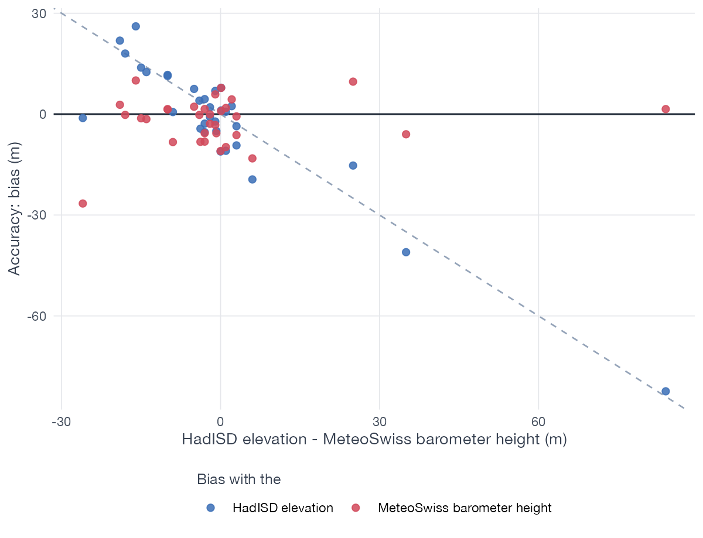

Figure 13: Bias at the Swiss stations present in both HadISD and MeteoSwiss, computed with the HadISD elevation (blue) and with the MeteoSwiss barometer height (red), against the difference between the two heights. Dashed: bias = −difference, the bias expected if the whole error came from the listed elevation.

## A.3 The temperature assumption explains the in-flight error

For every sonde level more than 200 m above the ground, the error expected from the difference between the assumed and the observed mean temperature of the column, $\Delta z \cdot (\bar T_\text{assumed} - \bar T_\text{obs}) / \bar T_\text{obs}$, matches the observed error (<a href="#fig-temperature" class="quarto-xref">Figure 14</a>): it explains 94% of its variance (r = 0.97). The in-flight error is therefore almost entirely an error of the assumed temperature profile, not of ERA5’s pressure.

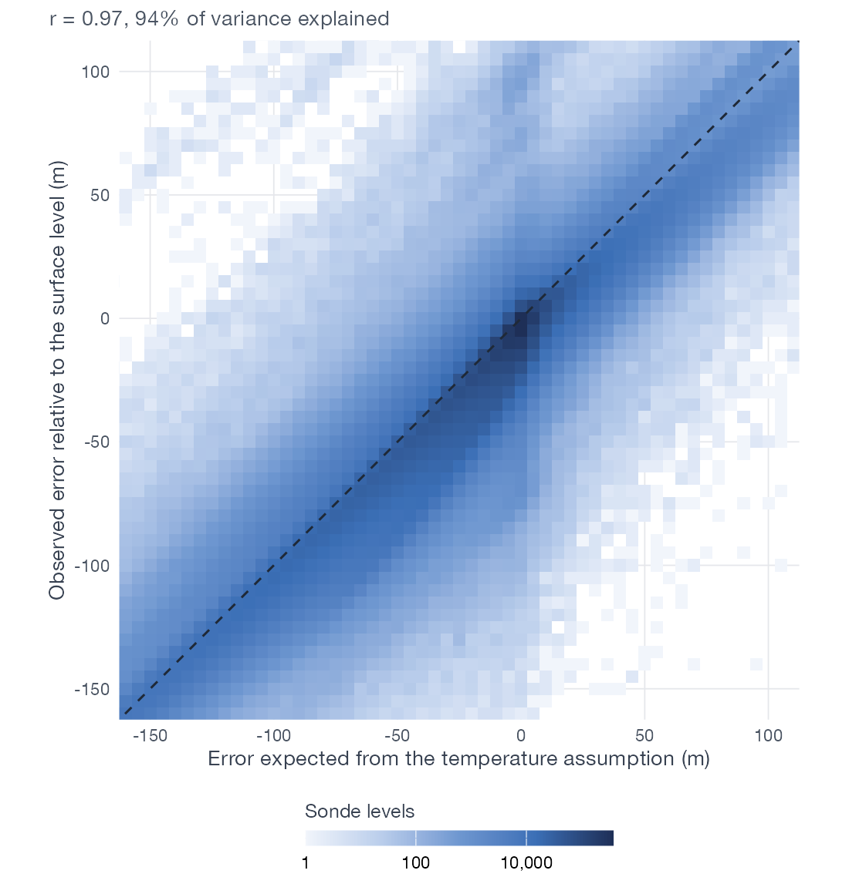

Figure 14: Observed in-flight error (relative to the surface level of the same sounding) against the error expected from the temperature assumption, for sonde levels more than 200 m above the ground. Dashed: 1:1 line.

## A.4 The screen removes errors of the stations, not of ERA5

**The bound is set by what ERA5 can produce.** Where ERA5 needs no extrapolation (flat terrain, station within 30 m of ERA5 orography), 95% of the stations have a \|bias\| below 12.8 m, and the 30 m term is about twice that (<a href="#tbl-basis-flat" class="quarto-xref">Table 6</a>). Over an elevation gap, the radiosondes show that the extrapolation error rarely exceeds a few percent of the gap (<a href="#tbl-basis-gap" class="quarto-xref">Table 7</a>). An offset larger than 30 m plus 10% of the gap is therefore a station error.

Table 6: \|bias\| where ERA5 needs no extrapolation: sub-grid SD \< 20 m and station within 30 m of ERA5 orography (m).

|   n | p50 | p90 |  p95 |  p99 |
|----:|----:|----:|-----:|-----:|
| 719 | 1.8 |   8 | 12.8 | 35.9 |

Table 7: Extrapolation error over a height gap, measured by radiosondes: per-station mean error relative to the surface level, divided by height above the ground.

| height (m)       | stations | median (%) | p99 of \|.\| (%) | max \|.\| (%) |
|:-----------------|---------:|-----------:|-----------------:|--------------:|
| (300,600\]       |      339 |      -0.74 |              9.4 |          20.8 |
| (600,1e+03\]     |      539 |      -0.87 |              7.4 |          36.4 |
| (1e+03,1.5e+03\] |      541 |      -0.93 |              4.3 |          20.3 |
| (1.5e+03,2e+03\] |      308 |      -0.98 |              5.3 |          19.3 |
| (2e+03,3e+03\]   |      474 |      -1.15 |              3.5 |           4.5 |

**Independent checks agree.** 14 excluded stations have another HadISD station within 50 km, and ERA5 fits every one of those neighbours to within 51 m, while the excluded stations are off by up to 1,591 m; conversely, 7 of 45 tested reference stations with \|bias\| \> 15 m share their offset with a neighbour, i.e. real ERA5 errors, mostly in mountains, which are kept. 76 of the 106 implausible offsets are at stations whose elevation a DEM confirms, often in flat terrain next to ERA5’s orography (e.g. Greater Kankakee Airport, Holsworthy Control Range, Strigino), where ERA5 has no mechanism to err. Finally, excluded stations track ERA5 hour by hour (median SD 4.8 m) at a fixed offset, the signature of a station-height error. DEMs are not used as a filter (next section).

**DEMs are not used as a filter**, because they would remove good stations:

- **Coordinates are coarse.** 65% fall on whole arc-minutes (±0.5′, up to ±900 m). A single DEM point can then be off by tens to hundreds of metres in rough terrain.
- **The DEM is therefore sampled on a 5×5 grid over that uncertainty**, in SRTM and ASTER GDEM. An elevation is “refuted” if it lies more than 15 m outside the DEM range in every available DEM.
- **SRTM would not have helped.** The Mapzen tiles used before are SRTM wherever SRTM exists (median difference 0 m).
- **DEMs are only good to ~15 m.** SRTM’s 90% absolute height error is 5–9 m (Rodríguez et al. 2006). SRTM and ASTER differ by a median 5 m (p90 14 m).
- **A DEM filter would remove good stations.** At 162 reference stations the DEM contradicts the listed elevation (median difference 71 m), yet ERA5 reproduces it (median \|bias\| 5.4 m). There, the coordinates are wrong, not the elevation.

**The typical error does not depend on the bound** (<a href="#tbl-sensitivity" class="quarto-xref">Table 8</a>). The medians hardly move with a looser or stricter bound; only the pooled MAE does, driven by a few stations with offsets of hundreds of metres. Loosening the bound to 60 m + 20% adds back 56 stations and raises the MAE from 6.1 to 7.1 m.

Table 8: Ground-level error (m) for looser and stricter bounds (\|bias\| ≤ a + b × gap), with the step-change stations kept or excluded. Used in the report: 30 m + 10%, step-change stations excluded.

| offset rule | step stations | stations | median \|bias\| | p90 \|bias\| | median SD | MAE |
|:---|:---|---:|:---|:---|:---|:---|
| no screen | kept | 2646 | 2.8 | 15.9 | 3.7 | 11.7 |
| no screen | excluded | 2614 | 2.7 | 15.3 | 3.7 | 11.6 |
| 15 m + 5% | kept | 2446 | 2.4 | 9.4 | 3.6 | 5.4 |
| 15 m + 5% | excluded | 2421 | 2.4 | 9.2 | 3.6 | 5.3 |
| 30 m + 10% (used) | kept | 2540 | 2.6 | 11.7 | 3.6 | 6.2 |
| 30 m + 10% (used) | excluded | 2509 | 2.5 | 11.5 | 3.6 | 6.1 |
| 60 m + 20% | kept | 2597 | 2.7 | 13.7 | 3.7 | 7.2 |
| 60 m + 20% | excluded | 2565 | 2.6 | 13.3 | 3.6 | 7.1 |
| 100 m + 30% | kept | 2618 | 2.7 | 14.7 | 3.7 | 7.8 |
| 100 m + 30% | excluded | 2586 | 2.7 | 14.0 | 3.6 | 7.8 |

> [!NOTE]
>
> ### The 144 excluded stations
>
> 

>
> Table 9: Stations excluded from the reference set (m). SRTM/ASTER: DEM at the listed coordinates. DEM refutes: listed elevation more than 15 m outside the DEM range of the coordinate-uncertainty box in every available DEM. Neighbour: median ERA5 bias in 2023 at up to two HadISD stations within 50 km (blank: none, or not tested).
>
> 

>
> | station | reason | elev. | ERA5 orog. | bias | SD | step | from | SRTM | ASTER | DEM refutes | neighbour bias | neighbour km |
> |:---|:---|---:|---:|---:|---:|---:|:---|---:|---:|:---|---:|---:|
> | HERBERT ISLAND | implausible offset | 1605.0 | 47 | -1591.0 | 2.6 |  |  | 0 |  | TRUE | 2.9 | 34 |
> | ERDENI | implausible offset | 2417.0 | 2492 | -1229.9 | 19.1 |  |  | 2427 | 2421 | FALSE |  |  |
> | LAHSH | implausible offset | 1198.0 | 3501 | 816.5 | 26.1 |  |  | 4801 | 4803 | TRUE |  |  |
> | UNKNOWN MONGOLIA | implausible offset | 213.0 | 1097 | 783.1 | 6.0 |  |  | 1143 | 1148 | TRUE |  |  |
> | THREDBO AWS | implausible offset | 1368.0 | 1177 | 582.8 | 11.1 |  |  | 1859 | 1862 | TRUE | 5.8 | 33 |
> | LA ESPERANZA | implausible offset | 1100.0 | 1230 | 564.6 | 5.4 |  |  | 1757 | 1756 | TRUE |  |  |
> | FLAGSTAFF | implausible offset | 2181.6 | 2224 | -485.2 | 16.8 |  |  | 2153 | 2154 | FALSE | -0.8 | 36 |
> | GREATER KANKAKEE AIRPORT | implausible offset | 191.7 | 197 | 406.5 | 16.3 |  |  | 188 | 186 | FALSE |  |  |
> | HOLSWORTHY CONTROL RANGE | implausible offset | 40.0 | 66 | 354.5 | 25.0 |  |  | 29 | 26 | FALSE | -2.6 | 9 |
> | PLAN DE GUADALUPE INTL / SALT | implausible offset | 1456.3 | 1737 | 337.9 | 5.5 |  |  | 1428 | 1420 | TRUE |  |  |
> | COLIMA | implausible offset | 751.9 | 877 | -322.2 | 6.1 |  |  | 748 | 746 | FALSE |  |  |
> | SIVAS | implausible offset | 1285.0 | 1466 | 306.2 | 3.3 |  |  | 1286 | 1287 | FALSE |  |  |
> | BINDER | implausible offset | 747.0 | 1175 | 304.6 | 8.8 |  |  | 1053 | 1040 | TRUE |  |  |
> | KASTAMONU | implausible offset | 1100.0 | 1262 | -301.2 | 5.8 |  |  | 1067 | 1075 | FALSE |  |  |
> | NAZE/FUNCHATOGE | implausible offset | 294.1 | 21 | -284.4 | 2.9 |  |  | 291 | 291 | FALSE |  |  |
> | XINING / CAOJIAPU | implausible offset | 2184.0 | 2656 | 244.8 | 5.6 |  |  | 2173 | 2170 | FALSE |  |  |
> | SHINE USA | implausible offset | 1494.0 | 1456 | 236.8 | 9.0 |  |  | 1224 | 1232 | TRUE |  |  |
> | YAN AN | implausible offset | 959.0 | 1199 | 220.0 | 3.8 |  |  | 991 | 978 | FALSE |  |  |
> | WUJIABA / CHANGSHUI | implausible offset | 2103.0 | 1972 | -218.1 | 4.8 |  |  | 2096 | 2093 | FALSE |  |  |
> | BAYAN DOBO SUMA | implausible offset | 1093.0 | 1103 | 211.8 | 9.0 |  |  | 1027 | 1032 | TRUE |  |  |
> | ULYGAIIN DUGANG | implausible offset | 883.0 | 974 | -208.9 | 8.1 |  |  | 802 | 805 | FALSE |  |  |
> | BAGUIO | implausible offset | 1295.7 | 613 | 206.9 | 6.0 |  |  | 1288 | 1286 | FALSE |  |  |
> | HANBOGD | implausible offset | 914.0 | 1071 | 198.2 | 4.7 |  |  | 1120 | 1128 | TRUE |  |  |
> | YOUYANG | implausible offset | 665.0 | 818 | 163.8 | 4.1 |  |  | 654 | 646 | FALSE |  |  |
> | JIANGBEI | implausible offset | 416.1 | 379 | -152.8 | 4.0 |  |  | 416 | 476 | FALSE |  |  |
> | JIANGCHENG | implausible offset | 1121.0 | 1166 | 144.3 | 3.9 |  |  | 1266 | 1265 | TRUE |  |  |
> | BAM | implausible offset | 940.0 | 958 | 132.8 | 4.7 |  |  | 973 | 966 | TRUE |  |  |
> | LINCANG | implausible offset | 1503.0 | 1831 | 128.6 | 5.0 |  |  | 2712 | 2701 | TRUE |  |  |
> | MARAGHEH | implausible offset | 1478.0 | 1554 | -128.4 | 7.0 |  |  | 1362 | 1373 | TRUE |  |  |
> | TONHIL | implausible offset | 2095.0 | 2094 | 126.7 | 5.3 |  |  | 2242 | 2240 | TRUE |  |  |
> | BOGD | implausible offset | 1646.0 | 1564 | -124.0 | 7.5 |  |  | 1535 | 1528 | TRUE |  |  |
> | URGAMAL | implausible offset | 1263.0 | 1403 | 122.8 | 8.1 |  |  | 1265 | 1264 | FALSE |  |  |
> | PINGLIANG | implausible offset | 1348.0 | 1554 | 117.8 | 4.2 |  |  | 1367 | 1352 | FALSE |  |  |
> | JARTAI | implausible offset | 1143.0 | 1061 | -114.7 | 3.8 |  |  | 1032 | 1032 | TRUE |  |  |
> | SUMBAWANGA | implausible offset | 1923.0 | 1634 | -114.2 | 5.2 |  |  | 1843 | 1834 | TRUE |  |  |
> | AMARBUYANTAYN | implausible offset | 2103.0 | 1745 | 113.5 | 8.0 |  |  | 1919 | 1946 | TRUE |  |  |
> | FRANCISCO SARABIA / TUXTLA GU | implausible offset | 460.0 | 705 | 109.3 | 6.4 |  |  | 459 | 454 | FALSE | -4.5 | 47 |
> | SIMAO | implausible offset | 1303.0 | 1354 | 109.2 | 3.8 |  |  | 1315 | 1321 | FALSE |  |  |
> | KHOY | implausible offset | 1213.4 | 1377 | -108.9 | 7.1 |  |  | 1187 | 1182 | TRUE |  |  |
> | LINDONG | implausible offset | 485.0 | 633 | 101.8 | 3.3 |  |  | 483 | 485 | FALSE |  |  |
> | KASHAN | implausible offset | 1056.1 | 1136 | -100.6 | 6.2 |  |  | 1058 | 1064 | FALSE |  |  |
> | GUIPING | implausible offset | 44.0 | 155 | 87.3 | 3.5 |  |  | 22 | 22 | FALSE |  |  |
> | LONGDONGBAO | implausible offset | 1138.7 | 1234 | 86.0 | 4.0 |  |  | 1133 | 1104 | FALSE |  |  |
> | HIDALGO DEL PARRAL CHIH. | implausible offset | 1661.0 | 1839 | 83.2 | 8.3 |  |  | 1714 | 1713 | TRUE |  |  |
> | MONTANA | implausible offset | 1508.0 | 1820 | -82.4 | 7.0 |  |  | 1450 | 1452 | FALSE | 4.9 | 14 |
> | STRIGINO | implausible offset | 78.0 | 97 | 79.9 | 2.7 |  |  | 74 | 64 | FALSE |  |  |
> | ALPINE-CASPARIS MUNI ARPT | implausible offset | 1375.6 | 1468 | -77.8 | 4.7 |  |  | 1365 | 1345 | FALSE | -5.0 | 32 |
> | COLLINS BAY SASK | implausible offset | 492.0 | 429 | -76.6 | 2.5 |  |  | 498 | 507 | FALSE |  |  |
> | BRATSK | implausible offset | 490.7 | 413 | -75.8 | 2.8 |  |  | 488 | 488 | FALSE |  |  |
> | PRINS CHRISTIAN | implausible offset | 19.0 | 66 | 75.0 | 6.6 |  |  |  |  | FALSE |  |  |
> | PALU/MUTIARA | implausible offset | 6.0 | 268 | 74.6 | 4.5 |  |  | 79 | 79 | FALSE |  |  |
> | KITALE | implausible offset | 1850.1 | 1947 | -73.8 | 8.4 |  |  | 1830 | 1833 | FALSE |  |  |
> | MAKKOVIK | implausible offset | 71.0 | 93 | -72.6 | 88.5 |  |  | 62 | 52 | FALSE |  |  |
> | NUEVA CASAS GRANDES CHIH. | implausible offset | 1487.0 | 1765 | 72.4 | 14.5 |  |  | 1483 | 1483 | FALSE |  |  |
> | FENGNING | implausible offset | 661.0 | 942 | 72.4 | 5.4 |  |  | 732 | 733 | FALSE |  |  |
> | RUO’ERGAI | implausible offset | 3441.0 | 3538 | 70.3 | 6.0 |  |  | 3457 | 3464 | FALSE |  |  |
> | ULSAN | implausible offset | 13.7 | 149 | 70.3 | 3.8 |  |  | 12 | 7 | FALSE | 0.9 | 49 |
> | SUIFENHE | implausible offset | 498.0 | 479 | 69.2 | 2.8 |  |  | 460 | 452 | FALSE | 5.6 | 19 |
> | MECHERIA | implausible offset | 1175.0 | 1144 | -66.6 | 4.2 |  |  | 1111 | 1109 | TRUE | 2.3 | 30 |
> | YANGJIANG | implausible offset | 22.0 | 20 | 66.5 | 2.9 |  |  | 16 | 13 | FALSE |  |  |
> | BAITA | implausible offset | 1083.9 | 1182 | 66.0 | 4.2 |  |  | 1078 | 1069 | FALSE |  |  |
> | KIGOMA | implausible offset | 885.0 | 928 | -64.1 | 5.1 |  |  | 807 | 809 | FALSE |  |  |
> | DIPKARPAZ | implausible offset | 136.0 | 0 | 63.7 | 3.6 |  |  | 150 | 145 | FALSE | -6.6 | 34 |
> | BANMETHUOT | implausible offset | 537.0 | 381 | -63.4 | 7.8 |  |  | 488 | 469 | TRUE |  |  |
> | SABZEVAR | implausible offset | 908.3 | 1161 | 63.1 | 5.4 |  |  | 915 | 914 | FALSE |  |  |
> | NAPO | implausible offset | 794.0 | 911 | 62.3 | 4.5 |  |  | 1174 | 1182 | TRUE |  |  |
> | ZHOUSHUIZI | implausible offset | 32.6 | 23 | 60.7 | 3.6 |  |  | 29 | 19 | FALSE |  |  |
> | MOGOCHA | implausible offset + step change | 625.0 | 750 | 56.9 | 30.2 | 74 | 2022-08 | 625 | 625 | FALSE |  |  |
> | KESHAN | implausible offset | 237.0 | 267 | 55.4 | 3.1 |  |  | 240 | 228 | FALSE |  |  |
> | EL ALTO INTL | implausible offset | 4061.5 | 4047 | -53.5 | 4.5 |  |  | 4037 | 4032 | TRUE |  |  |
> | YUZHNY / TASHKENT ISLAM KARIM | implausible offset | 431.9 | 456 | 53.3 | 3.7 |  |  | 432 | 419 | FALSE |  |  |
> | PRIESTLEY GLACIER | implausible offset | 1924.0 | 1887 | 51.8 | 12.1 |  |  |  | 1992 | TRUE |  |  |
> | POSSESSION IS | implausible offset | 30.0 | -3 | 51.7 | 9.7 |  |  |  |  |  |  |  |
> | GUIUAN | implausible offset | 2.1 | 18 | 51.5 | 3.4 |  |  | 6 | 9 | FALSE |  |  |
> | FRANKSTON (BALLAM PARK) | implausible offset | 110.0 | 108 | -51.4 | 23.0 |  |  | 114 | 103 | FALSE |  |  |
> | KOLTSOVO | implausible offset | 232.9 | 272 | 46.8 | 2.6 |  |  | 227 | 218 | FALSE |  |  |
> | DEHRADUN | implausible offset | 682.0 | 726 | -46.5 | 6.1 |  |  | 655 | 655 | FALSE |  |  |
> | HOVU-AKSY | implausible offset | 1043.0 | 1161 | -46.0 | 5.3 |  |  | 1013 | 999 | FALSE |  |  |
> | BANYUWANGI | implausible offset | 5.0 | 134 | 45.7 | 3.8 |  |  | 2 | 7 | FALSE |  |  |
> | DJELFA/TLETSI | implausible offset | 1144.0 | 1114 | 45.5 | 4.2 |  |  | 1132 | 1138 | FALSE |  |  |
> | GAOUA | implausible offset | 335.0 | 324 | -45.0 | 4.0 |  |  | 315 | 315 | FALSE |  |  |
> | ILAM | implausible offset | 1368.0 | 1364 | -44.9 | 4.3 |  |  | 1328 | 1322 | FALSE |  |  |
> | IRKUTSK | implausible offset | 510.5 | 568 | -44.1 | 3.9 |  |  | 494 | 489 | FALSE |  |  |
> | BAJANAUL | implausible offset | 504.0 | 429 | -44.0 | 3.0 |  |  | 539 | 537 | FALSE |  |  |
> | HONAVAR | implausible offset | 9.0 | 130 | 43.9 | 16.3 |  |  | 20 | 19 | FALSE |  |  |
> | S.A.N.A.E. AWS | implausible offset | 817.0 | 823 | 43.9 | 6.4 |  |  |  | 833 | FALSE |  |  |
> | QINZHOU | implausible offset | 6.0 | 56 | 43.7 | 3.1 |  |  | 8 | 9 | FALSE |  |  |
> | FEZXZAN | implausible offset | 120.0 | 165 | 43.5 | 2.8 |  |  | 115 | 95 | FALSE |  |  |
> | ARAK | implausible offset | 1661.8 | 1791 | 42.9 | 5.9 |  |  | 1654 | 1661 | FALSE |  |  |
> | SAMARKAND | implausible offset | 677.9 | 696 | 42.8 | 4.6 |  |  | 670 | 675 | FALSE |  |  |
> | VILNIUS INTL | implausible offset | 196.9 | 158 | -42.1 | 2.5 |  |  | 180 | 194 | FALSE |  |  |
> | SOHAR MAJIS | implausible offset | 44.0 | -12 | -41.4 | 2.8 |  |  | 35 | 30 | FALSE |  |  |
> | MONCLOVA INTL | implausible offset | 568.1 | 661 | 41.1 | 11.9 |  |  | 566 | 572 | FALSE |  |  |
> | XINZHENG | implausible offset | 150.9 | 127 | -40.7 | 3.6 |  |  | 149 | 154 | FALSE |  |  |
> | DUSHAN | implausible offset | 971.0 | 945 | 40.3 | 4.0 |  |  | 1009 | 1009 | FALSE |  |  |
> | SAM-NEUA | implausible offset | 1000.0 | 1074 | -39.8 | 8.4 |  |  | 971 | 971 | FALSE |  |  |
> | SEVCENKO | implausible offset | 15.0 | -18 | -39.3 | 4.0 |  |  | -29 | -28 | TRUE | -50.5 | 31 |
> | RUTENG/SATAR TACIK | step change | 1170.0 | 484 | -37.5 | 5.6 | 10 | 2022-08 | 1482 | 1475 | TRUE |  |  |
> | JOAO PESSOA | implausible offset | 7.0 | 11 | 36.9 | 3.7 |  |  | 12 | 20 | FALSE |  |  |
> | XIAOSHAN | implausible offset | 7.0 | 1 | 36.5 | 3.4 |  |  | 5 | 14 | FALSE |  |  |
> | UIL | implausible offset | 128.0 | 100 | -35.1 | 3.5 |  |  | 62 | 63 | TRUE |  |  |
> | P C PELSER | implausible offset | 1354.5 | 1377 | -35.0 | 6.6 |  |  | 1362 | 1356 | FALSE |  |  |
> | LITANG | step change | 3950.0 | 4387 | 34.1 | 28.0 | 56 | 2023-01 | 3963 | 3971 | FALSE |  |  |
> | TUKTUT NOGAIT NWT | implausible offset | 522.0 | 559 | 33.9 | 4.1 |  |  |  | 561 | FALSE |  |  |
> | KOSTANAY | implausible offset | 181.4 | 178 | -33.2 | 3.1 |  |  | 177 | 165 | FALSE |  |  |
> | BALDRICK AWS | implausible offset | 1968.0 | 1965 | 32.3 | 6.3 |  |  |  | 2980 | TRUE |  |  |
> | NATITINGOU | implausible offset | 461.0 | 455 | -32.2 | 4.8 |  |  | 460 | 466 | FALSE |  |  |
> | TUXPAN.VER. | implausible offset | 28.0 | 21 | -30.7 | 8.1 |  |  | 9 | 13 | FALSE |  |  |
> | VAN | step change | 1670.3 | 1814 | -28.5 | 10.9 | 20 | 2023-11 | 1654 | 1653 | FALSE |  |  |
> | WU LU MU QI | step change | 919.0 | 1077 | 27.6 | 29.0 | 77 | 2024-07 | 892 | 903 | FALSE |  |  |
> | AGRI AHMED I HANI | step change | 1664.8 | 1897 | -25.7 | 7.1 | -16 | 2022-09 | 1666 | 1663 | FALSE |  |  |
> | LICHINGA | step change | 1373.1 | 1127 | -25.7 | 12.8 | 24 | 2023-04 | 1366 | 1363 | FALSE |  |  |
> | JOSE MARIA CORDOVA | step change | 2142.1 | 2033 | -24.2 | 7.1 | -14 | 2022-08 | 2122 | 2134 | FALSE | -9.7 | 20 |
> | XIFENGZHEN | step change | 1423.0 | 1250 | -23.4 | 26.6 | -56 | 2024-01 | 1414 | 1422 | FALSE |  |  |
> | MATAVERI INTL | step change | 69.2 | 8 | -22.3 | 11.5 | 26 | 2024-06 | 59 | 40 | FALSE |  |  |
> | EMBU | step change | 1493.0 | 1433 | 18.8 | 8.5 | -16 | 2023-03 | 1500 | 1483 | FALSE |  |  |
> | ELDORET | step change | 2120.0 | 2127 | -16.2 | 24.5 | 48 | 2023-05 | 2143 | 2138 | FALSE |  |  |
> | CAPE COLUMBINE | step change | 67.0 | 3 | -15.7 | 4.6 | -13 | 2022-09 | 5 | 6 | FALSE | 2.8 | 33 |
> | UC-ARAL | gross errors | 397.0 | 428 | -15.7 | 17.2 |  |  | 393 | 384 | FALSE |  |  |
> | NYERI | step change | 1759.0 | 2005 | -13.2 | 25.1 | 52 | 2023-02 | 1801 | 1795 | FALSE |  |  |
> | TERMINILLO MOUNTAIN | gross errors | 1875.0 | 1017 | -13.0 | 51.4 |  |  | 1889 | 1881 | FALSE |  |  |
> | ANIAK AIRPORT | step change | 25.9 | 110 | -13.0 | 6.6 | 16 | 2024-07 |  | 17 | FALSE |  |  |
> | NAKURU | step change | 1901.0 | 2006 | -12.9 | 20.4 | 49 | 2022-09 | 1923 | 1928 | FALSE |  |  |
> | CAPE AGULHAS | step change | 14.0 | 7 | -12.1 | 6.5 | -14 | 2023-02 | 0 |  | FALSE |  |  |
> | DESERT ROCK AIRPORT | step change | 984.5 | 1238 | 12.0 | 14.1 | 24 | 2023-12 | 993 | 985 | FALSE |  |  |
> | IRINGA | step change | 1425.9 | 1607 | -10.0 | 11.1 | -20 | 2023-09 | 1419 | 1408 | FALSE |  |  |
> | LA VETA PASS AWOS-3 ARPT | step change | 3114.1 | 2651 | -8.3 | 17.6 | -32 | 2023-11 | 2844 | 2863 | TRUE |  |  |
> | SHEFFIELD SCHOOL FARM | step change | 295.0 | 534 | -8.3 | 9.1 | -17 | 2023-02 | 266 | 253 | FALSE |  |  |
> | SUPUNG | step change | 76.0 | 303 | -8.3 | 8.5 | -15 | 2024-01 | 67 | 71 | FALSE |  |  |
> | BASSATINE | step change | 576.1 | 434 | -8.0 | 7.7 | -15 | 2023-01 | 563 | 562 | FALSE |  |  |
> | GIOIA DEL COLLE | step change | 361.8 | 253 | -7.7 | 6.7 | -14 | 2024-05 | 342 | 342 | TRUE |  |  |
> | DOME PLATEAU DOME A | gross errors | 4084.0 | 4056 | 6.7 | 7.0 |  |  |  | 2763 | TRUE |  |  |
> | MTHATHA | gross errors | 731.5 | 885 | 6.4 | 12.5 |  |  | 738 | 742 | FALSE |  |  |
> | LITTLE CHICAGO NWT | step change | 63.0 | 211 | -6.4 | 9.2 | 14 | 2022-08 |  | 60 | FALSE |  |  |
> | MIDELT | gross errors | 1515.0 | 1541 | -5.5 | 4.6 |  |  | 1464 | 1462 | TRUE |  |  |
> | PREITENEGG | step change | 1035.0 | 886 | 4.2 | 13.1 | 29 | 2024-03 | 950 | 950 | FALSE |  |  |
> | RUSTON REGIONAL AIRPORT | step change | 94.8 | 69 | -3.7 | 6.7 | 12 | 2022-11 | 91 | 42 | FALSE |  |  |
> | YOHO PARK BC | step change | 1602.0 | 2259 | 3.6 | 10.6 | -16 | 2022-08 | 1924 | 1918 | FALSE |  |  |
> | FRUHOLMEN FYR | step change | 14.2 | -2 | 3.4 | 7.1 | 12 | 2024-06 |  |  |  |  |  |
> | PBO ANANTAPUR | step change | 364.0 | 373 | 3.3 | 10.3 | 22 | 2022-09 | 377 | 368 | FALSE |  |  |
> | SINOP | step change | 32.0 | 15 | -2.9 | 5.7 | -11 | 2022-10 | 198 | 196 | FALSE |  |  |
> | CONAKRY / AHMED SEKOU TOURE I | gross errors | 21.9 | 1 | 0.7 | 4.3 |  |  | 17 | 34 | FALSE |  |  |
> | CORK | step change | 153.0 | 44 | -0.6 | 8.0 | -15 | 2022-12 | 141 | 97 | FALSE |  |  |
> | CABO FRIO | gross errors | 4.3 | 6 | -0.2 | 2.2 |  |  | 3 | 7 | FALSE |  |  |
>
> 

>
> 

## A.5 Assimilation does not flatter ERA5

- **Stations never assimilated fit as well as assimilated ones** (<a href="#tbl-assim" class="quarto-xref">Table 10</a>). In the same terrain class, the GNSS stations have the same median \|bias\| and SD as HadISD; the few Swiss stations absent from ISD are too few to tell.
- **Isolated stations do not fit better** (<a href="#tbl-density" class="quarto-xref">Table 11</a>). An isolated observation weighs most in ERA5’s analysis, so overfitting would show there first. In flat terrain, the opposite holds: HadISD stations with at most two other stations within 300 km have a median SD of 3.2 m, those with more than 30 neighbours 2.7 m, which reflects better-constrained analyses in dense networks.

Table 10: Median \|bias\| / median SD (m) and number of stations by terrain roughness, for assimilated (HadISD, MeteoSwiss in ISD) and never or probably not assimilated stations (GNSS, MeteoSwiss not in ISD), ERA5 single-levels.

| terrain | GNSS, height-checked | HadISD reference set | MeteoSwiss, in ISD | MeteoSwiss, not in ISD |
|:---|:---|:---|:---|:---|
| flat (\<20 m) | 2.5 / 2.5 (15) | 1.9 / 3.1 (870) |  |  |
| gentle (20-50 m) | 1.2 / 2.7 (8) | 2.5 / 3.3 (493) |  |  |
| hilly (50-150 m) | 1.7 / 3.1 (18) | 3.2 / 4.2 (622) | 2.4 / 2.9 (24) | 2.0 / 2.9 (1) |
| rough (150-300 m) | 5.3 / 3.9 (3) | 4.7 / 5.8 (373) | 1.9 / 4.1 (42) | 1.7 / 4.2 (2) |
| mountain (\>300 m) | 9.4 / 9.0 (3) | 6.1 / 8.5 (144) | 5.0 / 9.6 (63) | 7.0 / 10.0 (6) |

Table 11: Ground-level error of the HadISD reference stations in flat terrain (sub-grid SD \< 20 m), by the number of other HadISD stations within 300 km (m).

| stations within 300 km | stations | median \|bias\| | median SD |
|:-----------------------|---------:|:----------------|:----------|
| 0-2                    |      184 | 2.1             | 3.2       |
| 3-10                   |      309 | 2.2             | 3.4       |
| 11-30                  |      203 | 1.8             | 2.9       |
| \>30                   |      174 | 1.5             | 2.7       |

# Appendix B: supplementary figures

**Bias and SD per station** (<a href="#fig-maps" class="quarto-xref">Figure 15</a>), before the aggregation to 5° cells of <a href="#fig-map-residual" class="quarto-xref">Figure 3</a>.

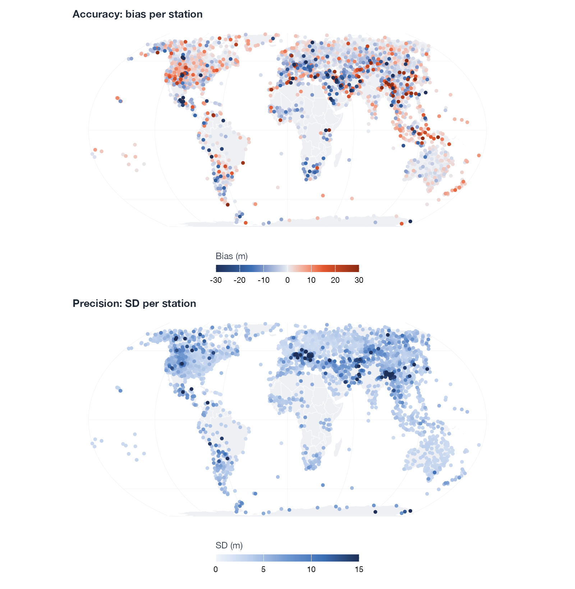

Figure 15: Bias (top) and SD (bottom) per station, HadISD reference set, ERA5 single-levels. Colours clipped at ±30 m and 15 m.

**In flight, the bias is two to four times larger at night than during the day** (<a href="#fig-daynight" class="quarto-xref">Figure 16</a>), at 1–1.5 km -20.2 m against -5.0 m in the summer half-year. Nocturnal inversions make the real column warmer than assumed, which matters for the many species that migrate at night.

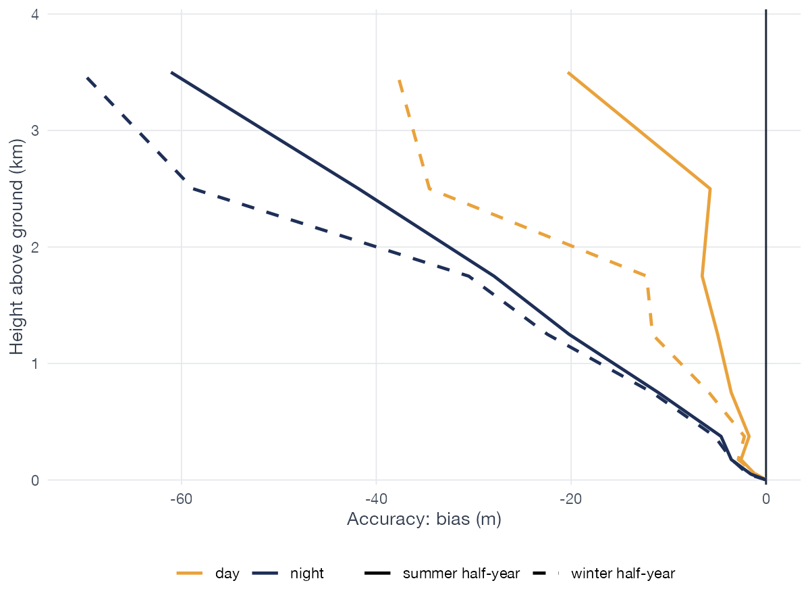

Figure 16: In-flight bias by day (07–19 h local solar time) and night, and by half-year, up to 4 km (ERA5 single-levels). Solid: summer; dashed: winter.

**In flight, ERA5-Land and ERA5 single-levels behave alike** (<a href="#fig-land-flight" class="quarto-xref">Figure 17</a>): relative to the surface, the offset of ERA5-Land’s reference level cancels.

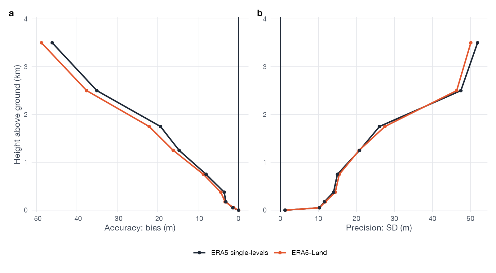

Figure 17: In-flight bias (a) and SD (b) against height, up to 4 km, with ERA5 single-levels and ERA5-Land.

