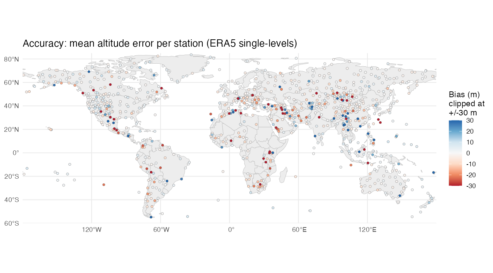
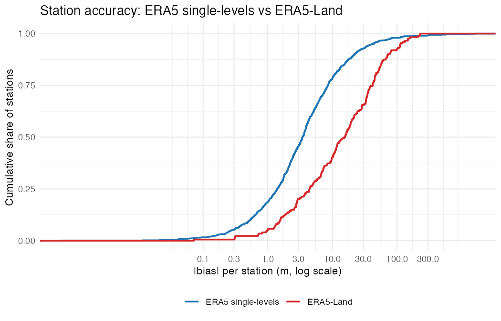
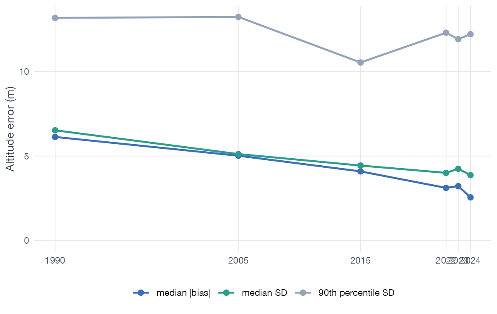
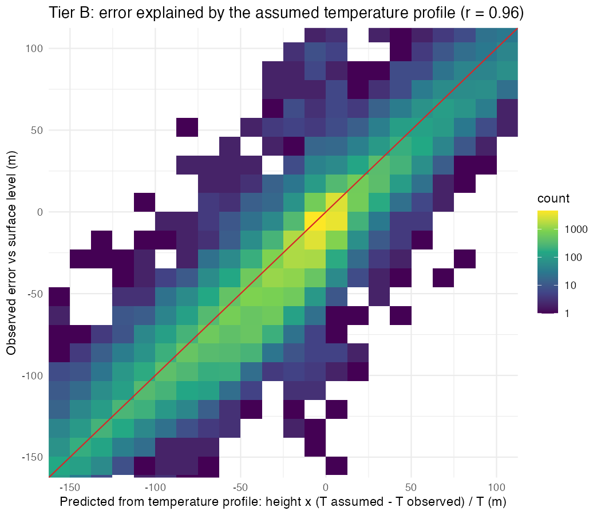
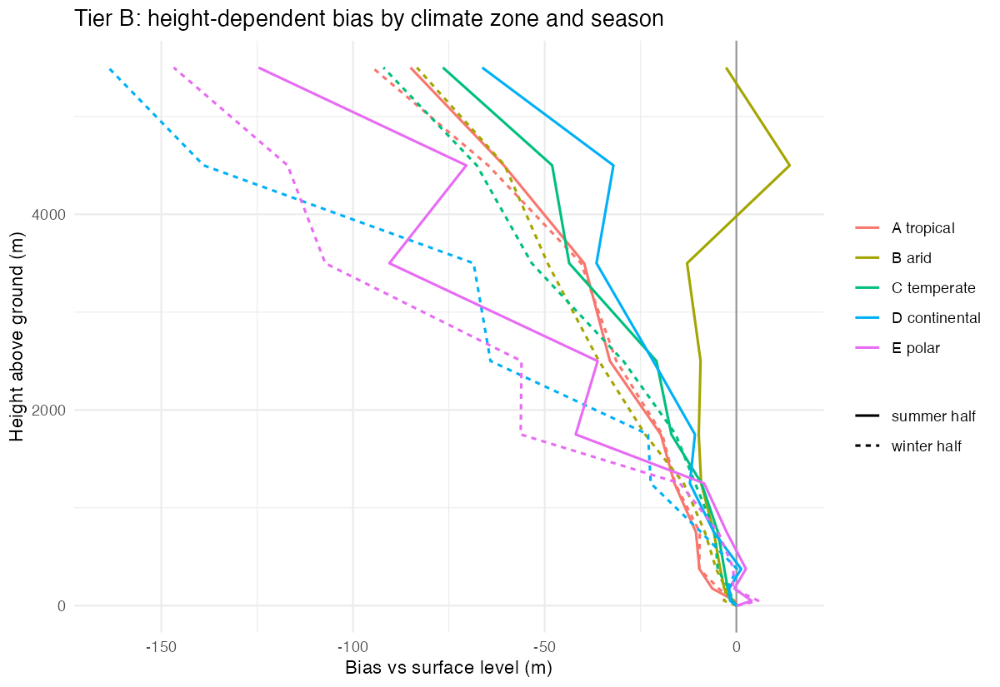

# How accurate is altitude from pressure geolocators?
Raphaël Nussbaumer
2026-09-30

> [!NOTE]
>
> ### In short
>
> **At ground level**, GeoPressureR’s default (ERA5 single-levels)
> retrieves a geolocator’s altitude with a median per-site **bias of 3.2
> m** (90% of sites within 14.8 m) and a **temporal scatter (SD) of 4.1
> m** (905 stations worldwide, 2022–2024). Pooled over all station-hours
> the mean absolute error is **7.3 m** and 95% of errors are below 24.6
> m. Terrain roughness is the main driver: errors roughly triple from
> flat to mountainous terrain.
>
> **In flight**, altitude is **underestimated by about 1–1.5% of the
> height above the ground** (-14 m at 1–1.5 km, -35 m at 2–3 km, -91 m
> at 5–6 km), because the formula assumes a standard temperature
> profile. The error is largest in continental and polar winters
> (surface inversions). Averaged over the heights at which tracked birds
> fly, flight adds a mean absolute error of **15.6 m**.
>
> **ERA5-Land** is much worse for absolute altitude (MAE 29.0 m) and
> should not be used for it.
>
> **The formula can be improved.** Using the virtual temperature (which
> accounts for humidity) and a lapse rate of -5.0 K/km estimated from
> the radiosondes reduces the in-flight bias from -10.7 m to -1.8 m on
> stations not used for the fit, without changing ground-level altitude.
> It is not (yet) what GeoPressureR does.

# Why this study

GeoPressureR (and GeoPressureAPI behind it) converts the pressure a
geolocator records into an altitude using ERA5 reanalysis: the surface
pressure $p_0$ and 2 m temperature $T_0$ at the bird’s location and
hour, the ERA5 orography $z_0$, and the barometric formula with a
standard lapse rate $L = -6.5$ K/km,

$$
z = z_0 + \frac{T_0}{L}\left[\left(\frac{p}{p_0}\right)^{-R L / (g M)} - 1\right].
$$

Users want to know how good that altitude is, where and when it is
worse, and why. An earlier check over the Alps
([GeoPressureAPI#27](https://github.com/GeoPressure/GeoPressureAPI/issues/27))
found ~9 m mean absolute error with ERA5 single-levels and led to making
single-levels the default. This study extends that check to the whole
globe, a full annual cycle, three recent years, and — using radiosondes
— to the heights at which birds fly.

# Methods

## What is validated

The exact GeoPressureR code path is evaluated: grid-cell snapping,
nearest-hour matching, the ERA5 orography files and
`pressure_to_altitude()` are taken from GeoPressureR 3.6.3.9000
(bc72cf02), reading ERA5 from the ECMWF ARCO archive
(`pressurepath_create(source = "arco")`). A cross-check against
GeoPressureAPI (Earth Engine) on 2238 station-hours found a maximum
difference of 0.09 m, so every result below applies to both entry
points.

Two ERA5 products are compared: **ERA5 single-levels** (0.25°, the
default) and **ERA5-Land** (0.1°). The mixed `"both"` option is not
evaluated separately: over land it is ERA5-Land.

## Altitude formula and alternatives

**Why a formula error grows with height.** In hydrostatic balance, the
thickness of the layer between the surface pressure $p_0$ and the
pressure $p$ is given by the hypsometric equation (Wallace & Hobbs 2006,
ch. 3)

$$
z - z_0 = \frac{R_d}{g}\,\bar T_v \,\ln\frac{p_0}{p},
$$

where $R_d = R/M$ is the gas constant of dry air and $\bar T_v$ the
(log-pressure weighted) mean *virtual* temperature of the layer.
GeoPressureR’s formula is this equation for a particular assumed
profile: a temperature that starts at the ERA5 2 m temperature $T_0$ and
decreases linearly at the lapse rate $L = -6.5$ K/km of the ICAO
standard atmosphere (ICAO 1993; ISO 2533:1975), with dry air
($T_v = T$). Because the thickness is proportional to $\bar T_v$, an
error in the assumed mean temperature translates into the same
*relative* error in height above the ground,

$$
\frac{\delta (z - z_0)}{z - z_0} = \frac{\bar T_\text{assumed} - \bar T_{v,\text{true}}}{\bar T_{v,\text{true}}},
$$

so 3 K (≈1%) too cold puts a bird 2 km above the ground about 20 m too
low. On the ground, $z - z_0$ is only the gap between the station and
the ERA5 orography (median 56 m), so the temperature assumption hardly
matters there.

The assumed layer is too cold for two separate reasons, each addressed
by one change:

1.  **Virtual temperature.** Water vapour is lighter than dry air, so
    moist air occupies a thicker layer than dry air at the same
    temperature. The hypsometric equation requires the virtual
    temperature $T_v = T\,(1 + 0.608\,q)$, where $q$ is the specific
    humidity; using $T$ is a simplification, not a modelling choice. We
    compute $q$ from the ERA5 2 m dewpoint and surface pressure, with
    the saturation vapour pressure of Bolton (1980), and replace $T_0$
    by $T_{v,0}$. The correction has no free parameter. At the
    radiosonde stations it averages 0.3 K in polar winter and up to 3.3
    K in the tropics (0.1–1.2% of height). As in pressure reduction to
    sea level (WMO 1968), humidity at the surface is assumed to hold
    through the layer, which slightly overestimates it aloft.
2.  **Lapse rate.** −6.5 K/km is a mean over the whole troposphere (0–11
    km). Lapse rates in the lowest kilometres vary with latitude, season
    and time of day (Stone & Carlson 1979; Rolland
    2003) and are often shallower: for example 3.9–5.2 K/km annual mean
          near-surface lapse rates in the Cascade Mountains (Minder et
          al. 2010), and much shallower still, or inverted, in winter
          inversions. Rather than adopt a value from the literature, we
          **estimate $L$ from the radiosondes**.

**Estimating and testing the lapse rate.** $L$ is the value that
minimises the bird-weighted mean squared error relative to the surface
level (Tier B; height bins weighted by the share of geolocator flight
points, stations weighted equally), found by one-dimensional
optimisation. It is estimated separately with $T_0$ and with $T_{v,0}$.
Its robustness is tested in three ways: (i) 20 repeated random 50/50
splits of the stations, fitting on one half and evaluating on the other;
(ii) separate fits for each climate zone and half-year; (iii) an
alternative objective that weights all height bins equally. Its effect
at ground level is evaluated on Tier A. These variants are evaluated
here only; all other results use the formula as implemented in
GeoPressureR.

## Reference data

**Tier A — surface barometers (ground level).** HadISD v3.4.3.2025f
(Dunn et al. 2012, 2016), a quality-controlled subset of NOAA ISD. Its
station-level pressure is treated as a geolocator reading and the
retrieved altitude is compared with the station elevation. Stations were
chosen for spatial balance: in every 5°×5° cell the highest, the lowest
and one random station, plus every station above 1000 m. Stations had to
report station pressure on at least half the days of each of 2022–2024,
at least 6-hourly; the set was then thinned to one random station per 5°
cell plus one per 2.5° cell above 1000 m. ERA5-Land was evaluated on a
random 200 of these stations, and a random 100 reporting in 1990, 2005
and 2015 test for changes over time.

**Tier B — radiosondes (0–6 km above ground).** IGRA2 (Durre et
al. 2006, 2018), 2023–2024. At every level the sonde reports pressure
and geopotential height; the pressure is given to the altitude formula
at the launch site and hour of that level, and the retrieved altitude is
compared with the sonde’s height. Stations: the highest and one random
active station per 10°×10° cell, plus all above 1000 m.

## Separating accuracy from precision, and handling errors in the reference

At ~5–10 m, errors in the reference itself matter. Three choices keep
them out of the headline numbers:

- **Accuracy vs precision.** Each station’s error is split into its mean
  (the *bias*: constant in time, relevant for absolute altitude) and the
  SD around that mean (*precision*: relevant for altitude changes). A
  wrong station elevation shifts only the bias, so precision is robust
  to metadata errors.
- **Reference screen (Tier A).** Stations whose own elevation or
  pressure cannot be trusted are excluded from the reference set
  (below).
- **Height relative to the surface level (Tier B).** The error at a
  level minus the error at the same sounding’s surface level cancels the
  station elevation entirely, isolating how the error grows with height.

Gross observation errors were flagged when more than 100 m (Tier A) or
150 m (Tier B) and 10 robust SD from the station’s (or height bin’s)
median error: 0.00076 of Tier A and 0.00060 of Tier B observations.

Pooled statistics give every station equal weight.

### Screening the surface stations

A station’s listed elevation and reported station pressure are not
always what they seem, and this is well documented. At ECMWF, surface
pressure reports from several hundred SYNOP stations are biased, often
by several hPa. These biases are “mostly related to incorrect
assumptions about the station heights” and stay fairly constant in time
(Vasiljevic et al. 2006). ECMWF’s monitoring guidance lists the usual
causes (ECMWF 2025):

- wrong latitude, longitude or elevation metadata;
- GNSS-derived elevations without the geoid correction;
- stations that report only mean sea-level pressure;
- sensor or encoding errors;
- step changes when the barometer height or the station position
  changes.

WMO distinguishes the datum to which station pressure refers ($H_p$)
from the ground elevation of the station, and at aerodromes from the
aerodrome elevation (WMO 2023). A listed elevation can therefore
legitimately differ from the height the pressure refers to. HadISD takes
its station metadata from ISD (Smith et al. 2011). It is
quality-controlled but not homogenised, and it merges records of
co-located stations (Dunn et al. 2012, 2016). ERA5 bias-corrects or
rejects such stations when it assimilates them (Vasiljevic et al. 2006;
Hersbach et al. 2020), so where a single station and ERA5 disagree by a
constant offset, the station is usually at fault.

Two rules remove such stations from the **reference set** used for all
statistics except the “all stations” row:

1.  **Implausible offset** (50 stations): \|bias\| \> 30 m + 10% of the
    gap between station elevation and ERA5 orography. The bound is set
    from data that do not use the bias of the station being tested
    (Appendix):
    - Where ERA5 needs no extrapolation (flat terrain, gap \< 30 m, 233
      stations), 95% of stations are within 15 m, so 30 m is about twice
      that.
    - Over a height gap, the radiosondes measure the extrapolation error
      directly. The per-station mean is -0.6% to -1.1% of the gap, and
      99% of stations stay within 3–7%. The 10% allowance is therefore
      generous.
2.  **Step change** (14 stations): a clear jump in the station’s error
    during 2022–2024. Monthly median errors are fitted with a
    month-of-year effect plus one step at the best breakpoint; a station
    is flagged if \|step\| ≥ 10 m and \|t\| ≥ 10. ERA5 does not jump at
    one site, but a station does when it moves, changes barometer or
    changes its reference height (ECMWF 2025). Examples are Xifengzhen,
    Nyeri, Eldoret (-56, 52, 48 m).

In total 64 of 969 stations (7%) are excluded. The Appendix lists them.

**Independent checks that the screen removes reference errors, not ERA5
errors.**

- *Neighbours.* ERA5’s bias was computed in 2023 at up to two other
  HadISD stations within 50 km of every station with \|bias\| \> 15 m. 9
  excluded stations have such a neighbour. ERA5 matches the neighbours
  of all of them to within 10 m, while the excluded stations themselves
  are off by up to 1,591 m. Their offsets belong to the station, not to
  ERA5 (the same logic ECMWF uses to decide whether a station or the
  model is biased; Vasiljevic et al. 2006). Conversely, 4 of the 16
  tested reference stations with \|bias\| \> 15 m share their offset
  with a neighbour. These are genuine ERA5 errors (mostly in mountains),
  and the screen keeps them.
- *No mechanism in ERA5.* 32 of the 50 implausible offsets are at
  stations whose elevation an independent DEM confirms, often in flat
  terrain close to ERA5’s orography (e.g. Gabes / Matmata, Changde,
  Strigino). There, ERA5 has nothing to extrapolate. The offset must
  come from the pressure’s datum or from the barometer.
- *Constant in time.* The excluded stations track ERA5 hour by hour
  (median SD 5.4 m, vs 4.1 m in the reference set) at a fixed offset.
  That is the signature ECMWF reports for station-height errors, not
  what a reanalysis error would look like.

**Why the DEM is not used as a filter.** Earlier versions also reported
a “DEM-trusted” subset. The check was replaced because it measures the
precision of the station coordinates more than the elevation:

- 63% of the coordinates fall on whole arc-minutes, i.e. ±0.5′ (up to
  ±900 m). A single DEM point can then be off by tens to hundreds of
  metres in rough terrain.
- The DEM was therefore sampled on a 5×5 grid covering that uncertainty,
  in SRTM and in ASTER GDEM. The Mapzen terrain tiles used before are
  SRTM wherever SRTM exists (median difference 0 m), so SRTM would not
  have helped. SRTM’s own 90% absolute height error is 5–9 m (Rodríguez
  et al. 2006), and SRTM and ASTER differ by a median 5 m (p90 14 m). A
  DEM cannot verify an elevation to better than ~15 m.
- At 77 reference stations, every available DEM contradicts the listed
  elevation (median difference 72 m). Yet ERA5 reproduces the listed
  elevation (median \|bias\| 6.5 m). At those stations the coordinates
  are wrong, not the elevation, so a DEM filter would have removed good
  stations and kept bad ones.

The DEM is kept only as supporting evidence in the table of excluded
stations.

**What remains.** The reference set still contains smaller reference
errors that no screen can detect: steps below 10 m, barometers a few
metres above the listed ground, rounded elevations. Its accuracy is
therefore an upper bound on ERA5’s own error. The Appendix shows how the
pooled statistics change with the screen. The median bias barely moves
(2.9–3.4 m across all variants), but MAE and RMSE depend on it, because
a handful of stations with offsets of hundreds of metres dominate them
when included.

## Drivers

Candidate drivers of accuracy and precision: the difference between
station elevation and ERA5 orography, sub-grid terrain roughness (ERA5
`sdor`), latitude, Köppen-Geiger climate zone (station level); local
solar hour, season, boundary layer height, skin − 2 m temperature (a
proxy for surface inversions) and 6 h surface pressure tendency
(observation level). Their effect is estimated with GAMs (mgcv) and
ranked by the deviance explained lost when each is dropped.

For Tier B, the error expected from the temperature assumption alone
follows from the relative-error equation above:
$\Delta z \cdot (\bar T_\text{assumed} - \bar T_\text{obs}) / \bar T_\text{obs}$,
where $\bar T_\text{obs}$ is the sonde’s log-pressure-weighted mean
(dry-bulb) temperature of the layer below the level.

# Results: ground level (Tier A)

| subset | dataset | stations | obs | median \|bias\| | p90 \|bias\| | median SD | p90 SD | MAE | RMSE | p95 \|err\| |
|:---|:---|---:|:---|---:|---:|---:|---:|---:|---:|---:|
| all stations | single-levels | 969 | 13,305,349 | 3.4 | 21.7 | 4.2 | 8.8 | 16.8 | 81.3 | 43.9 |
| all stations | land | 174 | 2,370,459 | 15.4 | 72.1 | 5.7 | 12.4 | 31.4 | 51.7 | 116.9 |
| reference set (plausible offset, no step change) | single-levels | 905 | 12,646,157 | 3.2 | 14.8 | 4.1 | 8.2 | 7.3 | 11.5 | 24.6 |
| reference set (plausible offset, no step change) | land | 166 | 2,281,024 | 13.7 | 69.3 | 5.6 | 12.4 | 29.0 | 47.8 | 108.6 |

Altitude error at ground level, 2022-2024 (m).

## By terrain, elevation, latitude and climate

| group | subset | stations | median \|bias\| | p90 \|bias\| | median SD | p90 SD | MAE | p95 \|err\| |
|:---|:---|---:|---:|---:|---:|---:|---:|---:|
| terrain | flat (\<20 m) | 293 | 2.2 | 8.3 | 3.2 | 5.3 | 4.9 | 16.4 |
| terrain | gentle (20-50 m) | 169 | 2.3 | 9.7 | 3.5 | 5.4 | 5.0 | 15.6 |
| terrain | hilly (50-150 m) | 234 | 3.9 | 15.2 | 4.2 | 6.9 | 7.6 | 25.8 |
| terrain | rough (150-300 m) | 153 | 5.6 | 20.1 | 6.1 | 11.5 | 10.5 | 31.4 |
| terrain | mountain (\>300 m) | 56 | 7.1 | 25.9 | 9.3 | 14.3 | 15.7 | 51.8 |
| elevation | \<200 m | 432 | 2.3 | 8.7 | 3.4 | 5.8 | 5.2 | 16.9 |
| elevation | 200-500 m | 100 | 2.6 | 10.5 | 3.6 | 6.6 | 5.8 | 18.5 |
| elevation | 500-1000 m | 69 | 3.0 | 11.2 | 4.1 | 8.7 | 6.4 | 21.0 |
| elevation | 1000-2000 m | 240 | 5.2 | 21.0 | 5.2 | 9.7 | 10.2 | 31.3 |
| elevation | \>2000 m | 64 | 7.2 | 24.2 | 6.9 | 16.5 | 13.8 | 47.5 |
| latitude | tropics (0-23.5) | 186 | 3.6 | 17.9 | 3.6 | 6.2 | 7.8 | 28.0 |
| latitude | subtropics (23.5-45) | 353 | 3.7 | 17.0 | 4.6 | 9.3 | 8.3 | 26.2 |
| latitude | mid-latitude (45-66.5) | 276 | 2.4 | 11.1 | 3.9 | 8.3 | 6.2 | 21.4 |
| latitude | polar (\>66.5) | 90 | 2.4 | 7.6 | 3.9 | 6.9 | 5.2 | 15.1 |
| climate | A tropical | 113 | 3.2 | 15.9 | 3.5 | 5.4 | 6.8 | 26.1 |
| climate | B arid | 202 | 3.8 | 16.9 | 4.4 | 7.7 | 7.7 | 23.9 |
| climate | C temperate | 180 | 3.6 | 16.0 | 4.2 | 8.9 | 8.0 | 28.1 |
| climate | D continental | 272 | 2.3 | 12.6 | 4.0 | 9.4 | 6.7 | 22.6 |
| climate | E polar | 95 | 3.2 | 11.2 | 4.7 | 8.5 | 7.8 | 26.8 |

ERA5 single-levels, by station class (m). Terrain = sub-grid orography
SD in the ERA5 cell.

## Drivers

| response | term | deviance explained (full) | lost when dropped | n |
|:---|:---|---:|---:|---:|
| log \|bias\| | station elevation - ERA5 orography | 0.169 | 0.017 | 862 |
| log \|bias\| | sub-grid terrain roughness | 0.169 | 0.007 | 862 |
| log \|bias\| | absolute latitude | 0.169 | 0.023 | 862 |
| log \|bias\| | Koppen climate zone | 0.169 | 0.020 | 862 |
| log SD | station elevation - ERA5 orography | 0.562 | 0.128 | 862 |
| log SD | sub-grid terrain roughness | 0.562 | 0.012 | 862 |
| log SD | absolute latitude | 0.562 | 0.005 | 862 |
| log SD | Koppen climate zone | 0.562 | 0.021 | 862 |

Station-level drivers (GAM).

| term                    | deviance explained (full) | lost when dropped |     n |
|:------------------------|--------------------------:|------------------:|------:|
| local solar hour        |                     0.337 |             0.001 | 2e+06 |
| season                  |                     0.337 |             0.001 | 2e+06 |
| boundary layer height   |                     0.337 |             0.004 | 2e+06 |
| skin - 2 m temperature  |                     0.337 |             0.000 | 2e+06 |
| 6 h pressure tendency   |                     0.337 |             0.001 | 2e+06 |
| station (random effect) |                     0.337 |             0.308 | 2e+06 |

Observation-level drivers of the de-biased absolute error (GAM with
station random effect).

| year | n_stations | abs_bias_median | sd_median | sd_p90 |
|-----:|-----------:|----------------:|----------:|-------:|
| 1990 |         96 |             6.1 |       6.5 |   13.2 |
| 2005 |         96 |             5.0 |       5.1 |   13.2 |
| 2015 |         96 |             4.1 |       4.4 |   10.5 |
| 2022 |         96 |             3.1 |       4.0 |   12.3 |
| 2023 |         96 |             3.2 |       4.2 |   11.9 |
| 2024 |         96 |             2.6 |       3.9 |   12.2 |

Change over time for stations reporting in every year (m).

# Results: in flight (Tier B)

| method | height above ground | n | bias | SD | MAE | RMSE | p95 \|err\| |
|:---|:---|:---|---:|---:|---:|---:|---:|
| ERA5-Land | (-10,1\] | 80,342 | 0.1 | 2.3 | 0.1 | 2.3 | 0.0 |
| ERA5-Land | (1,100\] | 43,203 | -1.2 | 14.8 | 6.6 | 14.9 | 30.1 |
| ERA5-Land | (100,250\] | 41,944 | -3.7 | 13.0 | 6.4 | 13.5 | 29.1 |
| ERA5-Land | (250,500\] | 44,773 | -5.0 | 9.2 | 7.2 | 10.5 | 19.0 |
| ERA5-Land | (500,1e+03\] | 134,450 | -7.5 | 17.0 | 12.1 | 18.6 | 40.8 |
| ERA5-Land | (1e+03,1.5e+03\] | 121,317 | -16.5 | 20.6 | 20.2 | 26.4 | 53.5 |
| ERA5-Land | (1.5e+03,2e+03\] | 88,050 | -24.6 | 25.6 | 27.8 | 35.5 | 67.7 |
| ERA5-Land | (2e+03,3e+03\] | 194,848 | -35.9 | 43.0 | 42.8 | 56.0 | 111.0 |
| ERA5-Land | (3e+03,4e+03\] | 173,516 | -49.8 | 46.7 | 58.0 | 68.3 | 126.3 |
| ERA5-Land | (4e+03,5e+03\] | 158,090 | -63.8 | 87.5 | 84.9 | 108.3 | 211.2 |
| ERA5-Land | (5e+03,6e+03\] | 194,252 | -98.7 | 94.7 | 111.8 | 136.8 | 258.3 |
| ERA5-Land |  | 7 | 75.8 | 7.4 | 75.8 | 76.2 | 96.8 |
| GeoPressureR (ERA5 single-levels) | (-10,1\] | 365,141 | 0.0 | 1.5 | 0.0 | 1.5 | 0.0 |
| GeoPressureR (ERA5 single-levels) | (1,100\] | 199,734 | -0.8 | 9.9 | 5.2 | 9.9 | 17.1 |
| GeoPressureR (ERA5 single-levels) | (100,250\] | 200,028 | -2.7 | 9.5 | 5.3 | 9.8 | 18.5 |
| GeoPressureR (ERA5 single-levels) | (250,500\] | 213,147 | -2.6 | 14.9 | 8.0 | 15.1 | 22.6 |
| GeoPressureR (ERA5 single-levels) | (500,1e+03\] | 609,037 | -7.0 | 13.3 | 10.3 | 15.0 | 29.8 |
| GeoPressureR (ERA5 single-levels) | (1e+03,1.5e+03\] | 545,323 | -13.6 | 20.0 | 17.7 | 24.2 | 50.2 |
| GeoPressureR (ERA5 single-levels) | (1.5e+03,2e+03\] | 418,624 | -19.4 | 30.0 | 25.3 | 35.8 | 69.4 |
| GeoPressureR (ERA5 single-levels) | (2e+03,3e+03\] | 896,880 | -35.0 | 47.5 | 43.2 | 59.0 | 121.5 |
| GeoPressureR (ERA5 single-levels) | (3e+03,4e+03\] | 784,171 | -46.7 | 61.8 | 56.9 | 77.5 | 145.6 |
| GeoPressureR (ERA5 single-levels) | (4e+03,5e+03\] | 716,230 | -62.5 | 96.1 | 87.3 | 114.6 | 231.6 |
| GeoPressureR (ERA5 single-levels) | (5e+03,6e+03\] | 884,139 | -90.6 | 103.1 | 109.1 | 137.2 | 273.5 |
| GeoPressureR (ERA5 single-levels) |  | 22 | 44.9 | 21.8 | 44.9 | 49.9 | 75.6 |

Error relative to the surface level of the same sounding, by height (m).

| method                            |  bias |  MAE | RMSE |
|:----------------------------------|------:|-----:|-----:|
| ERA5-Land                         | -12.4 | 16.8 | 30.1 |
| GeoPressureR (ERA5 single-levels) | -10.7 | 15.6 | 30.6 |

Error averaged over the height distribution of geolocator flight points
(m).

| hbin | day_summer half | day_winter half | night_summer half | night_winter half |
|:---|---:|---:|---:|---:|
|  | 35.1 | 62.5 | 33.2 | 26.7 |
| (-10,1\] | 0.0 | 0.0 | 0.0 | 0.1 |
| (1,100\] | -0.5 | -0.6 | -1.0 | -1.3 |
| (1.5e+03,2e+03\] | -5.0 | -11.7 | -28.4 | -33.3 |
| (100,250\] | -2.1 | -2.1 | -3.3 | -3.2 |
| (1e+03,1.5e+03\] | -5.0 | -12.0 | -18.4 | -21.6 |
| (250,500\] | -0.9 | -2.2 | -3.1 | -4.5 |
| (2e+03,3e+03\] | -8.5 | -36.4 | -41.0 | -59.5 |
| (3e+03,4e+03\] | -21.7 | -38.2 | -64.1 | -75.6 |
| (4e+03,5e+03\] | -1.0 | -67.7 | -68.7 | -117.8 |
| (500,1e+03\] | -3.0 | -5.3 | -10.2 | -11.0 |
| (5e+03,6e+03\] | -41.3 | -91.6 | -105.0 | -143.0 |

Bias by height, day/night and season (m).

## Can the formula be improved?

**Fitted lapse rate.** With the 2 m temperature, the lapse rate that
best fits the radiosondes is -4.1 K/km; with the virtual temperature it
is -5.0 K/km. Both are well determined: across the 20 station splits the
fitted value varies by ±0.1 K/km (SD). Weighting all height bins equally
instead of by bird flight heights gives -4.7 and -5.3 K/km. Accounting
for humidity explicitly thus brings the lapse rate back towards the
standard value: about a third of the gap between −6.5 K/km and the
fitted dry-air lapse rate is a humidity effect.

| formula | L fitted (K/km) | bias | MAE | RMSE | MAE gain (worst split) |
|:---|:---|:---|:---|:---|:---|
| GeoPressureR (T2m, -6.5 K/km) | -6.50 ± 0.00 | -10.7 ± 0.8 | 15.5 ± 0.5 | 30.5 ± 1.1 | 0.0 (0.0) |
| virtual temperature (Tv, -6.5 K/km) | -6.50 ± 0.00 | -6.2 ± 0.8 | 13.4 ± 0.5 | 28.2 ± 1.2 | 2.1 (1.9) |
| fitted lapse rate (T2m, -4.1 K/km) | -4.15 ± 0.10 | -3.8 ± 1.0 | 13.1 ± 0.5 | 25.8 ± 1.1 | 2.4 (2.1) |
| virtual temperature + fitted lapse rate (Tv, -5.0 K/km) | -5.01 ± 0.10 | -1.8 ± 1.0 | 13.1 ± 0.4 | 26.2 ± 1.1 | 2.4 (2.0) |

Bird-weighted error on held-out stations (mean ± SD over 20 random 50/50
station splits; the lapse rate is fitted on the other half). MAE gain:
reduction of MAE relative to the current formula on the same held-out
stations (m).

**Out-of-sample performance.** On held-out stations, the virtual
temperature alone reduces the bird-weighted bias from -10.7 m to -6.2 m,
and together with the fitted lapse rate to -1.8 m. The mean absolute
error falls from 15.5 m to 13.1 m, and it improves in every one of the
20 splits. Held-out and in-sample errors are practically identical, as
expected for a single parameter estimated from ~300 stations.

| height above ground | GeoPressureR (T2m, -6.5 K/km) | virtual temperature (Tv, -6.5 K/km) | fitted lapse rate (T2m, -4.1 K/km) | virtual temperature + fitted lapse rate (Tv, -5.0 K/km) |
|:---|---:|---:|---:|---:|
| (1,100\] | -0.8 | -0.5 | -0.8 | -0.5 |
| (100,250\] | -2.7 | -2.0 | -2.7 | -2.0 |
| (250,500\] | -2.6 | -1.0 | -2.2 | -0.7 |
| (500,1e+03\] | -7.0 | -3.1 | -5.1 | -1.9 |
| (1e+03,1.5e+03\] | -13.6 | -7.5 | -7.1 | -3.3 |
| (1.5e+03,2e+03\] | -19.4 | -10.1 | -8.7 | -3.3 |
| (2e+03,3e+03\] | -35.0 | -24.1 | -7.0 | -6.2 |
| (3e+03,4e+03\] | -46.7 | -25.4 | -2.1 | 3.1 |
| (4e+03,5e+03\] | -62.5 | -42.5 | 23.2 | 12.0 |
| (5e+03,6e+03\] | -90.6 | -60.2 | 36.4 | 20.6 |

Bias relative to the surface level, by height (m).

**Error by height.** The corrected formula removes the systematic
underestimation up to about 3 km (-3 m at 1–1.5 km and -6 m at 2–3 km,
compared with -14 m and -35 m). Above that it slightly overestimates (21
m at 5–6 km), because the fit is dominated by the heights at which birds
fly most. **The scatter does not change**: the SD at each height is the
same for all four formulas, because a constant lapse rate cannot follow
the day-to-day temperature profile.

| climate       | season      | stations | L with T2m (K/km) | L with Tv (K/km) |
|:--------------|:------------|---------:|------------------:|-----------------:|
| A tropical    | summer half |       56 |              -4.2 |             -6.1 |
| A tropical    | winter half |       56 |              -4.2 |             -5.9 |
| B arid        | summer half |       55 |              -6.1 |             -7.0 |
| B arid        | winter half |       55 |              -4.1 |             -4.7 |
| C temperate   | summer half |       83 |              -4.7 |             -5.9 |
| C temperate   | winter half |       83 |              -4.3 |             -5.1 |
| D continental | summer half |       86 |              -4.9 |             -5.6 |
| D continental | winter half |       86 |              -2.6 |             -2.9 |
| E polar       | summer half |       37 |              -3.4 |             -3.7 |
| E polar       | winter half |       36 |              -2.4 |             -2.6 |

Lapse rate fitted separately for each climate zone and half-year.

**Regional differences remain.** Fitted separately, the lapse rate (with
virtual temperature) ranges from -7.0 K/km (arid summer: steeper than
standard, as a deep, well-mixed boundary layer approaches the dry
adiabatic 9.8 K/km) to -2.6 K/km (polar winter, with persistent surface
inversions). Continental and polar winters stay underestimated with the
global value, and arid summers become overestimated. A single global
lapse rate removes the mean bias, not these regional and seasonal
patterns.

**Ground level.** With the fitted lapse rate, ground-level altitude is
practically unchanged: pooled MAE 7.25 m → 7.24 m, median station bias
3.17 m → 3.14 m, largest change of a single observation 9.7 m (905 Tier
A reference stations; the virtual-temperature factor, not available for
Tier A, changes ground-level altitude by less than 1.2% of the
station-to-orography gap).

# Discussion and guidance for users

## What users can expect

| Situation | Typical error | Driver |
|----|----|----|
| Absolute altitude on the ground, flat terrain | bias 2.2 m (p90 8.3 m), MAE 4.9 m | ERA5 surface pressure at 0.25° |
| Absolute altitude on the ground, mountains (sub-grid SD \> 300 m) | bias 7.1 m (p90 25.9 m), MAE 15.7 m | terrain the 0.25° grid cannot resolve |
| Altitude *changes* at one site (precision) | SD 3.2 m (flat) to 9.3 m (mountains) | as above; almost no diurnal or seasonal cycle |
| In flight, 1–1.5 km above ground | -14 m bias, RMSE 24 m (added to the ground-level error) | assumed temperature profile |
| In flight, 2–3 km above ground | -35 m bias, RMSE 59 m | as above; ~2x in continental/polar winter |

**On the ground, the error is mostly a fixed offset per place, not
noise.** Station identity explains almost all of the explainable
variation in the de-biased error; hour of day, season, boundary layer
height, surface inversions and pressure tendency each add less than 0.5%
of deviance. Precision (SD ~4 m) is therefore better than absolute
accuracy (MAE ~7 m), and roughly constant in time. What changes the
error is *where*: the gap between the true ground and ERA5’s smoothed
orography, and sub-grid terrain roughness.

**In flight, the error grows with height and is systematic.** The
barometric formula extrapolates the ERA5 2 m temperature upwards with a
standard lapse rate of −6.5 K/km and ignores humidity. The real
atmosphere is usually warmer than that (shallower lapse rates, surface
inversions, and the virtual-temperature effect of water vapour), so the
layer is too cold in the formula and the bird is placed too low. The
error predicted from the sonde’s own temperature profile explains 93% of
the variance (r = 0.96, slope 0.94); the remaining offset of -9 m is
consistent with humidity, which the dry-bulb comparison leaves out (the
virtual-temperature correction alone removes -4.5 m of the bird-weighted
bias). It is worst over cold continental and polar surfaces in winter,
where strong inversions sit under much warmer air, and in the humid
tropics.

**Flight altitudes from GeoPressureR are therefore conservative
(slightly too low).** For a bird at 2 km above the ground, expect it
about 25–35 m too low, with a scatter (SD) of 30–50 m; roughly double
that in a continental or polar winter.

**ERA5 has improved.** For the same stations, the median ground-level
bias fell from 6.1 m in 1990 to 2.6 m in 2024, and the precision
improved by about a third. Tracks from the 1990s and earlier should be
expected to be somewhat less accurate.

**ERA5-Land vs ERA5 single-levels.** ERA5-Land’s median ground-level
bias is about four times larger. Its height-*relative* errors in flight
are similar to single-levels, because the error relative to the surface
level cancels its static orography inconsistency. This confirms that its
problem is a fixed spatial offset
([GeoPressureAPI#27](https://github.com/GeoPressure/GeoPressureAPI/issues/27)),
which matters for absolute altitude and for comparing altitudes between
places.

## Improving the formula

**Recommendation for GeoPressureR.** The virtual temperature is a
correction of a simplification in the current formula, has no free
parameter, and removes about 40% of the in-flight bias on its own; it
only requires reading the ERA5 2 m dewpoint in addition to surface
pressure and 2 m temperature. Combined with a lapse rate of -5.0 K/km,
the in-flight bias averaged over bird flight heights drops from -10.7 m
to -1.8 m and the MAE from 15.5 m to 13.1 m, on stations not used for
the fit, with no effect on ground-level altitude. The lapse rate is an
empirical estimate, but a robust one: it is stable across station splits
and objectives, and it lies in the range reported for the lower
troposphere near the surface. Fitting the lapse rate alone (with the dry
2 m temperature, -4.1 K/km) performs about as well statistically. We
nevertheless recommend the combination: the virtual temperature is
required by the physics, whereas a lapse rate fitted without it mixes
the humidity and temperature-profile effects into one constant with no
physical meaning, which is harder to interpret and to refine (e.g. into
a lapse rate varying with location and season).

**What a constant lapse rate cannot fix.** The scatter in flight, and
the remaining regional and seasonal biases (continental and polar
winters too low, arid summers too high), come from departures of the
actual temperature profile from any fixed one, mainly surface inversions
and deep convective boundary layers. Two further steps could address
them: a lapse rate that varies with location and season (e.g. the
climate-zone values above, or a climatology derived from ERA5), or using
the actual ERA5 temperature profile on pressure levels, or ERA5
geopotential at the bird’s pressure directly. The latter would remove
most of the temperature-driven variance, which explains 93% of the
in-flight error, but it needs far more ERA5 data per point and is left
for future evaluation.

## Limitations

- **Not independent of ERA5.** Station surface pressure and radiosondes
  are both assimilated by ERA5, so errors *at these sites* are
  optimistic. Remote areas without observations are likely somewhat
  worse, especially for ground-level bias.
- **The sensor is not included.** Geolocator pressure sensors add their
  own offset, drift and resolution (1 hPa ≈ 8 m near the ground). The
  numbers here are the error of the retrieval method given a perfect
  pressure reading.
- **Radiosonde geometry.** The ERA5 column at the launch site is used;
  balloon drift (typically a few km below 5 km) is ignored. Sonde
  heights are themselves derived hypsometrically. The ~10 m scatter
  within the first 100 m partly reflects integer-metre reporting and
  interpolated low levels.
- **Reference screen.** 64 surface stations were excluded for an
  implausible offset or a step change. Neighbours and DEMs support this
  where available, but not every excluded station could be checked
  independently. Conversely, the reference set still contains undetected
  small reference errors, so its accuracy is an upper bound on ERA5’s.
- **Sampling.** Stations are thinned for spatial balance, but coverage
  is still sparse in parts of Africa, South America and over the oceans
  (Tier A is land-only).

# Data and code availability

Code: <https://github.com/GeoPressure/altitude-validation>. ERA5 and
ERA5-Land: Copernicus Climate Change Service (Hersbach et al. 2020;
Muñoz-Sabater et al. 2021), via the ECMWF ARCO archive. HadISD: Met
Office Hadley Centre, Non-Commercial Government Licence; this product
may contain data governed by WMO Resolution 40 Annex 1. IGRA2: NOAA
NCEI. Bird heights: GeoLocator master data package
(<https://doi.org/10.5281/zenodo.18187092>).

# Appendix: reference screen

## Sensitivity to the screen

| offset rule | step-change stations | stations | median \|bias\| | p90 \|bias\| | median SD | MAE | RMSE | p95 \|err\| |
|:---|:---|---:|---:|---:|---:|---:|---:|---:|
| no screen | kept | 969 | 3.4 | 21.7 | 4.2 | 16.8 | 81.3 | 43.9 |
| no screen | excluded | 955 | 3.4 | 21.3 | 4.1 | 16.8 | 81.8 | 43.8 |
| 15 m + 5% | kept | 879 | 3.0 | 11.6 | 4.1 | 6.4 | 10.0 | 20.4 |
| 15 m + 5% | excluded | 868 | 2.9 | 11.6 | 4.0 | 6.3 | 9.8 | 19.9 |
| 30 m + 10% (used) | kept | 919 | 3.2 | 15.5 | 4.1 | 7.4 | 11.8 | 25.4 |
| 30 m + 10% (used) | excluded | 905 | 3.2 | 14.8 | 4.1 | 7.3 | 11.5 | 24.6 |
| 60 m + 20% | kept | 947 | 3.4 | 18.9 | 4.2 | 8.8 | 15.5 | 33.0 |
| 60 m + 20% | excluded | 933 | 3.3 | 17.6 | 4.1 | 8.7 | 15.4 | 32.3 |
| 100 m + 30% | kept | 955 | 3.4 | 20.1 | 4.2 | 9.7 | 19.0 | 36.2 |
| 100 m + 30% | excluded | 941 | 3.3 | 19.3 | 4.1 | 9.6 | 18.9 | 35.5 |

Ground-level statistics (ERA5 single-levels, 2022-2024, m) for looser
and stricter plausibility bounds (\|bias\| \<= a + b x \|station
elevation - ERA5 orography\|), with the step-change stations kept or
excluded. The row used in the report is ‘30 m + 10% (used)’ with
step-change stations excluded.

The median bias and median SD are insensitive to the screen. MAE, RMSE
and the 95th percentile are dominated by the few stations with offsets
of hundreds of metres when those are included. Loosening the bound to 60
m + 20% adds back 28 stations and raises the MAE from 7.3 to 8.7 m.

## Basis of the plausibility bound

|   n | p50 | p90 |  p95 |  p99 |
|----:|----:|----:|-----:|-----:|
| 233 | 2.3 | 8.4 | 14.7 | 46.7 |

\|bias\| where ERA5 needs no extrapolation: flat terrain (sub-grid SD \<
20 m) and station within 30 m of ERA5 orography (m).

| height above ground (m) | stations | median (% of height) | 99th pct of \|.\| (%) | max \|.\| (%) |
|:---|---:|---:|---:|---:|
| (300,600\] | 187 | -0.65 | 6.9 | 20.8 |
| (600,1e+03\] | 257 | -0.78 | 6.4 | 36.4 |
| (1e+03,1.5e+03\] | 257 | -0.86 | 3.2 | 20.3 |
| (1.5e+03,2e+03\] | 147 | -0.92 | 6.7 | 19.3 |
| (2e+03,3e+03\] | 248 | -1.10 | 3.4 | 3.6 |

Extrapolation error over a height gap, measured by radiosondes:
per-station mean error relative to the surface level, divided by the
height above ground.

## Excluded stations

| station | reason | elev. | ERA5 orog. | bias | SD | step | step from | SRTM | ASTER | DEM refutes elev. | neighbour bias | neighbour km |
|:---|:---|---:|---:|---:|---:|---:|:---|---:|---:|:---|---:|---:|
| HERBERT ISLAND | implausible offset | 1605.0 | 47 | -1591.0 | 2.6 |  |  | 0 |  | TRUE | 2.9 | 34 |
| ERDENI | implausible offset | 2417.0 | 2492 | -1229.9 | 19.1 |  |  | 2427 | 2421 | FALSE |  |  |
| LAHSH | implausible offset | 1198.0 | 3501 | 816.5 | 26.1 |  |  | 4801 | 4803 | TRUE |  |  |
| THREDBO AWS | implausible offset | 1368.0 | 1177 | 582.8 | 11.1 |  |  | 1859 | 1862 | TRUE | 5.8 | 33 |
| LA ESPERANZA | implausible offset | 1100.0 | 1230 | 564.6 | 5.4 |  |  | 1757 | 1756 | TRUE |  |  |
| FLAGSTAFF | implausible offset | 2181.6 | 2224 | -485.2 | 16.8 |  |  | 2153 | 2154 | FALSE | -0.8 | 36 |
| PLAN DE GUADALUPE INTL / SALT | implausible offset | 1456.3 | 1737 | 337.9 | 5.5 |  |  | 1428 | 1420 | TRUE |  |  |
| SIVAS | implausible offset | 1285.0 | 1466 | 306.2 | 3.3 |  |  | 1286 | 1287 | FALSE |  |  |
| KASTAMONU | implausible offset | 1100.0 | 1262 | -301.2 | 5.8 |  |  | 1067 | 1075 | FALSE |  |  |
| NAZE/FUNCHATOGE | implausible offset | 294.1 | 21 | -284.4 | 2.9 |  |  | 291 | 291 | FALSE |  |  |
| BAGUIO | implausible offset | 1295.7 | 613 | 206.9 | 6.0 |  |  | 1288 | 1286 | FALSE |  |  |
| SHYMKENT | implausible offset | 422.1 | 509 | 177.3 | 3.7 |  |  | 408 | 409 | FALSE |  |  |
| LINCANG | implausible offset | 1503.0 | 1831 | 128.6 | 5.0 |  |  | 2712 | 2701 | TRUE |  |  |
| TONHIL | implausible offset | 2095.0 | 2094 | 126.7 | 5.3 |  |  | 2242 | 2240 | TRUE |  |  |
| BOGD | implausible offset | 1646.0 | 1564 | -124.0 | 7.5 |  |  | 1535 | 1528 | TRUE |  |  |
| GABES / MATMATA | implausible offset | 125.0 | 136 | -120.4 | 5.0 |  |  | 120 | 112 | FALSE |  |  |
| SUMBAWANGA | implausible offset | 1923.0 | 1634 | -114.2 | 5.2 |  |  | 1843 | 1834 | TRUE |  |  |
| AMARBUYANTAYN | implausible offset | 2103.0 | 1745 | 113.5 | 8.0 |  |  | 1919 | 1946 | TRUE |  |  |
| CHANGDE | implausible offset | 35.0 | 50 | 112.7 | 3.5 |  |  | 39 | 43 | FALSE |  |  |
| KHOY | implausible offset | 1213.4 | 1377 | -108.9 | 7.1 |  |  | 1187 | 1182 | TRUE |  |  |
| HIDALGO DEL PARRAL CHIH. | implausible offset | 1661.0 | 1839 | 83.2 | 8.3 |  |  | 1714 | 1713 | TRUE |  |  |
| MONTANA | implausible offset | 1508.0 | 1820 | -82.4 | 7.0 |  |  | 1450 | 1452 | FALSE | 4.9 | 14 |
| STRIGINO | implausible offset | 78.0 | 97 | 79.9 | 2.7 |  |  | 74 | 64 | FALSE |  |  |
| ALPINE-CASPARIS MUNI ARPT | implausible offset | 1375.6 | 1468 | -77.8 | 4.7 |  |  | 1365 | 1345 | FALSE | -5.0 | 32 |
| COLLINS BAY SASK | implausible offset | 492.0 | 429 | -76.6 | 2.5 |  |  | 498 | 507 | FALSE |  |  |
| KITALE | implausible offset | 1850.1 | 1947 | -73.8 | 8.4 |  |  | 1830 | 1833 | FALSE |  |  |
| MAKKOVIK | implausible offset | 71.0 | 93 | -72.6 | 88.5 |  |  | 62 | 52 | FALSE |  |  |
| RUO’ERGAI | implausible offset | 3441.0 | 3538 | 70.3 | 6.0 |  |  | 3457 | 3464 | FALSE |  |  |
| MECHERIA | implausible offset | 1175.0 | 1144 | -66.6 | 4.2 |  |  | 1111 | 1109 | TRUE | 2.3 | 30 |
| KIGOMA | implausible offset | 885.0 | 928 | -64.1 | 5.1 |  |  | 807 | 809 | FALSE |  |  |
| BAOAN INTL | implausible offset | 4.0 | 10 | 59.0 | 3.7 |  |  | -3 | 10 | FALSE | 1.2 | 26 |
| EL ALTO INTL | implausible offset | 4061.5 | 4047 | -53.5 | 4.5 |  |  | 4037 | 4032 | TRUE |  |  |
| PRIESTLEY GLACIER | implausible offset | 1924.0 | 1887 | 51.8 | 12.1 |  |  |  | 1992 | TRUE |  |  |
| POSSESSION IS | implausible offset | 30.0 | -3 | 51.7 | 9.7 |  |  |  |  |  |  |  |
| GUIUAN | implausible offset | 2.1 | 18 | 51.5 | 3.4 |  |  | 6 | 9 | FALSE |  |  |
| DEHRADUN | implausible offset | 682.0 | 726 | -46.5 | 6.1 |  |  | 655 | 655 | FALSE |  |  |
| HOVU-AKSY | implausible offset | 1043.0 | 1161 | -46.0 | 5.3 |  |  | 1013 | 999 | FALSE |  |  |
| DJELFA/TLETSI | implausible offset | 1144.0 | 1114 | 45.5 | 4.2 |  |  | 1132 | 1138 | FALSE |  |  |
| ILAM | implausible offset | 1368.0 | 1364 | -44.9 | 4.3 |  |  | 1328 | 1322 | FALSE |  |  |
| BAJANAUL | implausible offset | 504.0 | 429 | -44.0 | 3.0 |  |  | 539 | 537 | FALSE |  |  |
| HONAVAR | implausible offset | 9.0 | 130 | 43.9 | 16.3 |  |  | 20 | 19 | FALSE |  |  |
| S.A.N.A.E. AWS | implausible offset | 817.0 | 823 | 43.9 | 6.4 |  |  |  | 833 | FALSE |  |  |
| TANJUNG SELOR | implausible offset | 50.0 | 147 | -43.6 | 3.9 |  |  | 6 | 23 | FALSE |  |  |
| ARAK | implausible offset | 1661.8 | 1791 | 42.9 | 5.9 |  |  | 1654 | 1661 | FALSE |  |  |
| SALTOS DEL GUAIRA | implausible offset | 265.0 | 268 | 40.0 | 9.9 |  |  | 304 | 305 | FALSE |  |  |
| RUTENG/SATAR TACIK | step change | 1170.0 | 484 | -37.5 | 5.6 | 10 | 2022-08 | 1482 | 1475 | TRUE |  |  |
| YASAWA | implausible offset | 30.0 | 1 | 36.3 | 2.9 |  |  | 3 | 8 | TRUE |  |  |
| P C PELSER | implausible offset | 1354.5 | 1377 | -35.0 | 6.6 |  |  | 1362 | 1356 | FALSE |  |  |
| TUKTUT NOGAIT NWT | implausible offset | 522.0 | 559 | 33.9 | 4.1 |  |  |  | 561 | FALSE |  |  |
| BALDRICK AWS | implausible offset | 1968.0 | 1965 | 32.3 | 6.3 |  |  |  | 2980 | TRUE |  |  |
| NATITINGOU | implausible offset | 461.0 | 455 | -32.2 | 4.8 |  |  | 460 | 466 | FALSE |  |  |
| LICHINGA | step change | 1373.1 | 1127 | -25.7 | 12.8 | 24 | 2023-04 | 1366 | 1363 | FALSE |  |  |
| JOSE MARIA CORDOVA | step change | 2142.1 | 2033 | -24.2 | 7.1 | -14 | 2022-08 | 2122 | 2134 | FALSE | -9.7 | 20 |
| XIFENGZHEN | step change | 1423.0 | 1250 | -23.4 | 26.6 | -56 | 2024-01 | 1414 | 1422 | FALSE |  |  |
| MATAVERI INTL | step change | 69.2 | 8 | -22.3 | 11.5 | 26 | 2024-06 | 59 | 40 | FALSE |  |  |
| ELDORET | step change | 2120.0 | 2127 | -16.2 | 24.5 | 48 | 2023-05 | 2143 | 2138 | FALSE |  |  |
| NYERI | step change | 1759.0 | 2005 | -13.2 | 25.1 | 52 | 2023-02 | 1801 | 1795 | FALSE |  |  |
| IRINGA | step change | 1425.9 | 1607 | -10.0 | 11.1 | -20 | 2023-09 | 1419 | 1408 | FALSE |  |  |
| KURNOOL | step change | 281.0 | 341 | 8.5 | 5.9 | 11 | 2022-09 | 280 | 277 | FALSE |  |  |
| SUPUNG | step change | 76.0 | 303 | -8.3 | 8.5 | -15 | 2024-01 | 67 | 71 | FALSE | -0.4 | 32 |
| LITTLE CHICAGO NWT | step change | 63.0 | 211 | -6.4 | 9.2 | 14 | 2022-08 |  | 60 | FALSE |  |  |
| YOHO PARK BC | step change | 1602.0 | 2259 | 3.6 | 10.6 | -16 | 2022-08 | 1924 | 1918 | FALSE |  |  |
| STIGLER REGIONAL AIRPORT | step change | 183.2 | 184 | -3.6 | 12.2 | -27 | 2024-06 | 179 | 169 | FALSE |  |  |
| FRUHOLMEN FYR | step change | 14.2 | -2 | 3.4 | 7.1 | 12 | 2024-06 |  |  |  |  |  |

Stations excluded from the reference set (m). SRTM/ASTER: DEM at the
listed coordinates; ‘DEM refutes’ = listed elevation more than 15 m
outside the DEM range over the coordinate-uncertainty box in every
available DEM. Neighbour bias: median ERA5 bias in 2023 at up to two
HadISD stations within 50 km (blank: none, or not tested).

# References

- Bolton D (1980) The computation of equivalent potential temperature.
  *Monthly Weather Review* 108:1046–1053.
  <https://doi.org/10.1175/1520-0493(1980)108%3C1046:TCOEPT%3E2.0.CO;2>
- Dunn RJH, Willett KM, Thorne PW, et al. (2012) HadISD: a
  quality-controlled global synoptic report database for selected
  variables at long-term stations from 1973–2011. *Climate of the Past*
  8:1649–1679. <https://doi.org/10.5194/cp-8-1649-2012>
- Dunn RJH, Willett KM, Parker DE, Mitchell L (2016) Expanding HadISD:
  quality-controlled, sub-daily station data from 1931. *Geoscientific
  Instrumentation, Methods and Data Systems* 5:473–491.
  <https://doi.org/10.5194/gi-5-473-2016>
- Durre I, Vose RS, Wuertz DB (2006) Overview of the Integrated Global
  Radiosonde Archive. *Journal of Climate* 19:53–68.
  <https://doi.org/10.1175/JCLI3594.1>
- Durre I, Yin X, Vose RS, et al. (2018) Enhancing the data coverage in
  the Integrated Global Radiosonde Archive. *Journal of Atmospheric and
  Oceanic Technology* 35:1753–1770.
  <https://doi.org/10.1175/JTECH-D-17-0223.1>
- ECMWF (2025) Guidance on SYNOP surface pressure monitoring issues.
  ECMWF Confluence (E. Kuscu).
  <https://confluence.ecmwf.int/pages/viewpage.action?pageId=298952900>
- Hersbach H, Bell B, Berrisford P, et al. (2020) The ERA5 global
  reanalysis. *Quarterly Journal of the Royal Meteorological Society*
  146:1999–2049. <https://doi.org/10.1002/qj.3803>
- ICAO (1993) *Manual of the ICAO Standard Atmosphere*, Doc 7488/3, 3rd
  ed. International Civil Aviation Organization, Montreal.
- ISO (1975) *ISO 2533:1975 Standard Atmosphere*. International
  Organization for Standardization.
- Minder JR, Mote PW, Lundquist JD (2010) Surface temperature lapse
  rates over complex terrain: lessons from the Cascade Mountains.
  *Journal of Geophysical Research* 115:D14122.
  <https://doi.org/10.1029/2009JD013493>
- Muñoz-Sabater J, Dutra E, Agustí-Panareda A, et al. (2021) ERA5-Land:
  a state-of-the-art global reanalysis dataset for land applications.
  *Earth System Science Data* 13:4349–4383.
  <https://doi.org/10.5194/essd-13-4349-2021>
- NASA/METI/AIST/Japan Spacesystems and U.S./Japan ASTER Science
  Team (2019) ASTER Global Digital Elevation Model V003. NASA EOSDIS
  Land Processes DAAC. <https://doi.org/10.5067/ASTER/ASTGTM.003>
- NASA JPL (2013) NASA Shuttle Radar Topography Mission Global 1 arc
  second. NASA EOSDIS Land Processes DAAC.
  <https://doi.org/10.5067/MEaSUREs/SRTM/SRTMGL1.003>
- Rodríguez E, Morris CS, Belz JE (2006) A global assessment of the SRTM
  performance. *Photogrammetric Engineering & Remote Sensing*
  72:249–260. <https://doi.org/10.14358/PERS.72.3.249>
- Rolland C (2003) Spatial and seasonal variations of air temperature
  lapse rates in Alpine regions. *Journal of Climate* 16:1032–1046.
  <https://doi.org/10.1175/1520-0442(2003)016%3C1032:SASVOA%3E2.0.CO;2>
- Smith A, Lott N, Vose R (2011) The Integrated Surface Database: recent
  developments and partnerships. *Bulletin of the American
  Meteorological Society* 92:704–708.
  <https://doi.org/10.1175/2011BAMS3015.1>
- Stone PH, Carlson JH (1979) Atmospheric lapse rate regimes and their
  parameterization. *Journal of the Atmospheric Sciences* 36:415–423.
  <https://doi.org/10.1175/1520-0469(1979)036%3C0415:ALRRAT%3E2.0.CO;2>
- Vasiljevic D, Andersson E, Isaksen L, Garcia-Mendez A (2006) Surface
  pressure bias correction in data assimilation. *ECMWF Newsletter*
  108:20–27. <https://doi.org/10.21957/uv295rfmx5>
- Wallace JM, Hobbs PV (2006) *Atmospheric Science: An Introductory
  Survey*, 2nd ed., ch. 3. Academic Press.
  <https://doi.org/10.1016/B978-0-12-732951-2.50008-9>
- WMO (1968) *Methods in Use for the Reduction of Atmospheric Pressure*.
  Technical Note 91, WMO-No. 226. World Meteorological Organization,
  Geneva.
- WMO (2023) *Guide to Instruments and Methods of Observation*, Volume I
  (WMO-No. 8), chapters 1 (station elevation) and 3 (atmospheric
  pressure). World Meteorological Organization, Geneva.
