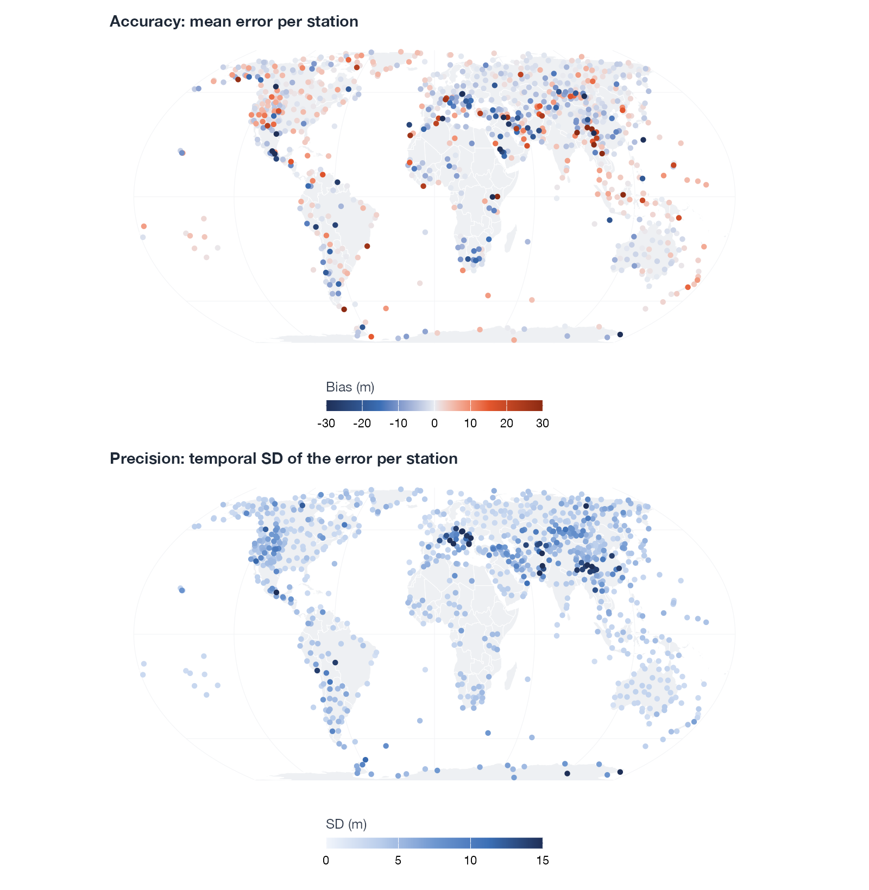
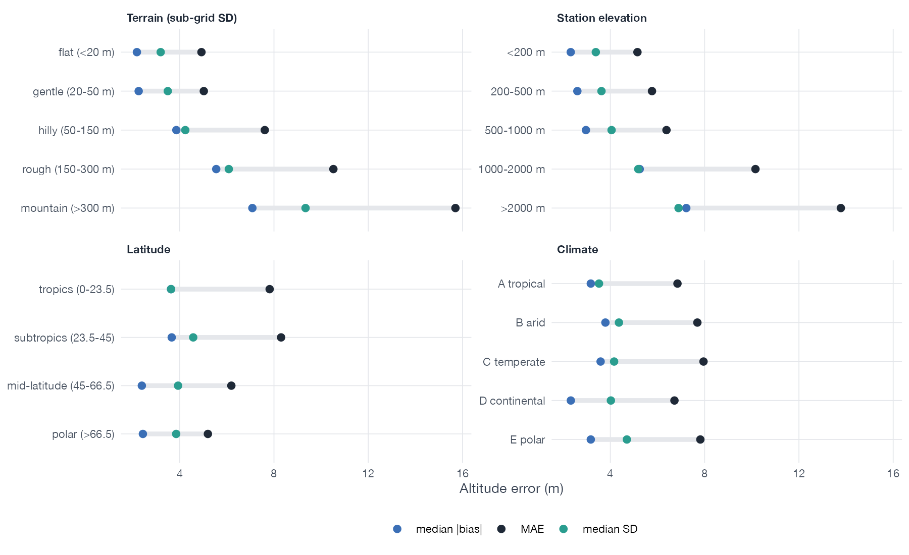
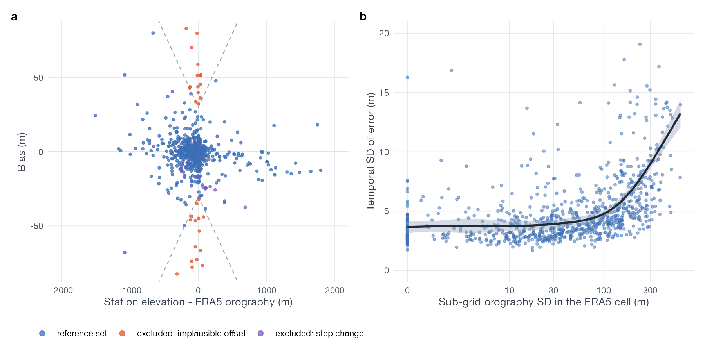
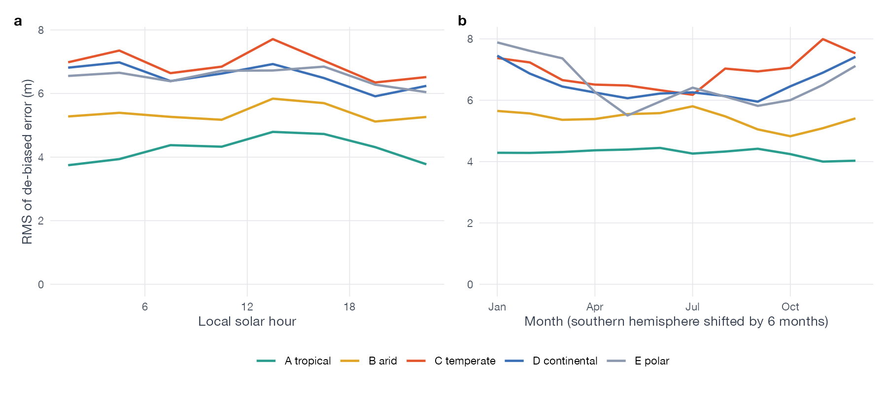
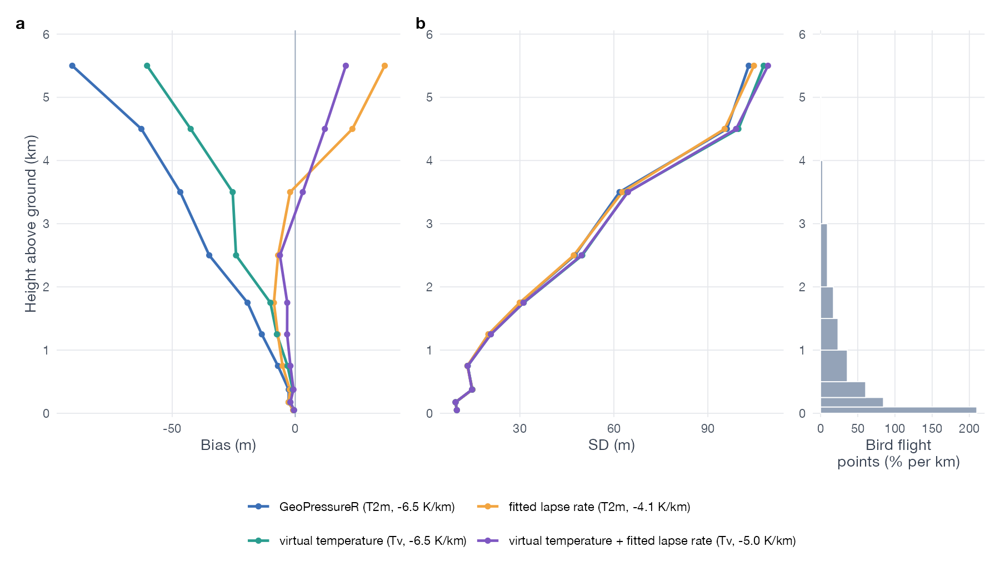
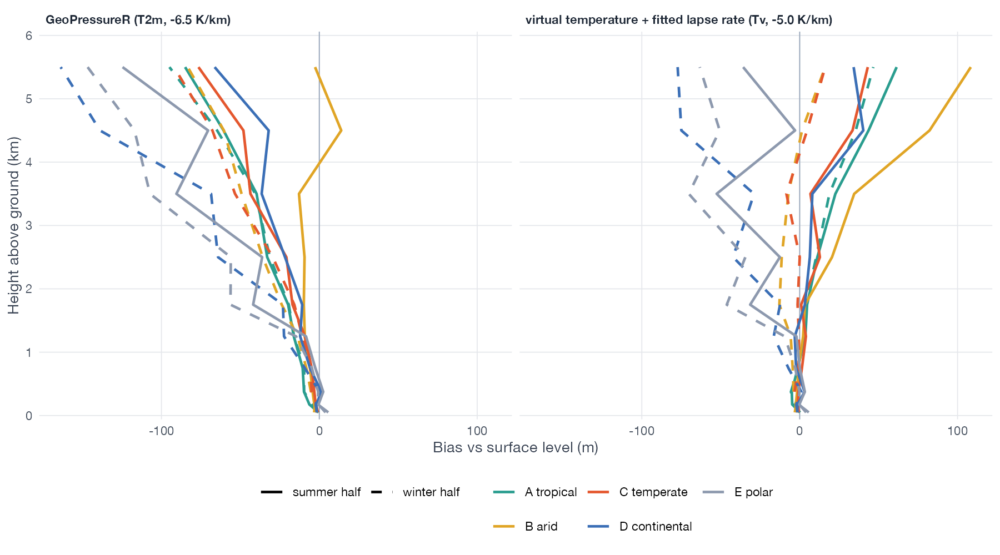

# How accurate is altitude from pressure geolocators?
Raphaël Nussbaumer
2026-09-30

> [!NOTE]
>
> ### In short
>
> - **Ground level.** GeoPressureR’s default (ERA5 single-levels) places
>   a geolocator on the ground with a median per-site **bias of 3.2 m**
>   (90% of sites within 14.8 m) and a **temporal scatter (SD) of 4.1
>   m**. Pooled MAE: **7.3 m** (905 stations, 2022–2024).
> - **On the ground, terrain drives the error.** It is a fixed offset
>   per place, and it roughly triples from flat terrain to mountains.
> - **In flight, altitude is too low by ~1–1.5% of the height above
>   ground**: -14 m at 1–1.5 km, -35 m at 2–3 km. The cause is the
>   formula’s standard temperature profile. Over the heights birds fly,
>   flight adds a MAE of **15.6 m**.
> - **ERA5-Land is much worse** for absolute altitude (MAE 29.0 m).
>   Don’t use it for altitude.
> - **The formula can be improved.** Virtual temperature plus a fitted
>   lapse rate of -5.0 K/km cuts the in-flight bias from -10.7 m to -1.8
>   m on held-out stations, with no change on the ground. GeoPressureR
>   does not do this (yet).

# Introduction

**Pressure geolocators record atmospheric pressure, not altitude.**
Altitude is derived afterwards, by comparing the recorded pressure with
a weather reanalysis. GeoPressureR (and GeoPressureAPI behind it) does
this with ERA5. The altitude is then used to:

- tell flight from rest, and reconstruct flight altitude and climbs;
- compare the altitude of resting sites with the terrain, which helps
  with positioning.

Users need to know how good that altitude is, where and when it is
worse, and why.

## How GeoPressureR computes altitude

For a pressure $p$ at a given place and hour, GeoPressureR reads three
ERA5 fields at the nearest grid cell and hour: surface pressure $p_0$, 2
m temperature $T_0$ and orography $z_0$. It then applies the barometric
formula with the standard lapse rate $L = -6.5$ K/km:

$$
z = z_0 + \frac{T_0}{L}\left[\left(\frac{p}{p_0}\right)^{-R L / (g M)} - 1\right].
$$

This is the hypsometric equation (Wallace & Hobbs 2006, ch. 3) for one
assumed temperature profile:

$$
z - z_0 = \frac{R_d}{g}\,\bar T_v \,\ln\frac{p_0}{p},
$$

where $\bar T_v$ is the (log-pressure weighted) mean *virtual*
temperature of the layer between $p_0$ and $p$. The assumed profile:

- starts at the ERA5 2 m temperature and decreases at −6.5 K/km, as in
  the ICAO standard atmosphere (ICAO 1993; ISO 1975);
- treats the air as dry ($T_v = T$).

## Where the error comes from

- **ERA5 at the surface.** $p_0$ and $z_0$ are 0.25° (~28 km) averages.
  Terrain the grid can’t resolve puts the real ground above or below
  $z_0$. This mostly matters on the ground.
- **The assumed temperature profile.** The layer thickness is
  proportional to $\bar T_v$, so an error in the assumed mean
  temperature is the same *relative* error in height (below). This
  mostly matters in flight.
- **The sensor.** A geolocator’s own offset, drift and resolution (1 hPa
  ≈ 8 m) come on top. They are not evaluated here.

$$
\frac{\delta (z - z_0)}{z - z_0} = \frac{\bar T_\text{assumed} - \bar T_{v,\text{true}}}{\bar T_{v,\text{true}}}
$$

An assumed layer 3 K (≈1%) too cold puts a bird at 2 km about 20 m too
low. On the ground, $z - z_0$ is only the small gap to the ERA5
orography (median 56 m), so the assumption barely matters there.

## Alternatives to the standard profile

The assumed layer is usually too cold, for two separate reasons:

1.  **Humidity.** Moist air is lighter, so a moist layer is thicker. The
    hypsometric equation requires the virtual temperature
    $T_v = T\,(1 + 0.608\,q)$, with $q$ the specific humidity. Using $T$
    instead is a simplification, not a modelling choice, and correcting
    it has no free parameter.
2.  **Lapse rate.** −6.5 K/km is a mean over the whole troposphere (0–11
    km). Near the surface, lapse rates vary with latitude and season
    (Stone & Carlson 1979; Rolland 2003) and are often shallower,
    e.g. 3.9–5.2 K/km annual means in the Cascade Mountains (Minder et
    al. 2010). Surface inversions make them shallower still, or reverse
    them.

Both are simple changes to the formula. This report tests whether they
help.

## Aims

An earlier check over the Alps
([GeoPressureAPI#27](https://github.com/GeoPressure/GeoPressureAPI/issues/27))
found ~9 m MAE with ERA5 single-levels and made single-levels the
default. This study extends it to:

1.  **the globe, the annual cycle and three recent years**: accuracy and
    precision on the ground;
2.  **the heights birds fly (0–6 km)**, using radiosondes;
3.  **the drivers**: terrain, climate, season, time of day, and ERA5’s
    change over time;
4.  **ERA5-Land vs ERA5 single-levels**;
5.  **two formula improvements**: virtual temperature, and a lapse rate
    fitted to the radiosondes.

# Methods

## Altitude retrieval evaluated

- **The exact GeoPressureR code path.** Grid snapping, nearest-hour
  matching, the ERA5 orography and `pressure_to_altitude()` all come
  from GeoPressureR 3.6.3.9000 (bc72cf02). ERA5 is read from the ECMWF
  ARCO archive (`pressurepath_create(source = "arco")`).
- **GeoPressureAPI gives the same result.** Across 2,238 station-hours
  at 25 stations, the API (Earth Engine) and ARCO differ by at most
  0.09 m. All results apply to both entry points.
- **Two ERA5 products.** ERA5 single-levels (0.25°, the default;
  Hersbach et al. 2020) and ERA5-Land (0.1°; Muñoz-Sabater et al. 2021).
  GeoPressureR’s `"both"` option is ERA5-Land over land, so it is not
  evaluated separately.

## Data

Table 1: Reference data.

|  | Tier A: surface barometers | Tier B: radiosondes |
|:---|:---|:---|
| Source | HadISD v3.4.3.2025f | IGRA v2.2 |
| Years | 2022–2024 (+ 1990, 2005, 2015 for 100) | 2023–2024 |
| Stations selected | 2,534 | 361 |
| Stations used | 969 (905 in the reference set) | 326 |
| Observations | 13,305,349 station-hours | 367,896 soundings, 5,881,928 levels |
| Station elevation (median, range) | 278 m (-36 to 4613 m) | 96 m (-24 to 3233 m) |
| Stations above 1000 m | 35% | 14% |
| Reference height | station elevation | sonde geopotential height |

Figure 1: Stations used. Right: station elevations (log scale).

### Tier A: surface barometers (HadISD)

**Source.** HadISD (Dunn et al. 2012, 2016) is a quality-controlled
subset of NOAA’s Integrated Surface Database (ISD; Smith et al. 2011).
Its **station-level pressure** is treated as a geolocator reading, and
the altitude retrieved from it is compared with the station elevation.

**Selection.** The aim is spatial balance, not network density:

- **Candidates** (2,534): in every 5°×5° cell, the highest, the lowest
  and one random station, plus every station above 1000 m.
- **Coverage** (1,833 kept): station pressure on at least half the days
  of each of 2022–2024, at least 6-hourly on average.
- **Thinning** (969 kept): one random station per 5° cell, plus one per
  2.5° cell above 1000 m. This keeps mountains well represented.
- **Subsets.** ERA5-Land is read for a random 200 stations. A random 100
  that also report in 1990, 2005 and 2015 are used to test change over
  time.

**Gross errors.** Single observations more than 100 m and 10 robust SD
from their station’s median error are dropped (0.08% of observations).

**Reference screen.** At ~5–10 m, errors in the reference itself matter.
They are well documented:

- SYNOP surface pressure is biased at several hundred stations, often by
  several hPa. The cause is “mostly … incorrect assumptions about the
  station heights”, and the bias stays fairly constant in time
  (Vasiljevic et al. 2006).
- ECMWF’s monitoring guidance lists the usual causes (ECMWF 2025): wrong
  lat/lon/elevation metadata, GNSS elevations without the geoid
  correction, sensor or encoding errors, and step jumps when the
  barometer height or position changes.
- WMO defines the datum of station pressure ($H_p$) separately from the
  ground elevation (WMO 2023), so the two can legitimately differ.
- HadISD is quality-controlled but **not homogenised**, and it merges
  records of co-located stations (Dunn et al. 2012, 2016).
- ERA5 bias-corrects or rejects such stations when it assimilates them
  (Vasiljevic et al. 2006; Hersbach et al. 2020). Where one station and
  ERA5 disagree by a constant offset, the station is usually at fault.

Two rules therefore remove stations from the **reference set** (64 of
969, 7%):

1.  **Implausible offset** (50): \|bias\| \> 30 m + 10% of the gap
    between station elevation and ERA5 orography. That is about twice
    what ERA5 can produce, judged from data that don’t use the station’s
    own bias:
    - where ERA5 needs no extrapolation (flat, gap \< 30 m), 95% of
      stations are within 15 m;
    - over a height gap, radiosondes put the extrapolation error at -0.6
      to -1.1% of the gap, and within 7% for 99% of stations.
2.  **Step change** (14): a clear jump in the station’s error during
    2022–2024. Each station’s monthly median errors are fitted with a
    month-of-year effect plus one step, and a station is flagged if
    \|step\| ≥ 10 m and \|t\| ≥ 10. ERA5 doesn’t jump at one site; a
    station does when it moves or changes barometer. Examples:
    Xifengzhen, Nyeri, Eldoret (-56, 52, 48 m).

**Independent checks confirm that the screen removes station errors, not
ERA5 errors:**

- **Neighbours.** 9 excluded stations have another HadISD station within
  50 km. ERA5 fits every one of those neighbours to within 10 m, while
  the excluded stations are off by up to 1,591 m. Conversely, 4 of 16
  tested reference stations with \|bias\| \> 15 m share their offset
  with a neighbour. Those are real ERA5 errors, mostly in mountains, and
  they are kept.
- **No mechanism in ERA5.** 32 of the 50 implausible offsets are at
  stations whose elevation the DEM confirms, often in flat terrain next
  to ERA5’s orography (e.g. Gabes / Matmata, Changde, Strigino).
- **Constant in time.** Excluded stations track ERA5 hour by hour
  (median SD 5.4 m) at a fixed offset, the signature of a station-height
  error.

**No DEM filter.** A DEM check (SRTM, ASTER) mostly measures coordinate
precision: 63% of coordinates are rounded to whole arc-minutes (±900 m).
At 77 good stations, the DEM contradicts an elevation that ERA5
reproduces. The DEM is used only as supporting evidence (Appendix A).

**What remains.** The reference set still holds small reference errors
no screen can catch: steps \< 10 m, barometers a few metres above the
listed ground, rounded elevations. Its accuracy is therefore an upper
bound on ERA5’s. The median bias is robust to the screen (2.9–3.4 m
across all variants, Appendix A); MAE and RMSE are not.

### Tier B: radiosondes (IGRA2)

**Source.** IGRA v2.2 (Durre et al. 2006, 2018). At every level a sonde
reports pressure and geopotential height. The pressure is given to the
altitude formula at the launch site and the hour of that level, and the
result is compared with the sonde’s height.

**Selection and filtering.**

- **Candidates** (361): in every 10°×10° cell, the highest and one
  random active station, plus every station above 1000 m. 351 have data
  in 2023–2024.
- **Levels**: all levels up to 6 km above ground, the upper end of bird
  flight. The time of each level comes from the reported elapsed time,
  or assumes a 5 m/s ascent.
- **Enough soundings**: stations weigh equally, so each needs ≥100
  soundings (326 kept).
- **Gross errors**: levels more than 150 m and 10 robust SD from the
  median of their height bin are dropped (0.06% of levels).
- **No station screen needed**: errors are taken relative to the
  sounding’s surface level (below), which cancels the station elevation.

### Bird flight heights

The heights at which tracked birds fly are used to weight the in-flight
errors. They come from the flight points of the GeoLocator master data
package (<https://doi.org/10.5281/zenodo.18187092>), binned by height
above ground.

## Error metrics

- **Accuracy vs precision.** Each station’s error splits into its mean
  (the **bias**: constant in time, matters for absolute altitude) and
  the SD around it (**precision**: matters for altitude changes). A
  wrong station elevation shifts only the bias.
- **Height relative to the surface (Tier B).** Error at a level minus
  error at the same sounding’s surface level. This isolates how the
  error grows with height.
- **Equal station weights.** Pooled statistics weight stations equally,
  so dense networks don’t dominate.
- **Bird-weighted error.** Tier B height bins weighted by the share of
  bird flight points in them.

## Drivers

- **Candidates.** Station level: gap between station elevation and ERA5
  orography, sub-grid terrain roughness (ERA5 `sdor`), latitude,
  Köppen-Geiger climate zone. Observation level: local solar hour,
  season, boundary layer height, skin − 2 m temperature (a proxy for
  surface inversions), 6 h surface pressure tendency.
- **Model.** GAMs (mgcv). Each driver is ranked by the deviance
  explained lost when it is dropped.
- **Temperature explanation (Tier B).** The error expected from the
  temperature assumption alone is
  $\Delta z \cdot (\bar T_\text{assumed} - \bar T_\text{obs}) / \bar T_\text{obs}$,
  with $\bar T_\text{obs}$ the sonde’s log-pressure weighted mean
  temperature below the level.

## Formula variants

- **Virtual temperature.** $q$ comes from the ERA5 2 m dewpoint and
  surface pressure (vapour pressure from Bolton 1980). Surface humidity
  is assumed to hold through the layer, as in pressure reduction to sea
  level (WMO 1968).
- **Fitted lapse rate.** $L$ minimises the bird-weighted squared error
  relative to the surface (Tier B). It is fitted both with $T_0$ and
  with $T_{v,0}$.
- **Robustness.** 20 random 50/50 station splits (fit on one half,
  evaluate on the other); separate fits per climate zone and half-year;
  an alternative objective that weights all height bins equally. The
  effect on the ground is evaluated on Tier A.
- **Headline numbers stay those of the current formula.** Variants
  appear only where labelled.

# Results

## Ground level

Table 2: Altitude error at ground level, 2022–2024 (m). \|bias\|:
per-station mean error. SD: temporal scatter per station. MAE, RMSE,
p95: pooled over station-hours, stations weighted equally.

|  | stations | median \|bias\| | p90 \|bias\| | median SD | MAE | RMSE | p95 \|err\| |
|:---|---:|:---|:---|:---|:---|:---|:---|
| all stations | 969 | 3.4 | 21.7 | 4.2 | 16.8 | 81.3 | 43.9 |
| reference set | 905 | 3.2 | 14.8 | 4.1 | 7.3 | 11.5 | 24.6 |
| reference set, ERA5-Land | 166 | 13.7 | 69.3 | 5.6 | 29.0 | 47.8 | 108.6 |

- **Accuracy: median \|bias\| 3.2 m, 90% of sites within 14.8 m.**
  Biases of both signs occur everywhere; the largest are in mountains
  (<a href="#fig-maps" class="quarto-xref">Figure 2</a>).
- **Precision: SD 4.1 m.** Precision is better than accuracy: at a given
  place, the error is mostly a fixed offset.
- **Terrain drives both**
  (<a href="#fig-class" class="quarto-xref">Figure 3</a>). From flat to
  mountainous terrain:
  - median \|bias\| 2.2 → 7.1 m;
  - MAE 4.9 → 15.7 m;
  - SD 3.2 → 9.3 m.

  Latitude and climate matter much less.

Figure 2: Accuracy (top) and precision (bottom) per station, reference
set, ERA5 single-levels. Colours clipped at ±30 m and 15 m.

Figure 3: Error by station class (reference set). Terrain = sub-grid
orography SD in the ERA5 cell.

- **The bias follows the terrain the grid can’t resolve**
  (<a href="#fig-drivers" class="quarto-xref">Figure 4</a>). It grows
  with the gap between station and ERA5 orography, and the SD grows with
  sub-grid roughness above ~100 m.
- **Almost no cycle in time**
  (<a href="#fig-cycles" class="quarto-xref">Figure 5</a>). Hour of day,
  season, boundary layer height, surface inversions and pressure
  tendency each explain \< 0.5% of deviance (Appendix B).
- **ERA5-Land is ~4× worse**
  (<a href="#fig-land" class="quarto-xref">Figure 6</a>): median
  \|bias\| 13.7 m, MAE 29.0 m.
- **ERA5 has improved.** For the same stations, the median \|bias\| fell
  from 6.1 m in 1990 to 2.6 m in 2024, and precision improved by about a
  third (<a href="#fig-era" class="quarto-xref">Figure 7</a>).

Figure 4: (a) Bias against the gap between station elevation and ERA5
orography; dashed: the plausibility bound (30 m + 10% of the gap). (b)
Precision against sub-grid terrain roughness (reference set, GAM fit).

Figure 5: Diurnal (3 h bins) and seasonal cycle of the de-biased error
(RMS), by climate zone.

Figure 6: Share of stations below a given \|bias\|, ERA5 single-levels
vs ERA5-Land (reference set).

Figure 7: Change over time, for the stations reporting in every year.

## In flight

Table 3: In-flight error of GeoPressureR, relative to the surface level
of the same sounding (m). Last row: averaged over the heights at which
tracked birds fly.

| height above ground | bias  | SD    | MAE   | RMSE  |
|:--------------------|:------|:------|:------|:------|
| 0.5–1 km            | -7.0  | 13.3  | 10.3  | 15.0  |
| 1–1.5 km            | -13.6 | 20.0  | 17.7  | 24.2  |
| 2–3 km              | -35.0 | 47.5  | 43.2  | 59.0  |
| 3–4 km              | -46.7 | 61.8  | 56.9  | 77.5  |
| 5–6 km              | -90.6 | 103.1 | 109.1 | 137.2 |
| **bird-weighted**   | -10.7 |       | 15.6  | 30.6  |

- **Altitude is too low, by ~1–1.5% of height**
  (<a href="#fig-height" class="quarto-xref">Figure 8</a>). The bias
  grows steadily with height, and the scatter grows faster.
- **The temperature profile explains it**
  (<a href="#fig-temperature" class="quarto-xref">Figure 9</a>). The
  error predicted from the sonde’s own temperature profile explains 93%
  of the variance (r = 0.96). The formula’s layer is usually too cold
  (shallower real lapse rates, inversions, humidity), so the bird is
  placed too low.
- **Worst in continental and polar winters**
  (<a href="#fig-climate" class="quarto-xref">Figure 10</a>), where
  strong surface inversions sit under much warmer air.
- **ERA5-Land behaves the same in flight.** Its orography offset cancels
  relative to the surface, which confirms that its problem is a fixed
  spatial offset.

Figure 8: Bias (a) and SD (b) of the in-flight error against height
above ground, with the height distribution of geolocator flight points
(right).

Figure 9: Observed in-flight error against the error predicted from the
difference between the assumed and the observed layer temperature
(levels above 200 m). Red: 1:1 line.

Figure 10: In-flight bias by climate zone and season (solid: summer
half-year; dashed: winter half-year; southern hemisphere shifted by six
months).

## Improving the formula

Table 4: Bird-weighted in-flight error on held-out stations (mean ± SD
over 20 random 50/50 station splits; the lapse rate is fitted on the
other half). MAE gain: MAE reduction vs the current formula on the same
stations, mean (worst split), m.

| formula | L (K/km) | bias | MAE | RMSE | MAE gain |
|:---|:---|:---|:---|:---|:---|
| GeoPressureR (T2m, -6.5 K/km) | -6.50 ± 0.00 | -10.7 ± 0.8 | 15.5 ± 0.5 | 30.5 ± 1.1 | 0.0 (0.0) |
| virtual temperature (Tv, -6.5 K/km) | -6.50 ± 0.00 | -6.2 ± 0.8 | 13.4 ± 0.5 | 28.2 ± 1.2 | 2.1 (1.9) |
| fitted lapse rate (T2m, -4.1 K/km) | -4.15 ± 0.10 | -3.8 ± 1.0 | 13.1 ± 0.5 | 25.8 ± 1.1 | 2.4 (2.1) |
| virtual temperature + fitted lapse rate (Tv, -5.0 K/km) | -5.01 ± 0.10 | -1.8 ± 1.0 | 13.1 ± 0.4 | 26.2 ± 1.1 | 2.4 (2.0) |

- **Fitted lapse rate: -4.1 K/km with dry air, -5.0 K/km with virtual
  temperature.** It is well determined: ±0.1 K/km across splits, and
  -5.3 K/km when all height bins weigh equally. About a third of the gap
  to −6.5 K/km is humidity.
- **Virtual temperature alone** reduces the held-out bias from -10.7 m
  to -6.2 m. The correction ranges from 0.3 K (polar winter) to 3.3 K
  (tropics).
- **Both together**: bias -1.8 m, MAE 15.5 → 13.1 m, better in all 20
  splits. Held-out and in-sample errors are practically identical.
- **Fitting the lapse rate alone performs about as well** statistically
  (<a href="#tbl-formula" class="quarto-xref">Table 4</a>).
- **The underestimation disappears up to ~3 km**
  (<a href="#fig-formula" class="quarto-xref">Figure 11</a>): -3 m at
  1–1.5 km and -6 m at 2–3 km, vs -14 and -35 m. Above that, the
  corrected formula slightly overestimates (21 m at 5–6 km).
- **The scatter does not change.** A constant lapse rate can’t follow
  the day-to-day profile.
- **Regional and seasonal biases remain**
  (<a href="#fig-formula-climate" class="quarto-xref">Figure 12</a>).
  Fitted per group, the lapse rate ranges from -7.0 K/km (arid summer)
  to -2.6 K/km (polar winter). With the global value, continental and
  polar winters stay too low and arid summers become too high.
- **No change on the ground.** Pooled MAE goes from 7.25 to 7.24 m; the
  largest change of any single observation is 9.7 m.

Figure 11: Bias (a) and SD (b) against height for the current formula
and the three variants (lapse rates fitted on all stations), with the
height distribution of geolocator flight points.

Figure 12: In-flight bias by climate zone and season: current formula
(left), and virtual temperature with the fitted lapse rate (right).
Solid: summer half-year; dashed: winter half-year.

# Discussion

## What users can expect

| Situation | Typical error | Driver |
|----|----|----|
| Absolute altitude on the ground, flat terrain | bias 2.2 m (p90 8.3 m), MAE 4.9 m | ERA5 surface pressure at 0.25° |
| Absolute altitude on the ground, mountains | bias 7.1 m (p90 25.9 m), MAE 15.7 m | terrain the 0.25° grid can’t resolve |
| Altitude *changes* at one site | SD 3.2 m (flat) to 9.3 m (mountains) | as above; almost no diurnal or seasonal cycle |
| In flight, 1–1.5 km above ground | -14 m bias, RMSE 24 m (on top of the ground error) | assumed temperature profile |
| In flight, 2–3 km above ground | -35 m bias, RMSE 59 m | as above; ~2× in continental/polar winter |

## Key points

- **On the ground, the error is a fixed offset per place, not noise.**
  Station identity explains almost all the explainable variation.
  Relative altitudes at one site (SD ~4 m) are therefore more reliable
  than absolute ones (MAE ~7 m).
- **In flight, the error is systematic and grows with height.** Flight
  altitudes from GeoPressureR are conservative. A bird at 2 km above
  ground is placed about 25–35 m too low, with a scatter of 30–50 m; in
  a continental or polar winter, both roughly double.
- **Older tracks are somewhat less accurate.** ERA5’s ground-level bias
  in 1990 was about twice that of 2024.
- **Use ERA5 single-levels, not ERA5-Land, for altitude.** ERA5-Land’s
  orography is inconsistent with its surface pressure, which shifts
  every altitude by a fixed, place-dependent offset
  ([GeoPressureAPI#27](https://github.com/GeoPressure/GeoPressureAPI/issues/27)).

## Recommendation for GeoPressureR

- **Add the virtual temperature.** It corrects a simplification, has no
  free parameter, and on its own removes about 40% of the in-flight
  bias. It only needs the ERA5 2 m dewpoint.
- **Combine it with a lapse rate of -5.0 K/km.** The held-out in-flight
  bias drops from -10.7 m to -1.8 m, with no effect on the ground. The
  estimate is stable across splits and objectives, and it lies within
  the range reported near the surface.
- **Prefer the combination to a lapse rate alone.** A dry-air fit (-4.1
  K/km) does about as well statistically. But it folds humidity and the
  temperature profile into one constant with no physical meaning, which
  is harder to interpret and to refine.
- **Beyond a constant lapse rate.** The remaining scatter and regional
  biases come from the actual temperature profile (inversions, deep
  convective boundary layers). Fixing them needs a lapse rate that
  varies with place and season, or the ERA5 temperature profile or
  geopotential on pressure levels. The latter could remove most of the
  temperature-driven variance (93% of the in-flight error), but it needs
  far more ERA5 data per point.

## Limitations

- **Not independent of ERA5.** ERA5 assimilates both the station
  pressures and the radiosondes, so errors *at these sites* are
  optimistic. Remote areas are likely somewhat worse, especially for
  ground-level bias.
- **The sensor is not included.** These are errors of the retrieval,
  given a perfect pressure reading.
- **Radiosonde geometry.** The ERA5 column at the launch site is used,
  and balloon drift (a few km below 5 km) is ignored. Sonde heights are
  themselves hypsometric. The ~10 m scatter in the first 100 m partly
  reflects integer-metre reporting.
- **Reference screen.** 64 stations were excluded. Neighbours and DEMs
  support this where available, but not every excluded station could be
  checked. The reference set still holds small undetected reference
  errors.
- **Sampling.** Coverage is still sparse in parts of Africa, South
  America and over the oceans (Tier A is land only).

# Data and code availability

- **Code:** <https://github.com/GeoPressure/altitude-validation>.
- **ERA5 and ERA5-Land:** Copernicus Climate Change Service, via the
  ECMWF ARCO archive.
- **HadISD:** Met Office Hadley Centre, Non-Commercial Government
  Licence. It may contain data governed by WMO Resolution 40 Annex 1;
  only derived statistics are published here.
- **IGRA2:** NOAA NCEI.
- **Bird heights:** GeoLocator master data package
  (<https://doi.org/10.5281/zenodo.18187092>).
- **DEMs:** SRTM GL1 and ASTER GDEM v3, via OpenTopoData.

# References

- Bolton D (1980) The computation of equivalent potential temperature.
  *Monthly Weather Review* 108:1046–1053.
  <https://doi.org/10.1175/1520-0493(1980)108%3C1046:TCOEPT%3E2.0.CO;2>
- Dunn RJH, Willett KM, Thorne PW, et al. (2012) HadISD: a
  quality-controlled global synoptic report database for selected
  variables at long-term stations from 1973–2011. *Climate of the Past*
  8:1649–1679. <https://doi.org/10.5194/cp-8-1649-2012>
- Dunn RJH, Willett KM, Parker DE, Mitchell L (2016) Expanding HadISD:
  quality-controlled, sub-daily station data from 1931. *Geoscientific
  Instrumentation, Methods and Data Systems* 5:473–491.
  <https://doi.org/10.5194/gi-5-473-2016>
- Durre I, Vose RS, Wuertz DB (2006) Overview of the Integrated Global
  Radiosonde Archive. *Journal of Climate* 19:53–68.
  <https://doi.org/10.1175/JCLI3594.1>
- Durre I, Yin X, Vose RS, et al. (2018) Enhancing the data coverage in
  the Integrated Global Radiosonde Archive. *Journal of Atmospheric and
  Oceanic Technology* 35:1753–1770.
  <https://doi.org/10.1175/JTECH-D-17-0223.1>
- ECMWF (2025) Guidance on SYNOP surface pressure monitoring issues.
  ECMWF Confluence (E. Kuscu).
  <https://confluence.ecmwf.int/pages/viewpage.action?pageId=298952900>
- Hersbach H, Bell B, Berrisford P, et al. (2020) The ERA5 global
  reanalysis. *Quarterly Journal of the Royal Meteorological Society*
  146:1999–2049. <https://doi.org/10.1002/qj.3803>
- ICAO (1993) *Manual of the ICAO Standard Atmosphere*, Doc 7488/3, 3rd
  ed. International Civil Aviation Organization, Montreal.
- ISO (1975) *ISO 2533:1975 Standard Atmosphere*. International
  Organization for Standardization.
- Minder JR, Mote PW, Lundquist JD (2010) Surface temperature lapse
  rates over complex terrain: lessons from the Cascade Mountains.
  *Journal of Geophysical Research* 115:D14122.
  <https://doi.org/10.1029/2009JD013493>
- Muñoz-Sabater J, Dutra E, Agustí-Panareda A, et al. (2021) ERA5-Land:
  a state-of-the-art global reanalysis dataset for land applications.
  *Earth System Science Data* 13:4349–4383.
  <https://doi.org/10.5194/essd-13-4349-2021>
- NASA/METI/AIST/Japan Spacesystems and U.S./Japan ASTER Science
  Team (2019) ASTER Global Digital Elevation Model V003. NASA EOSDIS
  Land Processes DAAC. <https://doi.org/10.5067/ASTER/ASTGTM.003>
- NASA JPL (2013) NASA Shuttle Radar Topography Mission Global 1 arc
  second. NASA EOSDIS Land Processes DAAC.
  <https://doi.org/10.5067/MEaSUREs/SRTM/SRTMGL1.003>
- Rodríguez E, Morris CS, Belz JE (2006) A global assessment of the SRTM
  performance. *Photogrammetric Engineering & Remote Sensing*
  72:249–260. <https://doi.org/10.14358/PERS.72.3.249>
- Rolland C (2003) Spatial and seasonal variations of air temperature
  lapse rates in Alpine regions. *Journal of Climate* 16:1032–1046.
  <https://doi.org/10.1175/1520-0442(2003)016%3C1032:SASVOA%3E2.0.CO;2>
- Smith A, Lott N, Vose R (2011) The Integrated Surface Database: recent
  developments and partnerships. *Bulletin of the American
  Meteorological Society* 92:704–708.
  <https://doi.org/10.1175/2011BAMS3015.1>
- Stone PH, Carlson JH (1979) Atmospheric lapse rate regimes and their
  parameterization. *Journal of the Atmospheric Sciences* 36:415–423.
  <https://doi.org/10.1175/1520-0469(1979)036%3C0415:ALRRAT%3E2.0.CO;2>
- Vasiljevic D, Andersson E, Isaksen L, Garcia-Mendez A (2006) Surface
  pressure bias correction in data assimilation. *ECMWF Newsletter*
  108:20–27. <https://doi.org/10.21957/uv295rfmx5>
- Wallace JM, Hobbs PV (2006) *Atmospheric Science: An Introductory
  Survey*, 2nd ed., ch. 3. Academic Press.
  <https://doi.org/10.1016/B978-0-12-732951-2.50008-9>
- WMO (1968) *Methods in Use for the Reduction of Atmospheric Pressure*.
  Technical Note 91, WMO-No. 226. World Meteorological Organization,
  Geneva.
- WMO (2023) *Guide to Instruments and Methods of Observation*, Volume I
  (WMO-No. 8), chapters 1 (station elevation) and 3 (atmospheric
  pressure). World Meteorological Organization, Geneva.

# Appendix A: reference screen

## Why the DEM is not used as a filter

- **Coordinates are coarse.** 63% fall on whole arc-minutes (±0.5′, up
  to ±900 m). A single DEM point can then be off by tens to hundreds of
  metres in rough terrain.
- **The DEM is therefore sampled on a 5×5 grid over that uncertainty**,
  in SRTM and ASTER GDEM. An elevation is “refuted” if it lies more than
  15 m outside the DEM range in every available DEM.
- **SRTM would not have helped.** The Mapzen tiles used before are SRTM
  wherever SRTM exists (median difference 0 m).
- **DEMs are only good to ~15 m.** SRTM’s 90% absolute height error is
  5–9 m (Rodríguez et al. 2006). SRTM and ASTER differ by a median 5 m
  (p90 14 m).
- **A DEM filter would remove good stations.** At 77 reference stations
  the DEM contradicts the listed elevation (median difference 72 m), yet
  ERA5 reproduces it (median \|bias\| 6.5 m). There, the coordinates are
  wrong, not the elevation.

## Sensitivity to the screen

Table 5: Ground-level statistics (m) for looser and stricter
plausibility bounds (\|bias\| ≤ a + b × gap), with the step-change
stations kept or excluded. Used in the report: ‘30 m + 10%’ with
step-change stations excluded.

| offset rule | step stations | stations | median \|bias\| | p90 \|bias\| | median SD | MAE | RMSE | p95 \|err\| |
|:---|:---|---:|:---|:---|:---|:---|:---|:---|
| no screen | kept | 969 | 3.4 | 21.7 | 4.2 | 16.8 | 81.3 | 43.9 |
| no screen | excluded | 955 | 3.4 | 21.3 | 4.1 | 16.8 | 81.8 | 43.8 |
| 15 m + 5% | kept | 879 | 3.0 | 11.6 | 4.1 | 6.4 | 10.0 | 20.4 |
| 15 m + 5% | excluded | 868 | 2.9 | 11.6 | 4.0 | 6.3 | 9.8 | 19.9 |
| 30 m + 10% (used) | kept | 919 | 3.2 | 15.5 | 4.1 | 7.4 | 11.8 | 25.4 |
| 30 m + 10% (used) | excluded | 905 | 3.2 | 14.8 | 4.1 | 7.3 | 11.5 | 24.6 |
| 60 m + 20% | kept | 947 | 3.4 | 18.9 | 4.2 | 8.8 | 15.5 | 33.0 |
| 60 m + 20% | excluded | 933 | 3.3 | 17.6 | 4.1 | 8.7 | 15.4 | 32.3 |
| 100 m + 30% | kept | 955 | 3.4 | 20.1 | 4.2 | 9.7 | 19.0 | 36.2 |
| 100 m + 30% | excluded | 941 | 3.3 | 19.3 | 4.1 | 9.6 | 18.9 | 35.5 |

- **The medians don’t move.** The median bias and median SD are
  insensitive to the screen.
- **MAE, RMSE and p95 do.** A few stations with offsets of hundreds of
  metres dominate them when included. Loosening the bound to 60 m + 20%
  adds back 28 stations and raises the MAE from 7.3 to 8.7 m.

## Basis of the plausibility bound

Table 6: \|bias\| where ERA5 needs no extrapolation: sub-grid SD \< 20 m
and station within 30 m of ERA5 orography (m).

|   n | p50 | p90 |  p95 |  p99 |
|----:|----:|----:|-----:|-----:|
| 233 | 2.3 | 8.4 | 14.7 | 46.7 |

Table 7: Extrapolation error over a height gap, measured by radiosondes:
per-station mean error relative to the surface level, divided by height
above ground.

| height (m)       | stations | median (%) | p99 of \|.\| (%) | max \|.\| (%) |
|:-----------------|---------:|-----------:|-----------------:|--------------:|
| (300,600\]       |      187 |      -0.65 |              6.9 |          20.8 |
| (600,1e+03\]     |      257 |      -0.78 |              6.4 |          36.4 |
| (1e+03,1.5e+03\] |      257 |      -0.86 |              3.2 |          20.3 |
| (1.5e+03,2e+03\] |      147 |      -0.92 |              6.7 |          19.3 |
| (2e+03,3e+03\]   |      248 |      -1.10 |              3.4 |           3.6 |

## Excluded stations

Table 8: Stations excluded from the reference set (m). SRTM/ASTER: DEM
at the listed coordinates. DEM refutes: listed elevation more than 15 m
outside the DEM range of the coordinate-uncertainty box in every
available DEM. Neighbour: median ERA5 bias in 2023 at up to two HadISD
stations within 50 km (blank: none, or not tested).

| station | reason | elev. | ERA5 orog. | bias | SD | step | from | SRTM | ASTER | DEM refutes | neighbour bias | neighbour km |
|:---|:---|---:|---:|---:|---:|---:|:---|---:|---:|:---|---:|---:|
| HERBERT ISLAND | implausible offset | 1605.0 | 47 | -1591.0 | 2.6 |  |  | 0 |  | TRUE | 2.9 | 34 |
| ERDENI | implausible offset | 2417.0 | 2492 | -1229.9 | 19.1 |  |  | 2427 | 2421 | FALSE |  |  |
| LAHSH | implausible offset | 1198.0 | 3501 | 816.5 | 26.1 |  |  | 4801 | 4803 | TRUE |  |  |
| THREDBO AWS | implausible offset | 1368.0 | 1177 | 582.8 | 11.1 |  |  | 1859 | 1862 | TRUE | 5.8 | 33 |
| LA ESPERANZA | implausible offset | 1100.0 | 1230 | 564.6 | 5.4 |  |  | 1757 | 1756 | TRUE |  |  |
| FLAGSTAFF | implausible offset | 2181.6 | 2224 | -485.2 | 16.8 |  |  | 2153 | 2154 | FALSE | -0.8 | 36 |
| PLAN DE GUADALUPE INTL / SALT | implausible offset | 1456.3 | 1737 | 337.9 | 5.5 |  |  | 1428 | 1420 | TRUE |  |  |
| SIVAS | implausible offset | 1285.0 | 1466 | 306.2 | 3.3 |  |  | 1286 | 1287 | FALSE |  |  |
| KASTAMONU | implausible offset | 1100.0 | 1262 | -301.2 | 5.8 |  |  | 1067 | 1075 | FALSE |  |  |
| NAZE/FUNCHATOGE | implausible offset | 294.1 | 21 | -284.4 | 2.9 |  |  | 291 | 291 | FALSE |  |  |
| BAGUIO | implausible offset | 1295.7 | 613 | 206.9 | 6.0 |  |  | 1288 | 1286 | FALSE |  |  |
| SHYMKENT | implausible offset | 422.1 | 509 | 177.3 | 3.7 |  |  | 408 | 409 | FALSE |  |  |
| LINCANG | implausible offset | 1503.0 | 1831 | 128.6 | 5.0 |  |  | 2712 | 2701 | TRUE |  |  |
| TONHIL | implausible offset | 2095.0 | 2094 | 126.7 | 5.3 |  |  | 2242 | 2240 | TRUE |  |  |
| BOGD | implausible offset | 1646.0 | 1564 | -124.0 | 7.5 |  |  | 1535 | 1528 | TRUE |  |  |
| GABES / MATMATA | implausible offset | 125.0 | 136 | -120.4 | 5.0 |  |  | 120 | 112 | FALSE |  |  |
| SUMBAWANGA | implausible offset | 1923.0 | 1634 | -114.2 | 5.2 |  |  | 1843 | 1834 | TRUE |  |  |
| AMARBUYANTAYN | implausible offset | 2103.0 | 1745 | 113.5 | 8.0 |  |  | 1919 | 1946 | TRUE |  |  |
| CHANGDE | implausible offset | 35.0 | 50 | 112.7 | 3.5 |  |  | 39 | 43 | FALSE |  |  |
| KHOY | implausible offset | 1213.4 | 1377 | -108.9 | 7.1 |  |  | 1187 | 1182 | TRUE |  |  |
| HIDALGO DEL PARRAL CHIH. | implausible offset | 1661.0 | 1839 | 83.2 | 8.3 |  |  | 1714 | 1713 | TRUE |  |  |
| MONTANA | implausible offset | 1508.0 | 1820 | -82.4 | 7.0 |  |  | 1450 | 1452 | FALSE | 4.9 | 14 |
| STRIGINO | implausible offset | 78.0 | 97 | 79.9 | 2.7 |  |  | 74 | 64 | FALSE |  |  |
| ALPINE-CASPARIS MUNI ARPT | implausible offset | 1375.6 | 1468 | -77.8 | 4.7 |  |  | 1365 | 1345 | FALSE | -5.0 | 32 |
| COLLINS BAY SASK | implausible offset | 492.0 | 429 | -76.6 | 2.5 |  |  | 498 | 507 | FALSE |  |  |
| KITALE | implausible offset | 1850.1 | 1947 | -73.8 | 8.4 |  |  | 1830 | 1833 | FALSE |  |  |
| MAKKOVIK | implausible offset | 71.0 | 93 | -72.6 | 88.5 |  |  | 62 | 52 | FALSE |  |  |
| RUO’ERGAI | implausible offset | 3441.0 | 3538 | 70.3 | 6.0 |  |  | 3457 | 3464 | FALSE |  |  |
| MECHERIA | implausible offset | 1175.0 | 1144 | -66.6 | 4.2 |  |  | 1111 | 1109 | TRUE | 2.3 | 30 |
| KIGOMA | implausible offset | 885.0 | 928 | -64.1 | 5.1 |  |  | 807 | 809 | FALSE |  |  |
| BAOAN INTL | implausible offset | 4.0 | 10 | 59.0 | 3.7 |  |  | -3 | 10 | FALSE | 1.2 | 26 |
| EL ALTO INTL | implausible offset | 4061.5 | 4047 | -53.5 | 4.5 |  |  | 4037 | 4032 | TRUE |  |  |
| PRIESTLEY GLACIER | implausible offset | 1924.0 | 1887 | 51.8 | 12.1 |  |  |  | 1992 | TRUE |  |  |
| POSSESSION IS | implausible offset | 30.0 | -3 | 51.7 | 9.7 |  |  |  |  |  |  |  |
| GUIUAN | implausible offset | 2.1 | 18 | 51.5 | 3.4 |  |  | 6 | 9 | FALSE |  |  |
| DEHRADUN | implausible offset | 682.0 | 726 | -46.5 | 6.1 |  |  | 655 | 655 | FALSE |  |  |
| HOVU-AKSY | implausible offset | 1043.0 | 1161 | -46.0 | 5.3 |  |  | 1013 | 999 | FALSE |  |  |
| DJELFA/TLETSI | implausible offset | 1144.0 | 1114 | 45.5 | 4.2 |  |  | 1132 | 1138 | FALSE |  |  |
| ILAM | implausible offset | 1368.0 | 1364 | -44.9 | 4.3 |  |  | 1328 | 1322 | FALSE |  |  |
| BAJANAUL | implausible offset | 504.0 | 429 | -44.0 | 3.0 |  |  | 539 | 537 | FALSE |  |  |
| HONAVAR | implausible offset | 9.0 | 130 | 43.9 | 16.3 |  |  | 20 | 19 | FALSE |  |  |
| S.A.N.A.E. AWS | implausible offset | 817.0 | 823 | 43.9 | 6.4 |  |  |  | 833 | FALSE |  |  |
| TANJUNG SELOR | implausible offset | 50.0 | 147 | -43.6 | 3.9 |  |  | 6 | 23 | FALSE |  |  |
| ARAK | implausible offset | 1661.8 | 1791 | 42.9 | 5.9 |  |  | 1654 | 1661 | FALSE |  |  |
| SALTOS DEL GUAIRA | implausible offset | 265.0 | 268 | 40.0 | 9.9 |  |  | 304 | 305 | FALSE |  |  |
| RUTENG/SATAR TACIK | step change | 1170.0 | 484 | -37.5 | 5.6 | 10 | 2022-08 | 1482 | 1475 | TRUE |  |  |
| YASAWA | implausible offset | 30.0 | 1 | 36.3 | 2.9 |  |  | 3 | 8 | TRUE |  |  |
| P C PELSER | implausible offset | 1354.5 | 1377 | -35.0 | 6.6 |  |  | 1362 | 1356 | FALSE |  |  |
| TUKTUT NOGAIT NWT | implausible offset | 522.0 | 559 | 33.9 | 4.1 |  |  |  | 561 | FALSE |  |  |
| BALDRICK AWS | implausible offset | 1968.0 | 1965 | 32.3 | 6.3 |  |  |  | 2980 | TRUE |  |  |
| NATITINGOU | implausible offset | 461.0 | 455 | -32.2 | 4.8 |  |  | 460 | 466 | FALSE |  |  |
| LICHINGA | step change | 1373.1 | 1127 | -25.7 | 12.8 | 24 | 2023-04 | 1366 | 1363 | FALSE |  |  |
| JOSE MARIA CORDOVA | step change | 2142.1 | 2033 | -24.2 | 7.1 | -14 | 2022-08 | 2122 | 2134 | FALSE | -9.7 | 20 |
| XIFENGZHEN | step change | 1423.0 | 1250 | -23.4 | 26.6 | -56 | 2024-01 | 1414 | 1422 | FALSE |  |  |
| MATAVERI INTL | step change | 69.2 | 8 | -22.3 | 11.5 | 26 | 2024-06 | 59 | 40 | FALSE |  |  |
| ELDORET | step change | 2120.0 | 2127 | -16.2 | 24.5 | 48 | 2023-05 | 2143 | 2138 | FALSE |  |  |
| NYERI | step change | 1759.0 | 2005 | -13.2 | 25.1 | 52 | 2023-02 | 1801 | 1795 | FALSE |  |  |
| IRINGA | step change | 1425.9 | 1607 | -10.0 | 11.1 | -20 | 2023-09 | 1419 | 1408 | FALSE |  |  |
| KURNOOL | step change | 281.0 | 341 | 8.5 | 5.9 | 11 | 2022-09 | 280 | 277 | FALSE |  |  |
| SUPUNG | step change | 76.0 | 303 | -8.3 | 8.5 | -15 | 2024-01 | 67 | 71 | FALSE | -0.4 | 32 |
| LITTLE CHICAGO NWT | step change | 63.0 | 211 | -6.4 | 9.2 | 14 | 2022-08 |  | 60 | FALSE |  |  |
| YOHO PARK BC | step change | 1602.0 | 2259 | 3.6 | 10.6 | -16 | 2022-08 | 1924 | 1918 | FALSE |  |  |
| STIGLER REGIONAL AIRPORT | step change | 183.2 | 184 | -3.6 | 12.2 | -27 | 2024-06 | 179 | 169 | FALSE |  |  |
| FRUHOLMEN FYR | step change | 14.2 | -2 | 3.4 | 7.1 | 12 | 2024-06 |  |  |  |  |  |

# Appendix B: supplementary tables

Table 9: Ground-level error by station class (reference set, ERA5
single-levels, m).

| group | class | stations | median \|bias\| | p90 \|bias\| | median SD | p90 SD | MAE | p95 \|err\| |
|:---|:---|---:|:---|:---|:---|:---|:---|:---|
| terrain | flat (\<20 m) | 293 | 2.2 | 8.3 | 3.2 | 5.3 | 4.9 | 16.4 |
| terrain | gentle (20-50 m) | 169 | 2.3 | 9.7 | 3.5 | 5.4 | 5.0 | 15.6 |
| terrain | hilly (50-150 m) | 234 | 3.9 | 15.2 | 4.2 | 6.9 | 7.6 | 25.8 |
| terrain | rough (150-300 m) | 153 | 5.6 | 20.1 | 6.1 | 11.5 | 10.5 | 31.4 |
| terrain | mountain (\>300 m) | 56 | 7.1 | 25.9 | 9.3 | 14.3 | 15.7 | 51.8 |
| elevation | \<200 m | 432 | 2.3 | 8.7 | 3.4 | 5.8 | 5.2 | 16.9 |
| elevation | 200-500 m | 100 | 2.6 | 10.5 | 3.6 | 6.6 | 5.8 | 18.5 |
| elevation | 500-1000 m | 69 | 3.0 | 11.2 | 4.1 | 8.7 | 6.4 | 21.0 |
| elevation | 1000-2000 m | 240 | 5.2 | 21.0 | 5.2 | 9.7 | 10.2 | 31.3 |
| elevation | \>2000 m | 64 | 7.2 | 24.2 | 6.9 | 16.5 | 13.8 | 47.5 |
| latitude | tropics (0-23.5) | 186 | 3.6 | 17.9 | 3.6 | 6.2 | 7.8 | 28.0 |
| latitude | subtropics (23.5-45) | 353 | 3.7 | 17.0 | 4.6 | 9.3 | 8.3 | 26.2 |
| latitude | mid-latitude (45-66.5) | 276 | 2.4 | 11.1 | 3.9 | 8.3 | 6.2 | 21.4 |
| latitude | polar (\>66.5) | 90 | 2.4 | 7.6 | 3.9 | 6.9 | 5.2 | 15.1 |
| climate | A tropical | 113 | 3.2 | 15.9 | 3.5 | 5.4 | 6.8 | 26.1 |
| climate | B arid | 202 | 3.8 | 16.9 | 4.4 | 7.7 | 7.7 | 23.9 |
| climate | C temperate | 180 | 3.6 | 16.0 | 4.2 | 8.9 | 8.0 | 28.1 |
| climate | D continental | 272 | 2.3 | 12.6 | 4.0 | 9.4 | 6.7 | 22.6 |
| climate | E polar | 95 | 3.2 | 11.2 | 4.7 | 8.5 | 7.8 | 26.8 |

Table 10: Drivers: deviance explained by the full GAM, and lost when
each term is dropped. Station level: log \|bias\| and log SD.
Observation level: de-biased absolute error (GAM with a station random
effect).

| response | term | full model | lost when dropped | n |
|:---|:---|---:|---:|:---|
| log \|bias\| | station elevation - ERA5 orography | 0.169 | 0.0172 | 862 |
| log \|bias\| | sub-grid terrain roughness | 0.169 | 0.0073 | 862 |
| log \|bias\| | absolute latitude | 0.169 | 0.0232 | 862 |
| log \|bias\| | Koppen climate zone | 0.169 | 0.0197 | 862 |
| log SD | station elevation - ERA5 orography | 0.562 | 0.1280 | 862 |
| log SD | sub-grid terrain roughness | 0.562 | 0.0118 | 862 |
| log SD | absolute latitude | 0.562 | 0.0054 | 862 |
| log SD | Koppen climate zone | 0.562 | 0.0215 | 862 |
| \|de-biased error\| (observations) | local solar hour | 0.337 | 0.0005 | 2,000,000 |
| \|de-biased error\| (observations) | season | 0.337 | 0.0009 | 2,000,000 |
| \|de-biased error\| (observations) | boundary layer height | 0.337 | 0.0039 | 2,000,000 |
| \|de-biased error\| (observations) | skin - 2 m temperature | 0.337 | 0.0001 | 2,000,000 |
| \|de-biased error\| (observations) | 6 h pressure tendency | 0.337 | 0.0014 | 2,000,000 |
| \|de-biased error\| (observations) | station (random effect) | 0.337 | 0.3080 | 2,000,000 |

Table 11: In-flight error by height, relative to the surface level of
the same sounding (m).

| dataset | height (m) | levels | stations | bias | SD | MAE | RMSE | p95 \|err\| |
|:---|:---|:---|---:|:---|:---|:---|:---|:---|
| ERA5-Land | (-10,1\] | 80,342 | 72 | 0.1 | 2.3 | 0.1 | 2.3 | 0.0 |
| ERA5-Land | (1,100\] | 43,203 | 62 | -1.2 | 14.8 | 6.6 | 14.9 | 30.1 |
| ERA5-Land | (100,250\] | 41,944 | 62 | -3.7 | 13.0 | 6.4 | 13.5 | 29.1 |
| ERA5-Land | (250,500\] | 44,773 | 64 | -5.0 | 9.2 | 7.2 | 10.5 | 19.0 |
| ERA5-Land | (500,1e+03\] | 134,450 | 69 | -7.5 | 17.0 | 12.1 | 18.6 | 40.8 |
| ERA5-Land | (1e+03,1.5e+03\] | 121,317 | 68 | -16.5 | 20.6 | 20.2 | 26.4 | 53.5 |
| ERA5-Land | (1.5e+03,2e+03\] | 88,050 | 62 | -24.6 | 25.6 | 27.8 | 35.5 | 67.7 |
| ERA5-Land | (2e+03,3e+03\] | 194,848 | 67 | -35.9 | 43.0 | 42.8 | 56.0 | 111.0 |
| ERA5-Land | (3e+03,4e+03\] | 173,516 | 63 | -49.8 | 46.7 | 58.0 | 68.3 | 126.3 |
| ERA5-Land | (4e+03,5e+03\] | 158,090 | 63 | -63.8 | 87.5 | 84.9 | 108.3 | 211.2 |
| ERA5-Land | (5e+03,6e+03\] | 194,252 | 70 | -98.7 | 94.7 | 111.8 | 136.8 | 258.3 |
| single-levels | (-10,1\] | 365,141 | 326 | 0.0 | 1.5 | 0.0 | 1.5 | 0.0 |
| single-levels | (1,100\] | 199,734 | 296 | -0.8 | 9.9 | 5.2 | 9.9 | 17.1 |
| single-levels | (100,250\] | 200,028 | 292 | -2.7 | 9.5 | 5.3 | 9.8 | 18.5 |
| single-levels | (250,500\] | 213,147 | 279 | -2.6 | 14.9 | 8.0 | 15.1 | 22.6 |
| single-levels | (500,1e+03\] | 609,037 | 308 | -7.0 | 13.3 | 10.3 | 15.0 | 29.8 |
| single-levels | (1e+03,1.5e+03\] | 545,323 | 309 | -13.6 | 20.0 | 17.7 | 24.2 | 50.2 |
| single-levels | (1.5e+03,2e+03\] | 418,624 | 291 | -19.4 | 30.0 | 25.3 | 35.8 | 69.4 |
| single-levels | (2e+03,3e+03\] | 896,880 | 294 | -35.0 | 47.5 | 43.2 | 59.0 | 121.5 |
| single-levels | (3e+03,4e+03\] | 784,171 | 294 | -46.7 | 61.8 | 56.9 | 77.5 | 145.6 |
| single-levels | (4e+03,5e+03\] | 716,230 | 280 | -62.5 | 96.1 | 87.3 | 114.6 | 231.6 |
| single-levels | (5e+03,6e+03\] | 884,139 | 321 | -90.6 | 103.1 | 109.1 | 137.2 | 273.5 |

Table 12: In-flight bias by height, day/night and half-year
(GeoPressureR, m).

| hbin | day_summer half | day_winter half | night_summer half | night_winter half |
|:---|---:|---:|---:|---:|
|  | 35.1 | 62.5 | 33.2 | 26.7 |
| (-10,1\] | 0.0 | 0.0 | 0.0 | 0.1 |
| (1,100\] | -0.5 | -0.6 | -1.0 | -1.3 |
| (1.5e+03,2e+03\] | -5.0 | -11.7 | -28.4 | -33.3 |
| (100,250\] | -2.1 | -2.1 | -3.3 | -3.2 |
| (1e+03,1.5e+03\] | -5.0 | -12.0 | -18.4 | -21.6 |
| (250,500\] | -0.9 | -2.2 | -3.1 | -4.5 |
| (2e+03,3e+03\] | -8.5 | -36.4 | -41.0 | -59.5 |
| (3e+03,4e+03\] | -21.7 | -38.2 | -64.1 | -75.6 |
| (4e+03,5e+03\] | -1.0 | -67.7 | -68.7 | -117.8 |
| (500,1e+03\] | -3.0 | -5.3 | -10.2 | -11.0 |
| (5e+03,6e+03\] | -41.3 | -91.6 | -105.0 | -143.0 |

Table 13: In-flight bias by height for the formula variants (m).

| height (m) | GeoPressureR (T2m, -6.5 K/km) | virtual temperature (Tv, -6.5 K/km) | fitted lapse rate (T2m, -4.1 K/km) | virtual temperature + fitted lapse rate (Tv, -5.0 K/km) |
|:---|---:|---:|---:|---:|
| (1,100\] | -0.8 | -0.5 | -0.8 | -0.5 |
| (100,250\] | -2.7 | -2.0 | -2.7 | -2.0 |
| (250,500\] | -2.6 | -1.0 | -2.2 | -0.7 |
| (500,1e+03\] | -7.0 | -3.1 | -5.1 | -1.9 |
| (1e+03,1.5e+03\] | -13.6 | -7.5 | -7.1 | -3.3 |
| (1.5e+03,2e+03\] | -19.4 | -10.1 | -8.7 | -3.3 |
| (2e+03,3e+03\] | -35.0 | -24.1 | -7.0 | -6.2 |
| (3e+03,4e+03\] | -46.7 | -25.4 | -2.1 | 3.1 |
| (4e+03,5e+03\] | -62.5 | -42.5 | 23.2 | 12.0 |
| (5e+03,6e+03\] | -90.6 | -60.2 | 36.4 | 20.6 |

Table 14: Lapse rate fitted separately for each climate zone and
half-year.

| climate       | season      | stations | L with T2m (K/km) | L with Tv (K/km) |
|:--------------|:------------|---------:|------------------:|-----------------:|
| A tropical    | summer half |       56 |              -4.2 |             -6.1 |
| A tropical    | winter half |       56 |              -4.2 |             -5.9 |
| B arid        | summer half |       55 |              -6.1 |             -7.0 |
| B arid        | winter half |       55 |              -4.1 |             -4.7 |
| C temperate   | summer half |       83 |              -4.7 |             -5.9 |
| C temperate   | winter half |       83 |              -4.3 |             -5.1 |
| D continental | summer half |       86 |              -4.9 |             -5.6 |
| D continental | winter half |       86 |              -2.6 |             -2.9 |
| E polar       | summer half |       37 |              -3.4 |             -3.7 |
| E polar       | winter half |       36 |              -2.4 |             -2.6 |

